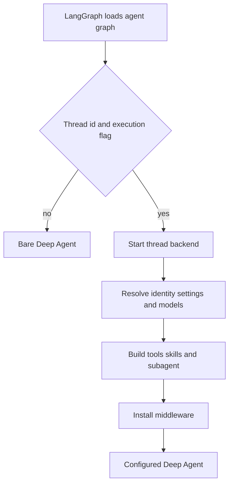

# Coding-agent graph assembly

`openswe.server.get_agent` is the public factory for the primary coding graph. The deployed `agent` graph points to `openswe.graphs.agent:traced_agent`, an alias of that factory. The graph object is deliberately stateless: durable per-thread state belongs in thread metadata and the sandbox. For an executable thread run, assembly selects that state and composes a Deep Agent with a backend, model policy, tool surface, skill sources, one general-purpose subagent, and ordered middleware.

## Load gate and configuration

This shows the execution gate that separates graph discovery from thread-bound assembly.

`build_agent` first parses `configurable` as `RunConfig`, sets `DEFAULT_RECURSION_LIMIT`, and requires both a `thread_id` and `__is_for_execution__ is True` for full assembly. The other path returns a bare `create_deep_agent(system_prompt="", tools=[])`; it does not allocate a sandbox or attach the run middleware. In either case, it binds a copy of the input configuration with `__pregel_*` keys removed, preventing a read-time LangGraph runtime from being serialized into subsequent calls.

`RunConfig` is intentionally a forgiving cross-launcher contract. Its declared fields are optional, unknown fields are retained, and parsing removes only fields that fail validation. It therefore carries identity and provenance, source context, repository/workspace selection, model selection, client-owned tools, and run-mode toggles without forcing every caller or graph type to provide the same shape.

## Identity, workspace, and backend

The triggering `profile_login` determines authorization, including whether private credentials and personal integrations can be used. In contrast, main/subagent model settings and repository instructions are thread settings: they are seeded from the initial profile but persist for later runs. Workspace settings are resolved by the run's workspace slug, while a desktop run uses local defaults rather than hosted profile/workspace policy.

Before the rest of the graph is built, the factory obtains a cached sandbox proxy and starts it. The reconnect callback creates a validated `LocalShellBackend` for desktop runs; hosted runs call `ensure_sandbox_for_thread` with the selected workspace. Hosted lifecycle reuses a cached or recorded sandbox and refreshes its GitHub proxy. An existing but unreachable sandbox raises rather than being silently replaced, protecting uncommitted work; a deleted sandbox is recreated so its stale recorded identifier cannot permanently block the thread.

The final backend is a `CompositeBackend` with the sandbox as default. It adds read-only bundled skills plus:

- hosted organization skills and, only when private credential scope is known, user skills;
- desktop user skills from state; and
- thread-scoped blob storage on hosted runs.

The ordered skill-source list goes to the parent and general-purpose subagent. `WorkspaceSkillsMiddleware` further filters checkpointed skill metadata to those sources, so a public thread does not retain personal-skill context from an earlier private run. Desktop also maps `/large_tool_results/`, `/conversation_history/`, and `/blobs/` to a sanitized, thread-specific artifact directory outside the project, keeping Deep Agent scratch data out of Git changes.

## Model resolution and prompt assembly

For hosted runs, model selection begins with workspace defaults, then applies dashboard profile main and optional subagent overrides, then stored thread settings. An explicit `agent_model_id`/`agent_effort` can supersede this only under the selection/handoff conditions and after checking `SUPPORTED_MODEL_IDS` and `model_supports_effort`. Adaptive routing can replace the primary selection with its fast route and builds route models; explicit selection disables routing. Resolved settings—including repository instructions and routing choices—are persisted before Fable gating, so deployment-wide Fable availability remains a per-run policy decision. Main, subagent, title, route, requested, and vision-fallback models receive separately derived provider arguments. A construction error becomes a deferred error model; fallback is configured only when its identifier differs from the primary model.

The factory gives Deep Agents an empty static system prompt. `PrepareAgentRunMiddleware` performs the run-specific work and prepends its `rendered_system_prompt` as a system message on model calls. Its preparation latch fingerprints its middleware type, latest message, and preparation configuration: retrying a successfully checkpointed invocation skips setup, while a new message/run refreshes credentials, prompt, and context. Implementations must be idempotent because a failure before checkpointing can run setup again.

For hosted preparation, the middleware resolves a GitHub token, triggering-user identity, backend readiness, working directory, workspace, and participants. It records the resolved model attribution, creates the prompt with working environment, dashboard/source, repository, collaboration, untrusted-input, repository instruction, recent-context, and workspace sections, and appends generated participant/sender context as messages rather than storing sender-specific data in the durable prompt. It suppresses dynamic context already visible after conversation summarization. Sandbox attachment failures notify the user before propagating the failure.

## Tools and delegation boundaries

The static parent surface is generated from an allowlist and then filtered by access and run context. Slack tools require trusted thread context (with limited reporting tools for a scheduled run); workspace-admin tools depend on admin authorization; sandbox download tools require a hosted LangSmith sandbox; and client-owned names remove the corresponding server tools. Desktop has only `http_request`, `fetch_url`, and `web_search`; stop-summary runs have only Slack thread read/reply. `ExcludeToolsMiddleware` applies Deep Agent and mode-specific exclusions independently of which static schemas were offered.

MCP integrations are represented by `DynamicToolMiddleware` rather than direct tools. It gets MCP tools only for hosted, non-stop-summary runs with a known credential scope; sources are layered instance, workspace, user, then managed gateway. The model sees `load_integration_tools` and a catalog first. A named integration must be loaded before its direct call; construction is locked per group, failures become unavailable-tool results, and collisions with Deep Agent/static names are rejected. When sandbox-preferring mode is enabled, the loader is hidden from the model and integrations are reachable through the sandbox tools endpoint instead.

There is one configured `general-purpose` fork subagent. It receives the shared skill sources and almost the parent static surface, but `_SubagentToolGuard` blocks parent-context operations such as Slack/thread management, background work, personal settings, incident administration, and SQL. It has its own transcript, optional workspace skills, dynamic integrations, workflow-push and PR guards, conversation offloading, OpenAI-response sanitization, model-error handling, and timeout middleware. This independent compilation is a security boundary: adding a parent-only guard does not constrain delegated tool calls unless the subagent gets an equivalent guard.

## Middleware ordering and execution guards

The parent stack is supplied outermost to innermost. It starts with filesystem/binary offload, conversation offloading, preparation, and optional review-guide, transcript, client-tools, incident, and workspace-skills middleware. It then validates image reads, limits model calls, translates tool errors, excludes tools, constrains subdirectory agent reads, retries `task`, and applies PR/workflow/task-coordination guards. Refreshing the GitHub proxy and message-queue/event checks follow where applicable; reply and CLI-result requirements are installed only for the appropriate surface.

The inner policy layer notifies on step limits, records usage, selects models, applies fallback and image fallback, and optionally makes integration schemas dynamic. Provider-message sanitizers and stable tool-result order precede model-error handling. `ModelCallTimeoutMiddleware` is innermost, so its deadline covers the provider call and can propagate outward to fallback behavior. `create_deep_agent` itself supplies `PatchToolCallsMiddleware`; the factory does not add its legacy custom orphaned-tool-call repair middleware.

## Operating and changing the factory

Use `build_agent(config, tool_surface=...)` as the composition seam when altering a tool-serving endpoint, and `get_agent(config)` for the deployed graph factory. Preserve the execution gate, bindable-config stripping, distinction between triggering-user authority and stored thread preferences, and the independently compiled subagent boundary. Changes to a tool should be checked against static access filtering, `ExcludeToolsMiddleware`, client ownership, sandbox-preferred delivery, and the subagent guard—not merely against its presence in `static_tools`.

Focused assembly tests cover public/private skill routing, desktop artifact and tool routes, backend handoff, persisted model/routing behavior, admin and Slack surfaces, and the parent/subagent tool boundary. The suite also confirms that setup overlaps sandbox start with settings loading and that binary content is offloaded to thread-scoped storage. See also [Middleware Stack](middleware-stack.md), [Sandbox Lifecycle](sandbox-lifecycle.md), [Models, Profiles, and Instructions](../concepts/models-profiles-instructions.md), [Tools](../concepts/tools.md), and [Context Engineering](../workflows/context-engineering.md).
