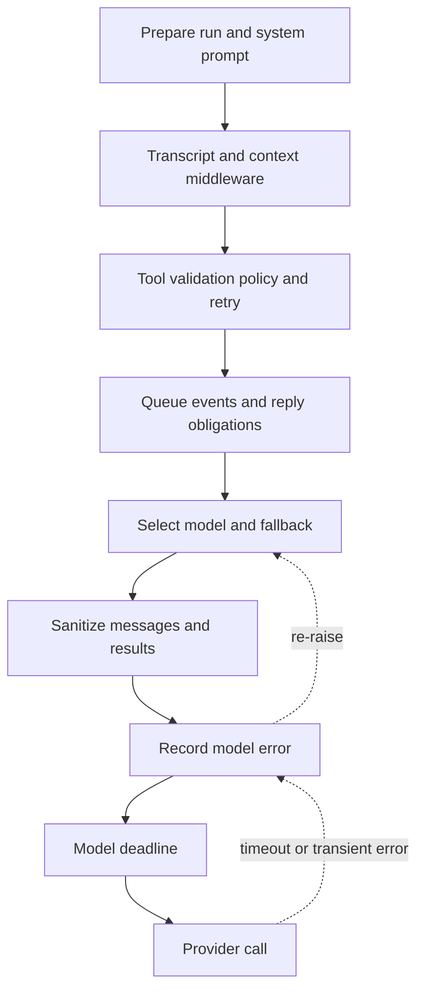

# Agent middleware and failure boundaries

`get_agent` and `get_reviewer_agent` give ordered middleware lists to `create_deep_agent`. The list is an onion: an earlier entry wraps a later entry for the hooks it implements. Order is therefore a behavioral contract—an outer wrapper can transform requests, intercept failures, or act after every inner wrapper. The factories are stateless; per-thread durable context is held in the sandbox and thread metadata. See [Agent Graph](agent-graph.md), [Reviewer and Analyzer](reviewer-and-analyzer.md), [Tools](../concepts/tools.md), [Follow-up Messages](../workflows/follow-up-messages.md), and [PR Creation](../workflows/pr-creation.md).

## Coding-agent stack

The assembled coding-agent stack is outer to inner (conditional entries are marked):

1. `FilesystemMiddleware` and `ConversationOffloadingMiddleware`
2. `PrepareAgentRunMiddleware`, then optional `ReviewGuideMiddleware`
3. `TranscriptMiddleware`, optional client-tools, incident, and workspace-skills middleware
4. `ValidateImageReadsMiddleware`, `ModelCallLimitMiddleware`, `ToolErrorMiddleware`, `ExcludeToolsMiddleware`, and `SubdirAgentsReadMiddleware`
5. `ToolRetryMiddleware` for `task`, `PullRequestCreationGuardMiddleware` outside local runs, `WorkflowPushGuardMiddleware`, and optional task coordination
6. GitHub-proxy refresh except in worker tasks; queue and event-match delivery except in stop-summary mode
7. `RequireUserReplyMiddleware` except in guide-prefetch runs, and `RequireCliResultMiddleware` for applicable CLI runs
8. Step-limit notification, run-usage recording, model selection, model fallback, and optional image fallback and dynamic integration tools
9. Fireworks, OpenAI Responses, and thinking-block sanitizers; stable tool-result ordering; `ModelErrorMiddleware`; `ModelCallTimeoutMiddleware`

The stack is assembled from the run configuration: local mode removes the PR guard; incident policy can lower the call limit; dynamic integrations exist only when MCP tools are available; image fallback is added when an offered model lacks vision support. The subagent deliberately excludes inherited queued-message delivery, event-match delivery, and model-selection middleware, because those are root-run responsibilities.

This is the principal coding-agent request path: preparation and policy occur outside the model recovery boundary, while timeout and error recording occur inside it.

### Preparation, retained context, and observability

`BasePrepareRunMiddleware` is the base `before_agent` lifecycle for the coding and reviewer specializations. It fingerprints the middleware class, latest message, and preparation configuration. A checkpointed matching `run_prepared_for` latch prevents duplicate setup on resume; a later invocation re-prepares fresh credentials, prompts, and review context. Since a failure before checkpointing can invoke `_prepare` again, implementations must be idempotent. Its model wrapper prepends the prepared `rendered_system_prompt` to any existing system message.

`ConversationOffloadingMiddleware` exposes Deep Agents compaction without streaming the summarizer's internal model output. It can be manual or automatic, records status events for the client, and avoids replacing a transcript with an empty summary. `TranscriptMiddleware` is explicitly non-critical observability: it maintains per-run state keyed by `thread_id:run_id`, queues event-log writes to one background writer so streaming does not wait on Postgres, and logs and swallows transcript failures.

Queued follow-ups are collected before each eligible model call. `check_message_queue_before_model` snapshots a thread's pending messages, builds human-message updates in FIFO order, and removes the queue records only after all messages are built; an exception therefore leaves them for a later call rather than losing input. Dashboard-originated queued input can switch the reply surface from Slack to web. A separate event-match hook is installed alongside it in normal coding runs.

## Tool surfaces, safety policy, and replies

The tool list is constructed before graph assembly and then filtered by access, run mode, and exclusions. `ExcludeToolsMiddleware` applies the final name-based exclusion to each model request. `DynamicToolMiddleware` advertises a catalog loader rather than eagerly creating connected integration tools: a model must call `load_integration_tools`, after which the selected names are retained in state and become callable. It rejects unknown, unloaded, or unavailable integrations with error `ToolMessage`s. For providers that support mid-conversation tool additions, it anchors provider-native additions after the loading result to preserve prompt-cache continuity; other models receive the tools in the normal request tool list.

`ValidateImageReadsMiddleware` keeps invalid binary content from poisoning later model calls. When `read_file` returns an image block, it checks magic bytes; a file whose extension says image but whose bytes do not is converted to a textual error result instead of being sent as an image to a provider. If retained messages do include images and the selected model is known text-only, `ImageModelFallbackMiddleware` substitutes a configured vision-capable model for that request.

`RequireUserReplyMiddleware` enforces the delivery contract for a Slack turn. A successful final reply tool call, an explicit no-reply call, or configured reply-producing tools discharges the obligation. If a model ends without tool calls and has not discharged it, the middleware injects at most two system-authored nudges and jumps back to the model; after that budget it posts the last assistant text through `slack_reply` rather than allow silent success. The current reply surface is reset at the start of every run and can change when queued dashboard input is delivered.

`WorkflowPushGuardMiddleware` is a narrower execution gate than general tool exclusion. It recognizes only a conservative standalone `git push` form issued through `execute` or `background_execute`, inspects the exact workflow-file diff in the sandbox, fingerprints it, and persists pending approval by thread. A matching approval rewrites the request to a fixed full-SHA refspec; otherwise the original push is not run and the model receives an approval-required error with an approval URL. Changing the workflow diff creates a new fingerprint and requires approval again.

## Failure boundaries and recovery

`ToolErrorMiddleware` converts ordinary unhandled tool exceptions to `ToolMessage(status="error")` JSON that includes the error type, text, and tool name when known, allowing the model to correct its approach. It distinguishes the sandbox cases:

- An SDK-marked transient sandbox connection rejection is reported as `sandbox_transient`: the command never started, so no state was changed.
- A sandbox connection error other than server reload, or a `ResourceNotFoundError` for the sandbox resource, means the backend is unreachable. The middleware attempts a user notification and re-raises, ending the run rather than repeatedly failing future sandbox calls.
- Cancellation is propagated unchanged.

`ToolRetryMiddleware` has a different scope: it wraps only delegated `task` calls with at most two retries, a one-second initial delay, and a ten-second maximum delay. It retries transient HTTP status failures, transport errors, and `ModelCallTimeoutError`; the last case matters because a subagent has no coding-agent fallback wrapper. On exhaustion, prompt/context-length failures return structured `failed` data for the parent model to address, while other errors are re-raised.

The model layers form the model-failure boundary. `ModelCallTimeoutMiddleware` is innermost, applies `asyncio.wait_for`, and turns a stalled provider call into `ModelCallTimeoutError`, a `TimeoutError`. Its configured deadline is `OPEN_SWE_MODEL_CALL_TIMEOUT_SECONDS` when positive and parseable, otherwise 900 seconds; it sits outside provider-client request timeouts so client retries can happen first. `ModelErrorMiddleware` logs and classifies any resulting exception, stores its type and classification code in thread metadata when context exists, then re-raises the original exception.

`ModelFallbackMiddleware` is created with a configured or default cross-provider fallback when it differs from the primary. It alternates primary and fallback attempts over a jittered backoff schedule, retrying connection, timeout, retryable `ModelError`, and selected 408/409/425/429/5xx/529 provider failures. A provider model-access error is immediately converted to an explanatory `AIMessage`; exhausted transient attempts normally produce a terminal outage `AIMessage`, preserving checkpointed progress for a retrigger. `ModelSelectionMiddleware` runs outside fallback: it honors an explicit requested model, otherwise preserves a selected route or selects fast, balanced, or performance from the latest authored human task, emits routing display metadata, and overrides the request model. Requested models register their own fallback pairing. 

## Accounting and completion hooks

`RecordRunUsageMiddleware` tags model responses with the invocation and selected route, then finalizes invocation usage after the agent completes. If a model call raises, it finalizes the tracked invocation with error status before re-raising, marking authentication rejection for authentication/401 failures. This makes accounting cover both normal completion and terminal model failure rather than treating usage as a best-effort afterthought.

`ModelCallLimitMiddleware` ends the run at its configured limit. The adjacent `notify_step_limit_reached` completion hook can notify the user of that specific stop. Run modes can add `RequireCliResultMiddleware` to prevent CLI-backed turns from ending without their required result; guide-prefetch runs intentionally omit reply enforcement because they prepare content ahead of the reader rather than answer them.

## Reviewer differences

The reviewer uses a smaller, review-specific chain: `PrepareReviewerRunMiddleware`, `ModelCallLimitMiddleware`, `ToolErrorMiddleware`, GitHub-proxy refresh, queue delivery, three message sanitizers, `RepairOrphanedToolCallsMiddleware`, stable result ordering, `ModelRetryMiddleware(retry_on=(TimeoutError,))`, `ModelErrorMiddleware`, `ModelCallTimeoutMiddleware`, and `settle_review_check_on_exit`.

It intentionally omits coding-agent filesystem/offloading, transcript, dynamic tools, general tool exclusion, task retry, PR/workflow guards, reply enforcement, model selection/fallback, image fallback, and run-usage middleware. `RepairOrphanedToolCallsMiddleware` makes a resumed review provider-valid by adding synthetic error results for unresolved tool-call IDs. The reviewer instead has a generic timeout retry wrapper, including for its subagent. Finally, `settle_review_check_on_exit` ensures a tracked but unpublished review check closes neutrally; if publishing succeeded but a stored completion PATCH failed, it retries the actual pending conclusion rather than reporting a misleading neutral result.

## Change guidance and focused tests

When changing this stack, preserve the outer-to-inner boundary deliberately. The timeout must remain inside error recording and fallback so a hang becomes a classified, retryable error; queue records must remain removed only after message construction; and sandbox retryability must continue to mean the SDK proved that the command never started. Any new tool that can answer a Slack turn must be included in the reply-discharge policy, while a new integration must reserve names against built-in tools.

`tests/agent/test_task_retry.py` is the focused regression suite for the delegated-task boundary: it asserts retry eligibility for transient status and transport failures, subagent model deadlines, structured return of model-fixable invalid prompts, and re-raising of unrecoverable failures. Extend it when changing the retry taxonomy or the parent-model recovery contract.
