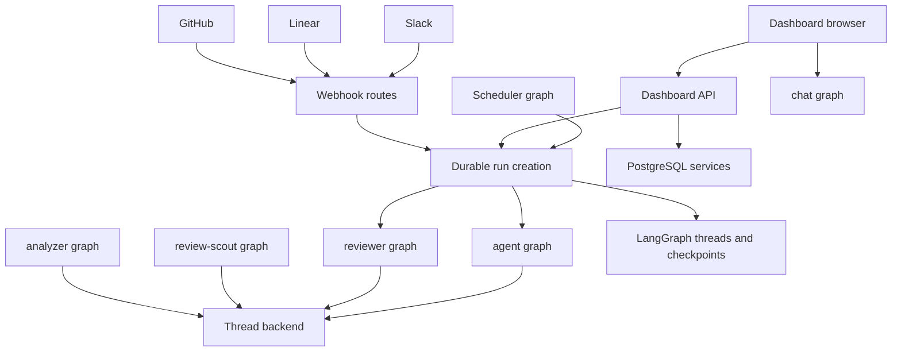

# Runtime architecture and public entrypoints

Open SWE is a LangGraph-based software factory. Durable LangGraph threads and runs provide execution state; graph factories assemble the agent appropriate to a run; FastAPI is the HTTP composition root for the dashboard, integrations, sandbox services, and operational endpoints. A PostgreSQL database supplies application-owned records and migrations, while the LangGraph service remains the run and checkpoint boundary.

## Deployment and graph entrypoints

`langgraph.json` is the cloud deployment manifest. It uses Python 3.14, loads `.env`, mounts `openswe.webapp:app`, and declares six stable graph entrypoints through intentionally thin `openswe/graphs/` re-export modules:

| Graph ID | Entry point | Runtime role |
|---|---|---|
| `agent` | `openswe.graphs.agent:traced_agent` | Coding-agent factory for normal work threads. |
| `reviewer` | `openswe.graphs.reviewer:traced_reviewer_agent` | Pull-request review and finding publication. |
| `analyzer` | `openswe.graphs.analyzer:traced_analyzer` | Learns repository-specific review style. |
| `review-scout` | `openswe.graphs.review_scout:traced_review_scout` | Produces and stores a review walkthrough and human-input summary. |
| `chat` | `openswe.graphs.chat:traced_chat_agent` | Read-only PR discussion. |
| `scheduler` | `openswe.graphs.scheduler:get_scheduler` | One-tick maintenance and scheduled-work dispatcher. |

The manifest configures deleting checkpoint retention with a 60-minute sweep and a 43,200-minute default TTL. Its Dockerfile instructions best-effort build the dashboard bundle for the configured mount prefix; a failed bundle build leaves the backend deployable without bundled static UI.

This diagram shows the main runtime boundary: browser and integration traffic is normalized before durable execution, while graph factories acquire their own thread-specific resources.

## Graph factories and execution context

`get_agent` delegates to the coding-agent builder for each graph load. For executable runs it resolves the sender identity and credential scope, chooses a desktop or managed backend, starts that backend, loads and normalizes thread settings, and then composes a fresh Deep Agent with models, tools, skills, subagents, and middleware. Graph discovery or any load without a thread ID deliberately receives an empty no-tool Deep Agent, preventing sandbox provisioning outside execution.

The coding, reviewer, analyzer, and review-scout factories use the thread-keyed sandbox backend proxy. The reviewer is constrained to review work: its primary toolset includes diff retrieval, finding create/update/list/publish, finding-thread actions, and web access—not coding-agent commit, push, or PR-opening tools. The analyzer uses a sandbox plus review-style tools to save a repository prompt and read finding outcomes. Review scout uses its own preparation middleware and records walkthrough steps and human input for a PR review.

PR chat is different by design: it has no sandbox. It selects a workspace chat model, obtains a GitHub App installation token scoped to the configured repository, and exposes repository-reading, finding, web, and proposed-comment/review tools. Its excluded-tool middleware preserves a read-only interaction boundary; it cannot become an arbitrary shell session.

The scheduler compiles a one-node `StateGraph`. A tick dispatches reconciliation, PR watching, background task monitoring, workspace refresh, session or agent cost refresh, feedback prompting, human-review deadlines, or a stored scheduled run. Required identifiers are checked before work launches; transient sandbox errors are retried for the configured attach interval and then return `sandbox_unavailable`, while non-transient failures propagate.

## FastAPI composition and lifecycle

`openswe.webapp` is a compatibility entrypoint that re-exports the application created by `openswe.api.app`. Import-time event-loop pinning happens before queue workers are constructed, and the lifespan repeats it before startup work. `create_app` configures credentialed CORS from `DASHBOARD_ALLOWED_ORIGINS`, adds the desktop `open-swe://app` origin, and rejects `*` because credentials are enabled. It also installs audit, request-ID, tracing, GitHub-error, and unknown-user handling before mounting routers and static UI.

The composition root mounts these public surfaces:

- `/dashboard/api`: browser-facing OAuth, profiles, users, workspaces, repositories, PRs, review chat and styles, schedules, threads and transcripts, MCP/CLI tools, audit/analytics, API keys, bridge, and invalidation APIs. Mutation requests use the same-origin dependency. The dashboard package lazily imports this aggregate router so non-web imports do not pull in the whole FastAPI/job surface.
- GitHub, Linear, and Slack webhook routers, plus health, plan, workflow approval, rollout events, sandbox tool, and sandbox OpenAI-compatible routes.
- Static dashboard assets, when available.

Startup is an operational gate, not merely application initialization: it validates the GitHub login allowlist, sandbox and local-development LLM configuration, requires PostgreSQL, and applies migrations. It then performs best-effort imports from the legacy LangGraph Store, starts analytics and cross-process listeners, and synchronizes configured admins. Several optional imports/listeners log failure and let the service continue with defined degraded behavior. Shutdown cancels blob import, stops listeners and analytics, and closes the database engine.

## Persistence, sandbox lifetime, and durable dispatch

`openswe.database` exposes the shared PostgreSQL connection, transaction, session, migration, and close primitives. PostgreSQL is mandatory at application startup. The async engine uses pre-ping and configurable pool limits, scopes operations to the `open_swe` schema, records slow or failed statements, and serializes migrations with a PostgreSQL advisory transaction lock. Read-only and repeatable-read snapshot transaction helpers support readers that must not write or observe a moving multi-query snapshot.

LangGraph owns checkpointed graph state and durable runs. Application thread metadata retains the sandbox binding and settings. The local backend proxy cache is keyed by thread ID; when a process lacks a usable cached connection it reconnects from the persisted sandbox ID. A missing/deleted sandbox can be replaced, but an existing unreachable coding sandbox raises rather than silently replacing the working tree and losing uncommitted work. Callers with re-derivable checkouts, such as review workflows, may opt into replacement.

`dispatch_agent_run` is the common creation boundary for agent and reviewer triggers. It builds or accepts exactly one normalized input envelope, records source identity as run metadata, and selects the graph using `assistant_id`. `create_durable_run` supplies the behavior that lets all product surfaces converge:

- `interrupt` is the default multitask strategy, so a follow-up interrupts and resumes an active thread from its synchronized checkpoints; background callers may choose another strategy.
- `sync` durability, resumable streams, subgraph streaming, all v3 stream modes, and the compatibility marker make an externally created run observable by the dashboard.
- The dispatcher adds an invocation ID and records a resolved user ID when possible. It creates/titles system-owned threads when requested.
- Completion webhooks are attached only when a secret is configured and the URL is absolute and non-loopback. Invalid completion configuration disables notification rather than making every run creation fail.

GitHub, Linear, and Slack routes authenticate deliveries before queuing their service work. GitHub verifies the HMAC signature and treats temporary workspace-routing failures as a 503 so GitHub retries. Linear verifies its signature and rejects stale timestamped deliveries. Slack rejects duplicate retries and validates message identity before routing. Integration-specific services derive stable thread identities from their issue, PR, channel, or conversation context; follow-up messages can therefore continue the intended durable thread rather than creating arbitrary sessions.

## Dashboard, desktop, and CLI surfaces

The `ui/` dashboard is a TanStack Router React application. Its route tree includes agent and assistant sessions, local sessions, plans, automations, bots, reviews, incidents, workspaces, integrations, settings, usage, feature flags, and administration. The router uses Vite's base URL, so a bundle built for a mount prefix routes and loads assets under that prefix. The agents layout requires a session, recognizes desktop-local threads, and can redirect eligible cloud threads to the experimental assistant UI.

The cloud and local product modes are intentionally separate. `langgraph.desktop.json` registers only the agent graph, supplies local authentication, a local checkpointer, and disables the bundled LangGraph UI. A desktop run has `source == "desktop"` and receives a `LocalShellBackend` rooted at an allowed local directory. The requested directory is real-path resolved and accepted only if it is an existing registered project or lies below the desktop worktree root; the backend inherits only a small shell-environment allowlist. Tool-result, history, and blob artifact routes live outside the repository to keep `git add -A` from accidentally committing agent scratch data.

`oswe` offers a third execution surface: it starts a remote cloud agent but serves the current local directory through a bridge. The remote deployment long-polls the CLI's bridge requests, and the CLI executes shell/file operations locally as the invoking user—not in a sandbox. The CLI creates or continues a deployment thread, reconnects event streaming with bounded backoff, and expects the agent to finish through `cli_result`, mapping the reported exit code to the local process. It supports workspace API keys, GitHub Actions OIDC, or a person session; person-only MCP tool commands reuse the backend's authorization and implementation.

## Operations, extension points, and focused verification

- Add a deployable graph by exporting a stable factory in `openswe/graphs/` and registering it in the relevant manifest. Registration alone does not make it an `dispatch_agent_run` target; callers that need another graph should use `create_durable_run` deliberately.
- Add HTTP behavior by composing a router in `create_app`; preserve CORS, auditing, request IDs, exception mapping, and dashboard same-origin protection rather than mounting an unauthenticated parallel surface.
- Treat sandbox recreation as a recovery policy. Replacing an unreachable coding backend changes a thread's working tree; only permit it when the caller can safely reconstruct state.
- Changing stream or dispatch defaults requires testing runs started outside the dashboard, because resumable v3-compatible events are what allow the UI to attach to integration-triggered work.
- Test database reader changes against the read-only transaction tests, and test lifecycle changes through the app lifespan because migration and service startup are part of the deployability contract.

Related pages: [Agent graph](./agent-graph.md), [Dashboard UI](../integrations/dashboard-ui.md), [Deployment](../operations/deployment.md), and [Invocation](../workflows/invocation.md).
