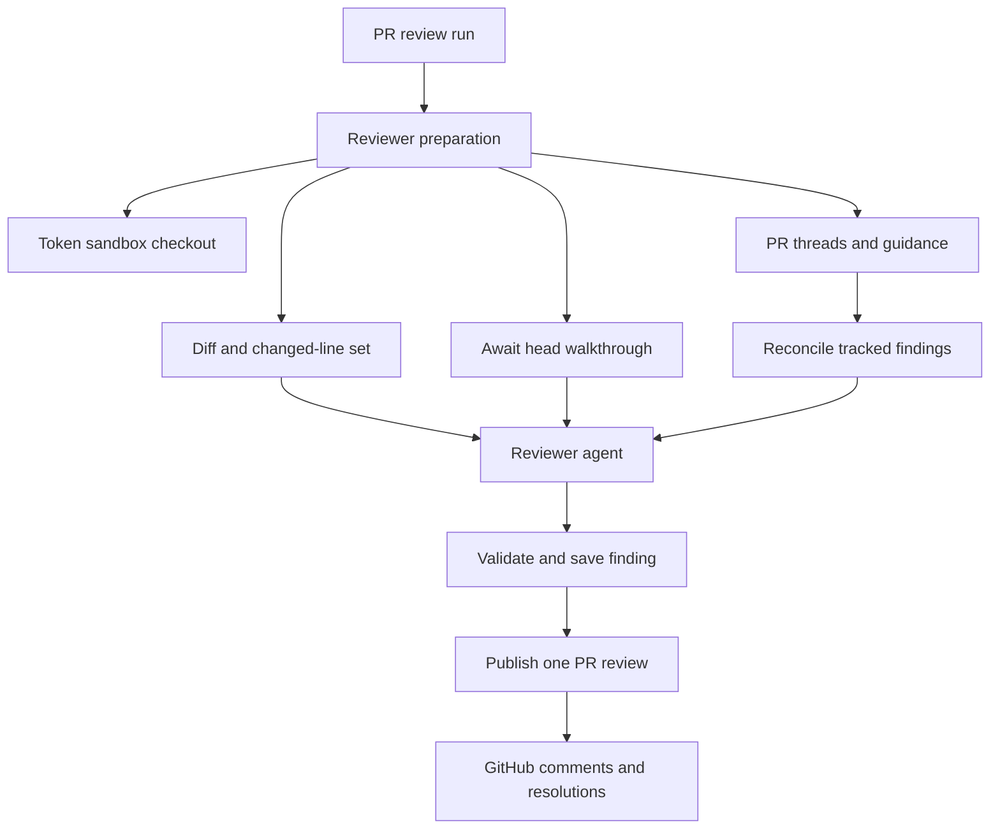
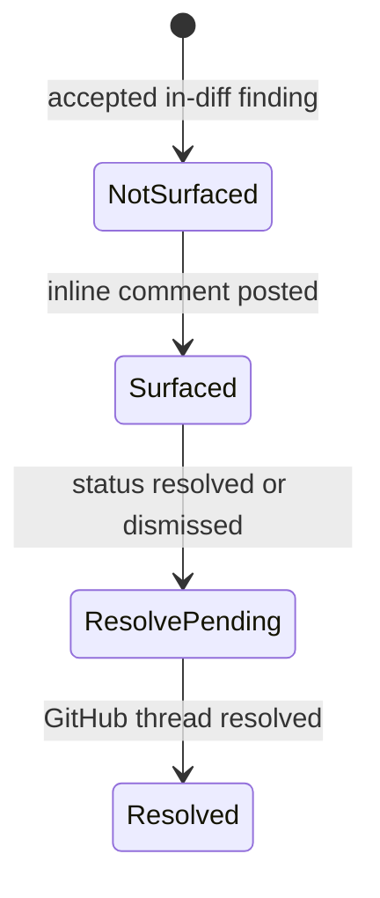

# Review, review-scout, and style-learning graphs

Open SWE deploys three related but separate LangGraph deep-agent graphs: `reviewer`, `review-scout`, and `analyzer`. The reviewer assesses a pull request and is the only one of the three that publishes GitHub review output. The scout makes a durable, head-specific walkthrough that helps the reviewer understand a change. The analyzer learns a per-repository prompt supplement from human feedback and reviewer outcomes. Their entrypoints are registered in `langgraph.json`.

For trigger routing, see [PR Review Workflow](../workflows/pr-review.md); for sandbox lifetime and recovery, see [Sandbox Lifecycle](sandbox-lifecycle.md); for tool descriptions, see [Tools](../concepts/tools.md).

## Responsibilities and boundaries

| Graph | Durable identity and output | Authority |
| --- | --- | --- |
| `reviewer` | A deterministic reviewer thread per PR; findings in PostgreSQL and PR/thread metadata in LangGraph | Reads the checkout and publishes/replies/resolves GitHub review threads through dedicated tools. It does not modify or push repository code. |
| `review-scout` | A deterministic scout thread and a PostgreSQL walkthrough pinned to one PR head | Replays the diff into local logical steps and records optional human-input summary. It does not publish review findings. |
| `analyzer` | A deterministic repository style thread and a `review_styles` store record | Reads historical feedback or outcomes and saves a repository-specific prompt; it does not review a particular PR. |

The reviewer prompt forbids commits, pushes, and direct `gh pr review` or review API use. Its explicit domain tools centralize finding mutation and publication: `fetch_review_diff`, `add_finding`, `update_finding`, `list_findings`, `publish_review`, `resolve_finding_thread`, and `reply_to_finding_thread`; it also has web read helpers. A single `reviewer` subagent may inspect an explicitly disjoint file partition, but it returns candidate defects only: the parent validates, persists, ranks, and publishes them.

All three factories return an empty no-tool agent if there is no `thread_id` or the graph is not executing. Reviewer and scout copy the caller's config and `configurable` map before setting a default recursion limit, whereas `get_analyzer` sets that limit on its received config. This distinction matters to callers that reuse config objects.

## PR review preparation and control flow

`PrepareReviewerRunMiddleware` performs deterministic setup before its first model call. For a source-backed PR it mints a repository-scoped GitHub App installation token, caches it as the thread's bot token, ensures a replaceable sandbox, and clone-or-fetches then checks out the PR head. The checkout is disposable: when an unreachable reviewer sandbox cannot be replaced, the run posts a typed notification on the PR and fails rather than silently abandoning the review.

It computes the full or delta re-review diff and an `(file, side, line)` membership set, then injects `diff_text` and `diff_line_set` into state. In parallel it fetches PR metadata, existing review threads, repository style, organization guidance, approval policy, base-ref `AGENTS.md` and scoped instructions, and API standards. The reviewer reconciles existing GitHub threads before rendering them as context. For non-evaluation runs it also starts or awaits a review-scout walkthrough.

Reviewer preparation provides validated diff context and best-effort supporting context before the model evaluates the change.

Author-controlled content is not trusted as instructions. PR title/body, existing thread comments, and finding replies are rendered in XML data blocks; closing tags are neutralized and author logins are validated. Review guidance is read from the base SHA, so a PR cannot rewrite the policy used to judge it. Evaluation runs intentionally omit workspace guidelines, learned style, and API standards to score the stock reviewer.

## Findings: durable review state

Findings now live in PostgreSQL under the pull request; LangGraph reviewer-thread metadata retains PR identity, head/review state, and the `kind: "reviewer"` discriminator. A compatibility path migrates legacy metadata-backed findings on first access. This separation lets a PR be re-reviewed after sandbox replacement and lets webhook/UI code address durable findings through its reviewer thread.

A finding carries severity, confidence, category, generated title, path/range/side, description and optional suggestion, diff membership/hunk, status and SHAs, GitHub publication identities, surface state, fingerprint/rank, and interactions. Surface state is monotonic (`not_surfaced`, `surfaced`, `resolve_pending`, `resolved`); normalization selects the furthest state for contradictory legacy data.

`add_finding` normalizes a one-ended range, validates title, severity, confidence, side, and ordering, and resolves diff context in this order: injected state, configurable values, then a fresh authenticated PR diff. A range not in the changed side returns `success: false` and `in_diff: false` with an explicit do-not-retry instruction. Valid findings save a diff hunk when available, drop suggestions over four lines, and are fingerprint-deduplicated. A missing durable reviewer thread likewise becomes a structured do-not-retry tool result rather than an exception that encourages futile retries.

The surface lifecycle records publication progress separately from the finding's open, resolved, or dismissed status.

Before a normal run, reconciliation indexes current GitHub threads by embedded finding marker, then saved thread ID, then comment ID. It backfills IDs and marks matches surfaced. It changes an open finding to resolved only if every matching thread is resolved; an outdated thread is terminal for matching but does not itself produce the resolved status. The latest non-bot response after the bot comment is retained as a `human_reply` interaction marked `needs_reassessment`.

## Publication, ranking, and failure behavior

`publish_review` must be the only tool call in its model turn. Its `ranking` must enumerate every publish candidate exactly once and in importance order; otherwise nothing is posted. Candidates are open, in-diff, unpublished findings at or above the selected threshold (default `medium`), with re-reviews restricted to findings first seen at the reviewed head. Eligible findings are capped by `REVIEW_FINDING_CAP` and sent as one GitHub PR review with a host-generated summary and inline comments. Suggestions render as fenced `suggestion` blocks.

Each inline comment embeds an `open-swe-review-comment` JSON marker containing the finding ID and anchor fields. This is the recovery key used when stored publication IDs must be backfilled. After posting, the tool records review/comment/thread identities, resolves threads for resolved findings through GitHub GraphQL, links the PR to its review, advances `last_reviewed_sha`, and settles review reporting.

Callers must inspect the structured response, not just `success`. Evaluation returns `dry_run: true` and never posts. A re-review with no new comments may return `success: true`, `review_id: null`, and `skipped_empty_re_review: true` after resolving eligible old threads and advancing state. If GitHub rejects an anchor, the tool filters against a current diff and retries the batch once when valid comments remain; otherwise it returns `unresolvable_findings` and a remediation hint instead of blindly retrying.

## Review scout: a head-specific walkthrough

The reviewer uses `ReviewScoutTarget` to retrieve a walkthrough for the current head. If absent, it starts or joins a durable `review-scout` run for the deterministic PR scout thread and polls for up to 600 seconds. A timeout or scout failure is non-fatal: the reviewer continues without a walkthrough while the scout can still complete for the review page. A new head does not join an active older-head run.

The scout requires repository, PR number, base SHA, and head SHA. It obtains a bot token and replaceable checkout, prepares the PR repository, calculates a merge base, and lets the model use only `commit_walkthrough_step` and `record_human_input`. It can include steering history; without that history, the human-input tool is removed. On completion, `StoreWalkthroughMiddleware` finalizes locally replayed commits into ordered steps and atomically replaces the PostgreSQL walkthrough for that PR/head. Each step records file ranges in the PR's real added (head) and deleted (merge-base) line numbering, plus an optional catch-all `other` step.

## Analyzer: review-style learning

The analyzer supplies a repository-specific supplement, not a replacement for the reviewer's global quality bar. Its two domain tools are `read_finding_outcomes` and `save_review_style_prompt`, and it has an 80-call limit. Preparation resolves the repository/workspace, ensures a sandbox whose GitHub proxy is scoped to the repository, and builds a prompt naming the selected playbook and the shared `REVIEWER_STYLE_THEMES`.

`analyzer_mode` selects one of two authoritative bundled playbooks:

- **`bootstrap`** starts from historical merged-PR human review samples and directs the agent to collect enough substantive feedback to synthesize an initial style prompt.
- **`continual`** reads recorded finding outcomes to reinforce recurring useful patterns and demote recurring false positives while refining the existing guidance.

Launchers seed both `SKILL.md` files into the input `files` channel. `get_analyzer` mounts a `StateBackend` at `/skills/` in a `CompositeBackend`; the route strips the prefix before delegating. Consequently the agent reads `/skills/<name>/SKILL.md` without bundled playbooks being written to its sandbox.

`REVIEW_STYLES` is a typed `review_styles` namespace keyed by normalized `owner/repo`. Its record tracks analysis status, custom prompt, approval mode, summary, sampling metadata, run/thread IDs, cron ID, error, and timestamps. The reviewer retrieves `custom_prompt` fail-soft during preparation and injects it as repository-specific style only when it agrees with the global bar.

Bootstrap first collects samples with the caller's GitHub token, marks the record running, then starts a durable analyzer run on the deterministic style thread. Collection or launch failures mark it failed. An immediate continual run uses the same thread and outcome-driven input. `save_review_style_prompt` rejects empty output, otherwise persists the trimmed prompt and metadata as completed; cron-registration failure does not undo that saved prompt.

A successful save idempotently ensures one daily `analyzer` cron per repository. Its SHA-256-derived schedule is staggered from 05:00 through 08:59 UTC. Cron input is threadless, but configurable state explicitly carries the deterministic style thread ID; otherwise the analyzer factory would return an empty agent. It carries no accumulated nightly message history, seeds the skills, selects continual mode, and relies on analyzer preparation to authenticate the sandbox proxy.

## Focused verification

The reviewer tests cover config isolation, diff anchoring including `LEFT` ranges, finding persistence/migration, marker rendering and publish failures, reconciliation, review APIs/chat, approval behavior, watch/re-review flow, and style synchronization. Review-scout tests cover Git replay behavior; its launcher and graph enforce same-head joining and head-specific walkthrough storage. Analyzer cron and style-job tests exercise seeded virtual skills, deterministic thread configuration, cron idempotence/removal, and staggered schedules.
