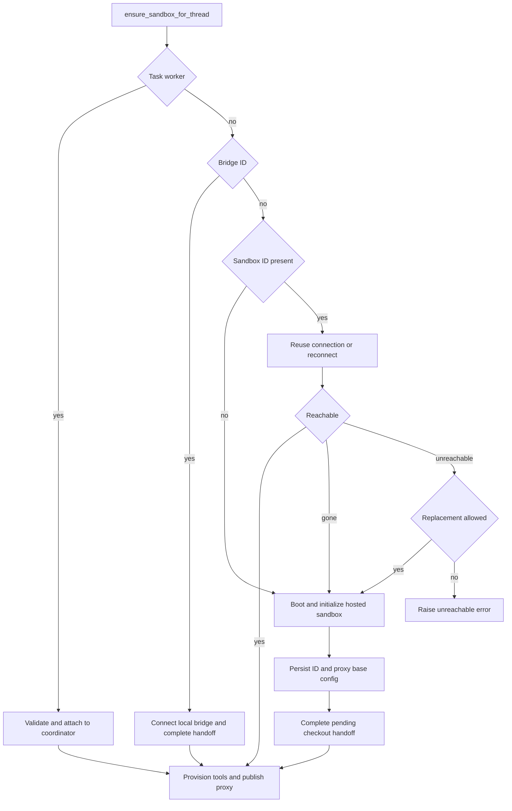

# Thread-bound sandbox lifecycle

A thread's sandbox is the durable home of its checkout and uncommitted work. A run can execute on a different worker, so the design separates the durable binding from a process-local connection. The lifecycle also supports a thread deliberately moving between a hosted provider and the owner's local machine without silently losing the checkout.

Related: [Agent graph](agent-graph.md), [Threads and state](../concepts/threads-and-state.md), [Sandbox providers](../integrations/sandbox-providers.md), and [PR review](../workflows/pr-review.md).

## Binding, cache, and stable handle

`thread.metadata["sandbox_id"]` is the authoritative binding. Reads always query the live thread rather than run configuration: a queued run may contain the sandbox ID from before a rebind. `SANDBOX_BACKENDS` is only a worker-local mapping from thread ID to a stable `SandboxBackendProxy`; `SANDBOX_CONNECTIONS` separately caches live connections by sandbox ID. When a binding changes, `set_sandbox_backend` retains the proxy object but swaps its target, so tools and middleware that already hold the proxy do not retain a stale backend.

The proxy is async-only. Its `a*` methods resolve the current target and its synchronous counterparts reject use. A missing target starts the registered reconnect callback, or resolves the live metadata ID through `connect_sandbox`. A lock and one shared startup task collapse concurrent callers into one connection attempt; awaiting it with `asyncio.shield` prevents cancellation of one caller from cancelling startup for the others. Failed startup is cleared so a later operation can retry. The proxy inherits `BaseSandbox`, preserving capture-at-source behavior for filesystem tooling; when an underlying backend lacks `aexecute_with_offload`, it returns an ordinary execution result instead.

## Provisioning from a workspace

`ensure_sandbox_for_thread` is the normal entrypoint. The graph factory registers it as the per-thread proxy's reconnect callback and starts that proxy before ordinary tool use. For a hosted new sandbox, `SandboxCreateConfig.resolve` loads the requested workspace (or its inherited default), selects its ready snapshot and resource settings, and passes workspace create parameters to the provider. Selecting `source="base"` intentionally skips workspace lookup and snapshot inheritance. An owner's `preserve_sandbox_memory` preference adds `preserve_memory_on_stop`; inability to read that preference only logs and falls back to normal boot. A stale workspace snapshot can be recorded for the caller while a background update is triggered without extending the boot critical path.

`create_sandbox` is the provider-neutral factory/reconnect boundary. `SANDBOX_TYPE` chooses a lazily imported provider: `langsmith`, `daytona`, `modal`, `runloop`, `e2b`, or `local`. LangSmith alone receives snapshot, sizing, and create-body overrides. Async providers are awaited; synchronous SDK-backed factories run in a worker thread. Optional third-party providers fail at startup with an installation instruction when their extra is absent.

## Hosted get, reconnect, or replace

*The thread lifecycle selects worker sharing, a local bridge, or a hosted sandbox, and only publishes a fully prepared backend.*

For a bound hosted ID, the lifecycle reuses a live connection when available or asks the configured provider to reconnect. It re-applies bot Git identity and refreshes LangSmith proxy credentials; those operations run concurrently because identity does not depend on proxy configuration. There is no preliminary ping: proxy refresh is itself the operation that establishes whether the sandbox can be reached. A new box is configured before its ID (and any persisted base proxy configuration) is written to thread metadata, and publication into the proxy happens after metadata update, checkout handoff, and tool URL provisioning. Thus a creation or metadata failure does not expose a partially initialized box through the proxy.

A provider-confirmed `SandboxGoneError` always permits creation of a replacement. In contrast, `SandboxUnreachableError` normally ends the run without replacement: the old machine may recover and may contain the only uncommitted working tree. `allow_replacement=True` is for reviewer runs, whose checkout is deterministically re-prepared for each PR revision. `require_existing=True` prevents a coordinator-dependent caller from creating or recovering a box itself. If a permitted replacement fails to boot, the lifecycle normalizes the failure as `SandboxUnreachableError`.

`recreate_sandbox_for_thread` is an explicit hosted rebind. It rejects task workers and bridged threads, attempts to stop the old LangSmith sandbox for at most ten seconds, creates a distinct replacement, persists its ID before switching the proxy, and provisions its tool URL. A stop failure is reported as `SandboxRecreationStopError` *after* the successful rebind, with both IDs. If persistence fails, the existing proxy still targets the old box.

## Task workers share, they do not own

A task worker has `task_id` and `sandbox_host_thread_id` metadata. Rather than provision its own filesystem, it validates that the host is the task coordinator and that task, owner, workspace, visibility, admin status, and repository permissions are compatible. It then ensures the coordinator's existing sandbox, confirms that its ID did not change during attachment, copies the binding and base proxy configuration into worker metadata, and publishes the same underlying backend under the worker's own proxy. Workers cannot recreate or replace the shared host; the coordinator must recover it. If a worker has pending background tasks, attachment also schedules their reconciliation.

Thread-scoped repository access is treated as a ceiling, not a requested default. The live thread scope is cached only after a successful read; a read error propagates because treating it as unrestricted would broaden credentials. Requested repositories are intersected with the recorded scope before a proxy token is minted.

## GitHub proxy credentials

LangSmith sandbox access is provisioned through its proxy, not by placing a GitHub credential in the sandbox environment. Every new or reused LangSmith sandbox obtains a workspace token, configures the proxy, and records expiry, repository scope, permission scope, workspace, and base proxy configuration per thread. The before-model middleware calls `maybe_refresh_proxy_token`; a known token refreshes in its last five minutes, while an unknown expiry refreshes after 50 minutes. Refresh preserves the recorded scope, or intersects an explicit requested set with it, and middleware logs failures instead of blocking the model call.

The persisted `sandbox_base_proxy_config` makes custom proxy rules survive a worker restart and a reconnect. This configuration is part of the durable thread binding only after a successful new-box initialization.

## Bridged local machines and checkout handoff

A `sandbox_id` with the bridge prefix denotes the owner's local CLI machine, not a provider sandbox. `ensure_sandbox_for_thread` connects it through `BridgeSandboxBackend`, skips managed proxy and global Git identity setup, completes any pending checkout transfer, and publishes it. The bridge backend queues execute and file-transfer requests for the CLI's long poll. It verifies liveness before connection and while waiting; a disconnected bridge becomes `SandboxUnreachableError`, never a cloud replacement.

Bridge requests are stored in Postgres because the graph worker and long-poll handler can be different processes. Their state is `pending`, `claimed`, then `done` or `failed`; exclusive `FOR UPDATE SKIP LOCKED` claims and conditional completion make commands at-most-once. A heartbeat determines whether a bridge is live; bridge closure or pruning fails waiting requests rather than leaving them until command timeout. Reopening a bridge requeues requests claimed by the departed CLI, while a concurrently live second CLI is refused.

A user may move only their private, idle thread to an open bridge; moving back to cloud clears the bridge binding. The command records the source ID in `sandbox_handoff_from`, and the next successful lifecycle startup performs the transfer once. The source packs its branch, unpushed commits, staged changes, modifications, deletions, and untracked files into a Git bundle without changing its own worktree. The target fetches `origin`, imports the bundle, recreates the branch state, restores uncommitted changes, and only then clears the handoff marker. If a source bridge is no longer connected when moving to cloud, no transfer is attempted and the cloud run starts from pushed work.

The `worktree_handoff` tool is available only on a bridge backend. It asks the desktop application to move into a worktree and clears cached work-directory resolution afterward. A timeout or disconnect returns an explicitly unconfirmed result advising `pwd` and `git branch --show-current`, because the desktop may have completed the move despite the lost response.

## Portable repositories and reviewer preparation

Sandbox layouts differ by provider. `resolve_sandbox_work_dir` tries provider work-directory methods, shell `pwd`, provider home/root methods, then `$HOME`, verifying each candidate is writable and caching the first success. A bridged backend's work directory is already the local checkout, so repository resolution does not append the repository name. Checkout resolution also recognizes older `$HOME/<repo>` clones.

Reviewer preparation is intentionally reproducible: it clones or fetches, fetches the base and PR head where possible, force-checks out the requested head SHA, and verifies `HEAD`; failures return `False` so diff-based review can continue. Reviewer skills are extracted from the trusted base reference into `.review-skills` outside the PR checkout, never from PR-head content controlled by the contributor.

## Focused verification

The sandbox tests cover proxy single-flight reconnect and cancellation, publication ordering, stale metadata avoidance, replacement atomicity, task-worker authorization and coordinator recovery, workspace-scoped GitHub access, Git bundle handoff fidelity, portable paths, and reviewer checkout safety. These tests protect the key invariant: a run must never be silently switched to an empty or unauthorized filesystem while it believes it is continuing prior work.
