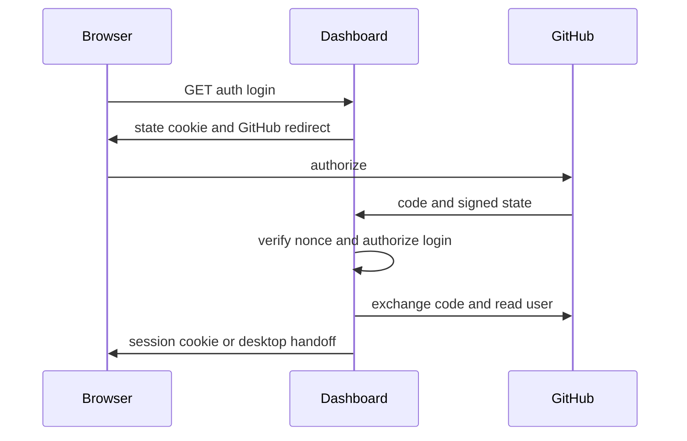
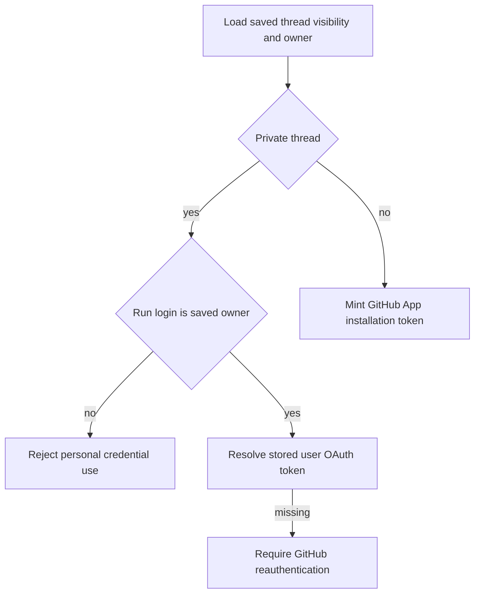

# Authentication, authorization, and credential scope

Open SWE separates browser identity, GitHub acting authority, workspace authority, and untrusted external input. A dashboard session establishes who is using the product; it does not by itself grant a sandbox a long-lived GitHub secret. Thread metadata and workspace routing are also security inputs, so credential selection validates their ownership and visibility rather than trusting a caller-supplied login. See also [sandbox lifecycle](../architecture/sandbox-lifecycle.md), [dashboard UI](../integrations/dashboard-ui.md), [configuration](../operations/configuration.md), and [invocation](../workflows/invocation.md).

## Dashboard identity and admission

The dashboard uses the GitHub App OAuth code flow. `GET /dashboard/api/auth/login` creates a random nonce, puts its HMAC in a signed, ten-minute state JWT, and retains the raw nonce in `osw_oauth_state`. The callback constant-time compares the cookie-derived HMAC before exchanging the code, resolving the GitHub user, applying the login gate, persisting the OAuth result, and issuing a session. `sanitize_redirect_to` accepts only a non-protocol-relative relative path or an absolute URL whose origin is `DASHBOARD_BASE_URL` or one of `DASHBOARD_ALLOWED_ORIGINS`; login and API paths are excluded to prevent redirect abuse.

GitHub OAuth login binds the state JWT to the browser cookie before a session or desktop handoff is issued.

Sessions are HS256 JWTs signed by `DASHBOARD_JWT_SECRET`, expire after seven days, and are carried in the `HttpOnly` `osw_session` cookie. `require_session` rejects a missing or invalid cookie and binds the session actor to audit logging; `/me` reports that identity and recomputes `is_admin`. Cookie policy is derived from deployment topology: HTTPS split-origin deployments use `Secure; SameSite=None`; same-origin and local deployments use `SameSite=Lax`. The OAuth state cookie is `HttpOnly`, `SameSite=Lax`, restricted to `/dashboard/api/auth`, and lasts only for the state TTL.

Startup requires `ALLOWED_GITHUB_ORGS` or `ALLOWED_GITHUB_USERS`, except a desktop-local backend configured with `OPEN_SWE_LOCAL_AUTH_TOKEN`. A login is admitted when it case-insensitively matches the explicit user list or is an active member of any allowed organization. Organization membership is checked with a repository-independent GitHub App token requesting `members: read`; missing app access, API failures, invalid responses, and non-active membership deny access. This is deliberately fail-closed.

Desktop login does not leave a browser session on a loopback listener. The callback returns a 120-second signed handoff code to a fixed `127.0.0.1` callback, and the desktop app must provide the matching PKCE S256 verifier to redeem it for a session. Separate cloud-terminal tickets last 60 seconds and are checked for both their fixed audience and the requested thread ID.

All dashboard API routers apply `require_same_origin_for_mutations`. Read-only methods are exempt; configured deployments require an allowed `Origin` or `Referer` for cookie-authenticated mutations. Bearer-only GitHub requests without a session cookie are exempt because the credential is not ambient browser state. With no configured dashboard origin, this CSRF check is intentionally a local-development no-op.

### Authorization after login

`CONFIGURED_ADMINS` is a case-insensitive set of GitHub logins and emails. Dashboard dependencies recompute membership from the session rather than trusting an admin bit stored in thread data. Repository-specific dashboard actions also verify that the user's current GitHub OAuth token can read the requested repository, retrying once after a forced refresh on 401; workspace-scoped actions perform the corresponding check with the GitHub App credential.

Slack linking uses Slack OpenID Connect with `openid email profile`, so the link is based on Slack-verified identity claims rather than a self-asserted account. If `SLACK_TEAM_ID` is set, identities from another workspace, including Slack Connect contexts, are rejected. Shared-thread account-link prompts use only the token-free dashboard settings URL, so another reader cannot redeem or attach someone else's authorization.

## GitHub credentials and thread scope

There are two deliberately distinct acting identities:

- A **private, user-owned thread** may use the saved GitHub OAuth token of its recorded owner, but only when the run's GitHub login matches that owner. A system-owned thread may not use private credentials, and malformed visibility or owner metadata is rejected.
- A **public thread** resolves to a GitHub App installation token. Thus public/shared work does not silently borrow a participant's personal OAuth authority.

`resolve_github_token` reads the saved thread scope, clears thread-local cached tokens before resolution, and raises `GitHubUserAuthRequired` if a private owner has no usable OAuth authorization. It only falls back to the App token when the thread has no eligible private credential owner. `pr_author_login` is a related authorship guard: in eligible shared user threads a requested author must be a recorded participant; private threads remain owner-pinned and system threads use the App.

Thread scope determines whether a run may act as a person or must act as the App.

Resolved tokens are process-memory-only cache entries keyed by `(thread_id, principal)`, where normalized `login:`/`email:` principals separate users and `bot` separates App tokens. The cache refuses an unbound user token. User entries expire within 60 seconds of their token expiry or after a 24-hour cap; a cached bot token that is expired can be re-minted with its recorded repository restriction. Explicit invalidation clears every cached token for a thread.

GitHub App installation tokens are obtained through the App SDK and cached only in-process by installation ID, repository IDs/names, and requested permissions. The cache stops reusing a token ten minutes before expiry. A missing App configuration may use the local `gh` CLI only in local development; otherwise token minting returns no credential.

## Sandboxes: scoped authority without secret injection

`workspace_token` gives a sandbox an installation-wide App token unless its caller explicitly supplies repositories; workspace routing/preload repositories are not themselves an access limit. For narrowed access, `repository_token` resolves only requested repository names that the App installation can actually reach and mints a token for those repository IDs. If no requested match exists it grants no credential; the installation-wide discovery token stays server-side. This makes webhook/reviewer callers responsible for passing a restrictive repository set where required.

LangSmith sandboxes receive GitHub access through proxy configuration, not environment variables. The proxy's credential record retains the repository and permission scope, expiry, workspace, and base proxy configuration. Near expiry it refreshes from that recorded scope (or an intersection with a narrower requested set), preventing a refresh from broadening authority. The before-model middleware attempts this refresh for each thread; failures are logged rather than allowing the refresh hook itself to terminate the model call.

## External trust boundaries

Webhook routes verify the raw request body before parsing it and fail closed when signing material is absent:

- GitHub compares `sha256=HMAC(GITHUB_WEBHOOK_SECRET, body)` with `X-Hub-Signature-256` using constant-time comparison; `/webhooks/github` returns 401 on failure.
- Slack verifies `v0:timestamp:body` with `SLACK_SIGNING_SECRET`, constant-time compares the `v0=` signature, and rejects timestamps more than 300 seconds from current time to limit replay.
- Linear constant-time compares the raw-body HMAC-SHA256 in `Linear-Signature`; the route also drops deliveries whose signed `webhookTimestamp` is more than 60 seconds old.
- The public `/webhooks/run-complete` route compares its query token to `RUN_COMPLETE_WEBHOOK_SECRET` in constant time. An unset secret rejects every request and disables completion/failure replies.

GitHub deliveries are additionally routed only when their repository is assigned to a workspace. For public repositories, an optional `PUBLIC_REPO_ORG_GATE` permits triggers only from active members of that organization (or configured internal bots); private repositories bypass that gate. GitHub comment text from an author who is not a registered user is wrapped in reserved untrusted-content tags, after any attempt to supply those tags in the raw comment has been replaced.

## Stored secret protection and operations

`TOKEN_ENCRYPTION_KEY` accepts one Fernet key or a newest-first comma/newline-separated list. `MultiFernet` encrypts with the first key and tries every key to decrypt, allowing staged key rotation. Invalid ciphertext and a missing encryption key decrypt to an empty value rather than raising. GitHub OAuth access and refresh tokens are encrypted before storage; token records are keyed through the user record rather than a mutable GitHub login. When a refresh token produces GitHub's unrecoverable `bad_refresh_token` or `unauthorized_client` error, the stored authorization is removed so callers require a clean sign-in.

### Focused tests and safe changes

`tests/dashboard/test_dashboard_github_login_gate.py` verifies startup failure without an allowlist, the local-backend exception, explicit-user matching, multi-organization membership, union semantics, and rejection outside both lists. Changes to identity policy should extend those tests and preserve the startup gate. Changes to credential selection should preserve the private-owner and system-thread invariants in `openswe/credential_scope.py`; changes to sandbox token minting must ensure a refresh cannot turn a repository-scoped token into installation-wide access.
