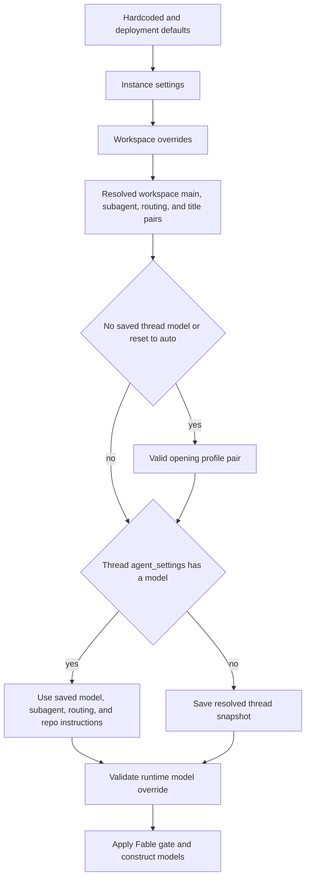

# Models, profiles, settings, and instructions

Open SWE separates **effective defaults** from a conversation's **snapshot**. Instance and workspace settings establish defaults; a profile can customize the opening of a hosted thread; and `agent_settings` in thread metadata freezes the resulting operating choices for later runs. The currently triggering person is still resolved on each preparation pass for identity, authorization-related context, PR preference, and standing instructions. This prevents a long-lived, multi-party conversation from silently switching its base model when another participant has different profile preferences. See [Threads and state](threads-and-state.md), [Agent graph](../architecture/agent-graph.md), and [Configuration](../operations/configuration.md).

## Selectable models and validity

`openswe/dashboard/options.py` is the curated model registry. A `ModelOption` defines a provider-prefixed id, UI label, supported efforts, default effort, image capability, and optionally whether it may be saved as a default. `SUPPORTED_MODEL_IDS` is derived from that list. Effort must always be validated against the particular model: it is not a global enum—for example, Kimi K3 accepts `low`, `high`, and `max`, whereas Gemini has `minimal` through `high`.

`default_model_pair()` is the terminal deployment fallback. It reads `LLM_MODEL_ID` and `LLM_REASONING_EFFORT`, falling back to a credential-sensitive built-in model and a default effort. It rejects an unsupported id, a non-defaultable id, or an unsupported effort with `ValueError`; it does not construct an arbitrary provider model. `default_vision_model_pair()` similarly chooses a supported OpenAI or Anthropic image-capable pair when one is needed.

Persisted selections can become stale as the registry evolves:

- A non-deprecated unsupported id is eligible for `provider_fallback_pair()`: the resolver prefers a supported model in the same Claude family, then another model on the same provider. It retains a compatible effort (and maps Gemini `none` to `minimal`) or uses the fallback's default effort.
- Explicitly deprecated ids are not provider-migrated. Their replacement map is presently empty, so they fall through to the applicable default.
- Fable is a non-defaultable model family. `available_requested_models()` hides it if the effective workspace setting disables Fable, and `gate_fable_model()` replaces any resolved Fable id with a safe non-Fable Anthropic pair. The factory applies that final gate to main, subagent, and title models, including stale thread snapshots.

The dashboard enriches copied registry entries with a context window, taking an explicit Codex override first, then LangChain's provider profile, then a small fallback table. This information is presentation metadata; it does not alter the registry.

## Settings tiers and persistence

Workspace configuration has two persistent tiers plus hardcoded defaults:

1. The instance record is stored under key `"default"` in the legacy `["team_settings"]` namespace.
2. Each workspace has a sparse `["workspace_settings"]` record keyed by slug. Missing and `None` fields inherit from the instance record.
3. The effective `WorkspaceSettings` merges hardcoded defaults, then instance values, then workspace overrides. Store reads fail soft to hardcoded defaults so a store outage does not prevent every agent or reviewer run.

The settings schema carries main and subagent pairs for agent and reviewer roles, routing pairs (`fast`, `balanced`, and `performance`), review chat, and thread titles. Each normal default resolver accepts a supported and defaultable pair, otherwise tries same-provider recovery, and finally uses `default_model_pair()`. Review chat inherits the agent default when its own pair is missing or invalid. Title selection has a deployment guard: an OpenAI title model changes to the configured Anthropic title model when neither usable gateway routing, an OpenAI key/OAuth, nor another OpenAI credential path is available.

Profiles are independent user records (`UserRecords("profile")`) containing a main pair, optional subagent pair, default repository and branch choices, PR preferences, and feature preferences such as model routing. OAuth credentials deliberately live in `UserRecords("github_oauth_token")`, so a profile update and OAuth refresh write distinct records instead of clobbering one another. Profile API validation normalizes a stale non-deprecated id to a same-provider fallback where possible, rejects invalid pairings, and disallows non-defaultable models. Run-start lookup is fail-soft; dashboard reads use the direct getter and can surface storage failures.

*Caption: settings are merged for defaults, while a thread snapshot stabilizes a hosted conversation after its opening run.*

## Agent factory precedence and lifecycle

`build_agent()` resolves hosted runs in this order:

1. It loads and normalizes the thread snapshot. `agent_settings` is typed, cached for five minutes, and strips malformed or obsolete data; reads fail soft. Normal writes log and continue if they fail, while the model-handoff path may request a strict write because it must persist an accepted request before changing models.
2. It obtains workspace defaults and only loads the sender's opening profile when there is no saved thread model (or a dashboard switch deliberately resets selection to auto). A valid profile main pair becomes both main and subagent pair unless the profile supplies a valid subagent pair.
3. A saved thread model supersedes those defaults and also restores the saved subagent, routing choices, repository instructions, and routing state. A dashboard explicit-selection mode disables adaptive routing; an auto reset clears the saved requested model and re-enables routing unless a later handoff pins a choice.
4. A valid `configurable.agent_model_id` plus `agent_effort` can replace the selected main and subagent pair. The factory persists the resolved snapshot before applying the dynamic Fable gate, so an administrator can disable Fable for existing threads.

Adaptive routing is separately controlled: a profile Boolean overrides the workspace Boolean, and otherwise routing is off. When active (except Slack ask runs), the factory starts with the `fast` route and retains all routing pairs in the snapshot. A model request classified from the opening message is offered only for eligible dashboard or Slack runs before handoff completion. The request and effort must be available and compatible; image-bearing input rejects a requested text-only model. Before the requested model is activated, the middleware writes `requested_model`, `model_id`, effort, and disables routing with a strict thread-settings write. A failed validation or persistence leaves selection unchanged. Later runs reuse the saved request without classifying again.

Image capability is also protected during normal execution. If a selected/routed model is text-only, the factory builds an image-capable fallback model and registers the text-only clients with `ImageModelFallbackMiddleware`; model handoff instead rejects an incompatible requested model. This distinguishes an explicit unavailable request from a safe capability fallback for a normal run.

## Provider construction, gateway, and runtime fallback

`provider_model_kwargs()` maps the resolved effort to the provider API: OpenAI uses a `reasoning` object (with `summary: "auto"` except for `none`), Anthropic uses adaptive summarized thinking plus `effort`, Gemini 3 uses `thinking_level`, Fireworks nests `reasoning_effort` under `model_kwargs`, and Baseten accepts only `low`, `high`, and `max` as `reasoning_effort`.

`make_model()` constructs through `init_chat_model` with six retries and a 600-second request timeout for shipped providers. OpenAI defaults to the Responses API with `store=False`, output version `responses/v1`, and encrypted reasoning included. When direct OpenAI has no API key, desktop OAuth may construct the client instead. Baseten is initialized as an OpenAI-compatible provider and requires `BASETEN_API_KEY` plus its direct base URL unless the gateway was successfully applied. Codex context-window profile overrides are passed into model construction.

Gateway routing is tri-state at the workspace level: `True` and `False` are authoritative; `None` inherits `LANGSMITH_GATEWAY_ENABLED`, or (when unset) the presence of `LANGSMITH_GATEWAY_API_KEY`. For routable provider prefixes with a LangSmith key, gateway overrides replace the direct base URL and API key and decide OpenAI Responses versus Chat Completions. An unroutable provider or missing LangSmith key is logged and remains direct rather than failing the run.

Request routing is not runtime failure fallback. `ModelFallbackMiddleware` receives `LLM_FALLBACK_MODEL_ID` when configured; otherwise Anthropic primaries cross-fallback to OpenAI and OpenAI primaries to Anthropic. Google, Fireworks, Baseten, and other providers do not silently cross-route. Construction failures are deferred into an error model so the graph can present the setup failure in the run rather than fail agent assembly immediately.

## Instruction sources and authority

The system prompt is assembled by `construct_system_prompt()` from bundled or `DEFAULT_PROMPT_PATH` default instructions, source and working-environment guidance, repository scope, collaboration guidance, optional repository custom instructions, workspace instructions, and recent context. Repository custom instructions are workspace-admin-managed records in `["agent_instructions"]`, keyed by normalized `owner/name`; repository access is required to manage them. At a thread's opening, the factory resolves them for the prompt default repository and saves the text in the thread snapshot. Later runs use that saved value, and a lookup failure simply leaves the section absent.

Workspace instructions are part of the rendered shared system prompt for the current workspace. Repository custom instructions are likewise system-prompt content and are rendered as **Repository-specific Custom Instructions**. The shipped prompt gives both mandatory system-prompt authority, but says repository-specific instructions win over workspace instructions; repository `AGENTS.md` wins over both and must be read before work. A deployment default prompt is prompt-level guidance below repository policy.

Personal instructions are different. They are stored per user in `UserRecords("instructions")`, keyed by GitHub login and limited to 20,000 characters. The dashboard Profile tab and the `save_user_instructions` tool share this separate record so an agent write cannot be overwritten by a profile save. During preparation, Open SWE resolves the current instructions for each participant and injects them as that person's `standing_instructions` in a dynamic context message. These instructions apply when acting on that person's requests; they do not become a shared thread system prompt, and the collaboration prompt makes them yield to repository instructions and `AGENTS.md`.

## Operational and test guidance

When adding a model or effort, update the registry, provider mapping, default eligibility, gateway support if applicable, and tests for stale/deprecated fallback and image capability. Changes to settings must preserve sparse workspace inheritance, fail-soft read behavior, and the final Fable gate. Changes to first-message handoff should retain its atomic order—validate, strictly persist, then activate—and cover reuse on later runs. `tests/agent/test_model_handoff_prepare.py` is the focused specification for handoff persistence, classification outcomes, incompatible efforts/images, routing reset, and trace attribution.
