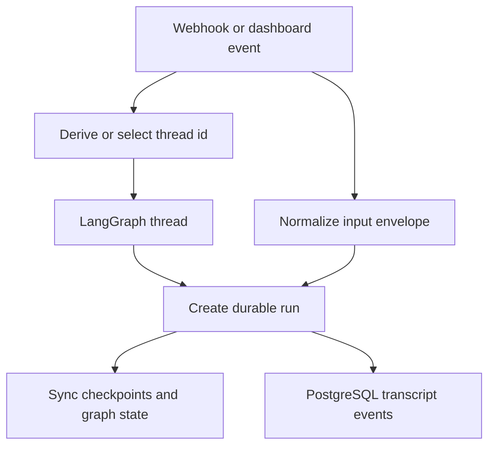
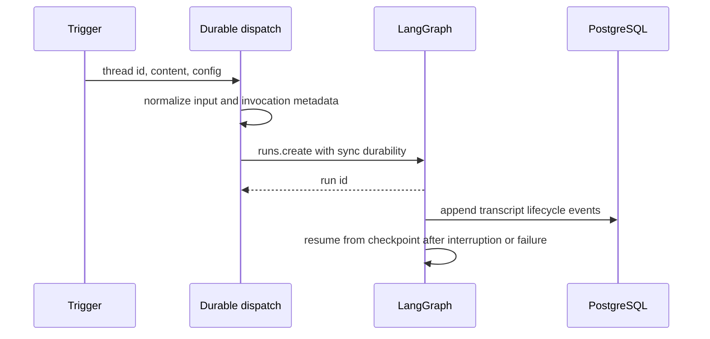

# Threads, durable runs, and persistent state

A **thread** is the durable identity of an Open SWE conversation. A **run** is one execution on that thread: it adds input and advances the graph from its saved LangGraph state; it does not replace the conversation. The system deliberately keeps several kinds of state in different owners:

| Owner | Owns | Do not use it for |
| --- | --- | --- |
| LangGraph thread and checkpointer | graph messages/checkpoints, LangGraph thread metadata, run lifecycle | transactional application records or dashboard transcript reads |
| LangGraph Store | independently namespaced key/value records | ordered, transactional follow-up delivery |
| PostgreSQL | transcript event log and projections, queued messages, users, workspaces, tasks, application relations | graph checkpoints |

This separation is important operationally: a missing Store item is an empty record, but a Store outage is an error; a PostgreSQL transcript is a UI-facing event log rather than the agent's LangGraph checkpoint; and a workspace or user profile is not automatically mutable thread configuration.

## Thread identity is a routing contract

`openswe/thread_ids.py` is the single home for deterministic identities shared by webhooks, dashboard flows, reviewers, and background work. Its input strings are persisted routing contracts: changing one makes existing threads unreachable from entrypoints that re-derive it.

| Purpose | Derivation key | Algorithm |
| --- | --- | --- |
| Slack location | `slack:{channel}:{timestamp}:{nonce}` | URL-namespace UUIDv5 |
| PR comment | `{owner}/{repo}/pr/{pr_number}` | URL-namespace UUIDv5 |
| Reviewer / review scout | PR key plus `/reviewer` or `/review-scout` | URL-namespace UUIDv5 |
| Per-user review chat | PR key plus `/chat/{login.lower()}` | URL-namespace UUIDv5 |
| Review style and baby-sit lock | repository/key-specific strings | URL-namespace UUIDv5 |
| Linear or GitHub issue | `linear-issue:{id}` / `github-issue:{id}` | SHA-256-derived UUID |

The distinct reviewer and agent PR keys prevent collisions. Branches created by Open SWE carry a UUID, which `thread_id_from_branch` can recover; otherwise callers use their external-object derivation.

Threads that people can open are created through `create_thread`, which requires a nonblank title. It stamps a creator's `prefer_tools_in_sandbox` preference at creation; an `if_exists="do_nothing"` create preserves existing metadata. System-created threads may use `ensure_titled_thread`: it creates when absent and updates generated titles, but never overwrites a human rename marked by `title_locked`.

A stable thread ID joins ingress, durable graph execution, and the separately persisted UI transcript.

## Thread metadata, users, workspaces, and tasks

LangGraph thread metadata is small, durable, queryable conversation context. Dashboard thread creation stamps source/origin, owner and visibility, category and trigger kind, participants, title, repository/model selection, and workspace. The workspace is carried forward into follow-up configuration under both `workspace` and the compatibility key `environment`; a system follow-up also restores source, repository, actor, and `SourceContext` from metadata.

A user is a PostgreSQL `users` record with a stable UUID and one or more provider identities keyed by immutable external IDs. This lets the dispatcher canonically label the same known person across Slack and dashboard inputs as `user:{uuid}`. Identity lookup is intentionally best effort at ingress: an unavailable database retains the surface identity rather than refusing a run.

A workspace is PostgreSQL-owned configuration: repositories belong to exactly one workspace, while a workspace can bind Slack channels, MCP connections, settings, and sandbox snapshot definition. Routing chooses the existing thread's workspace first, then an opening-message tag, repository, Slack channel, user default, and finally `default`. A resolved workspace is run context, not a replacement thread identity.

Tasks are also PostgreSQL relations, not thread metadata. A task has one coordinator thread and task memberships map coordinator and worker thread IDs to it. Reserving a worker is serialized with an advisory lock, verifies that the workspace still exists and matches an existing task, and refuses a worker identity already attached to a different delegation.

## Input normalization and per-run configuration

`dispatch_agent_run` accepts either a prebuilt `RunInput` or content plus source identities, never both. For ordinary dispatch it identifies a sender from Slack, GitHub, Linear, or a system source, canonicalizes a known person, builds namespaced sender/channel/system introductions, and wraps authored text or text blocks in an escaped `<input-message>` envelope. Entity identifiers must be nonempty namespaced IDs and reject whitespace and XML-significant characters.

Dynamic context is separate `<dynamic-context>` input. Its canonical content hash deduplicates channel and system introductions. Queue middleware uses hashes visible in graph state, not merely historical hashes: after summarization removes messages before its cutoff from the prompt, context from that hidden region is eligible to be injected again.

`RunConfig` is the tolerant `configurable` contract crossing webhooks, dashboard, cron, and graphs. It allows unknown fields and emits only supplied fields, so intermediate writers preserve data they do not understand. Parsing drops only invalid fields iteratively; it also rejects booleans where integer identifiers such as PR numbers are expected. Configuration is per run, whereas a thread's metadata is the durable conversation index.

## Durable dispatch, interruption, and completion

`create_durable_run` is the shared LangGraph dispatch contract. It creates/titles a system-owned thread when given a title, prepares an invocation ID and start timestamp in both run configuration and metadata, sets the v3 compatibility marker, and invokes `runs.create` with these defaults:

- `multitask_strategy="interrupt"`: a follow-up stops an active run and continues from the saved history/checkpoint. Callers that must wait, such as selected sandbox flows and background work, can request `enqueue`.
- `durability="sync"`: LangGraph checkpoints before each step, so a crash or recycle can resume from the last checkpoint.
- `if_not_exists="create"`, resumable streaming, the v3 stream-mode set, and subgraph streaming: an attaching dashboard can replay externally started runs and receive their events.
- A completion webhook only when `RUN_COMPLETE_WEBHOOK_SECRET` is configured and `COMPLETION_WEBHOOK_URL` is absolute HTTP(S) and non-loopback. Invalid or local URLs are logged and omitted rather than causing every run creation to fail.

The dispatcher selects the `agent` or `reviewer` graph and reports Slack background status for appropriate agent runs. Run metadata also receives the resolved user ID when available, Slack conversation type, and pull-request metadata for review graphs.

The dispatch path gives all product surfaces the same interruption, checkpoint, streaming, and completion-webhook behavior.

## PostgreSQL follow-up queue

The queue is not a Store list. `thread_queued_message` stores each follow-up as its own JSONB row with a monotonic identity sequence. Writers insert rather than rewrite a shared array, and an optional dashboard `queue_id` is unique per thread, so retrying that dashboard send does not enqueue it twice. After insertion, the queue keeps at most `MAX_QUEUED_MESSAGES` (100) and deletes older rows with a warning.

Before each model call, queue middleware snapshots a thread's rows oldest first, turns them into normalized messages, and removes *that snapshot* only after all conversion succeeds. A concurrent writer remains queued for the next call; a conversion failure leaves the captured rows in place. Webhooks normally interrupt instead of relying on this mechanism, while the dashboard uses it to inject a deliberate follow-up into a run already in flight.

## Transcript state is a PostgreSQL event log

Dashboard threads receive transcript metadata only when PostgreSQL is configured. Their creation appends `thread.created` after the LangGraph thread exists, carrying LangGraph metadata for the transcript's access mirror. The transcript is neither a second graph checkpointer nor an arbitrary activity log: it is an event-sourced, UI-facing representation of turns, messages, streamed fragments, tool calls, notices, and optional sandbox turn checkpoints.

`transcript.append` is its only writer. Under a per-thread PostgreSQL advisory lock, it deduplicates command IDs via receipts, assigns contiguous per-thread versions, writes event, attachments/tool output, projections, head version, and notification in one transaction. Replaying an accepted command returns its original version rather than appending another event. Projections are transactional and idempotent; canonical `message.completed` data replaces an accumulated stream fragment, allowing a lost fragment to self-heal.

The snapshot reader uses a repeatable-read transaction over projections, so the thread row, turns, messages, and tools correspond to one version without consulting LangGraph. It authorizes against mirrored LangGraph metadata for that reason. Only authorization- and snapshot-relevant metadata keys are mirrored; mirroring failures are logged but do not fail the originating metadata update, so operators should treat such warnings as possible access-state drift.

## LangGraph Store access

`openswe/store.py` is the sanctioned wrapper around LangGraph Store. Its policy is deliberately strict: a 404 reads as `None`, while every other transport failure raises. `TypedStore` validates records with a Pydantic model; a requested unreadable record raises, whereas searches log and skip malformed entries so one stale item does not break a whole listing. Store search namespaces are prefix matches, so callers that must distinguish a requested namespace from nested descendants use `StoreEntry.namespace`.

## Operating and changing this boundary

- Preserve every deterministic ID formula and metadata field that external ingress reuses; migration requires an explicit compatibility lookup, not a silent formula edit.
- Choose `interrupt` when a new request should supersede/continue current work and `enqueue` only when ordering behind live work is intended. Do not replace queue rows with a read-modify-write list.
- Treat LangGraph checkpoint retention independently from PostgreSQL transcript retention. Deleting a transcript removes its event/projection graph and receipts, but does not describe deletion of the LangGraph thread or checkpoint.
- Keep access-relevant metadata writes on the transcript mirror path. A new authorization predicate needs a corresponding mirrored key.
- Keep user, workspace, and task relations in their PostgreSQL owners. Put only conversation-local, routing-relevant facts in thread metadata.

See [Invocation](../workflows/invocation.md), [Follow-up Messages](../workflows/follow-up-messages.md), [Models, Profiles, and Instructions](./models-profiles-instructions.md), and [Sandbox Lifecycle](../architecture/sandbox-lifecycle.md) for the surrounding flows.
