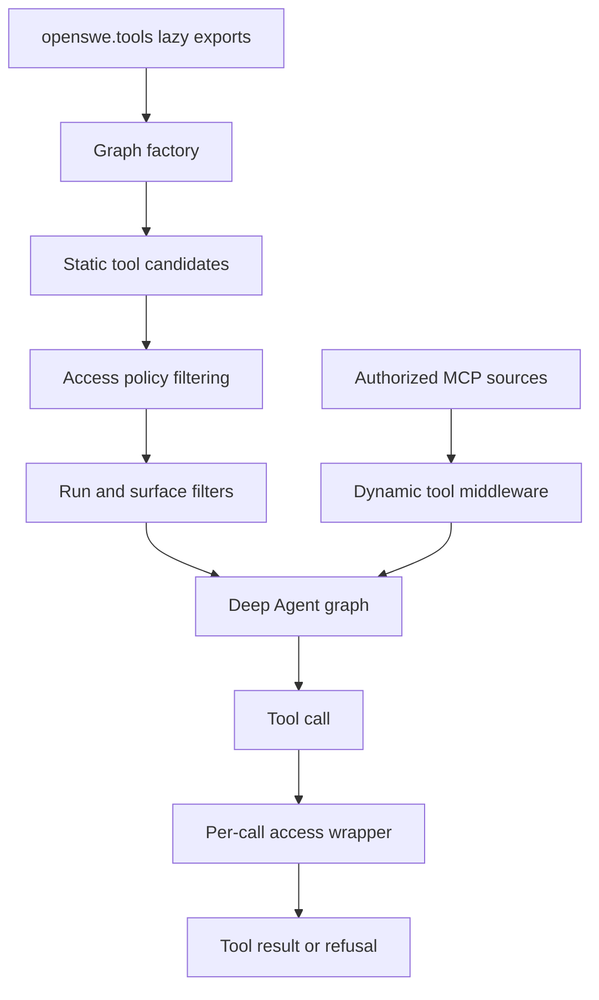
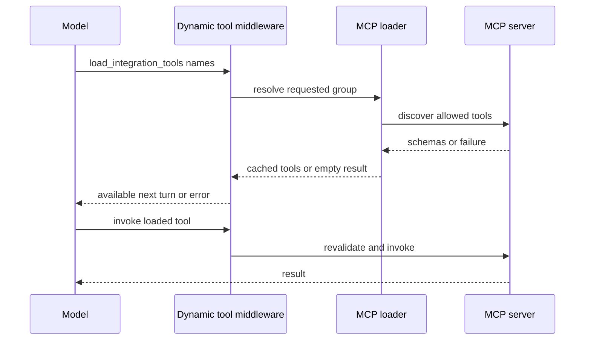

# Tool capability model

Open SWE treats a tool export, a graph's advertised tool surface, and permission to execute as separate decisions. `openswe.tools` is a lazy import facade; graph factories choose a curated list; access wrappers and middleware then limit what a particular run can see or do. That layering is important: adding an importable tool does not grant it to the coding agent, reviewer, PR chat, a subagent, or an MCP client.

## From catalog to a run-specific surface

`openswe.tools` maps public names to implementation modules in `_TOOL_MODULES`. Reading an export imports and caches it on demand. The custom module class also makes a public export win over an imported submodule with the same name. The catalog includes local tools and selected GitHub, Slack, and incident integrations; it is not a universal allowlist.

The main factory, `openswe.server:get_agent`, begins with a broad static set: web and HTTP access, background work, plan and user-settings operations, thread and babysit actions, PR and human-review flows, sandbox recovery, scheduled/event work, Slack, feedback, and selected administrative operations. It then applies `permitted(static_tools, tool_access)` before assembling the graph. Tool declarations can require a private thread, owner, admin thread, or admin surface; a sole writer may receive a deliberately projected result instead of a sensitive full result. The `@access` wrapper repeats the check on every invocation, so a change in thread access during a run is not protected only by the factory-time decision.

This path separates importability, model visibility, and execution authorization.

### Context and mode filters

Several restrictions are applied after the static candidate list is built:

- A local desktop run is reduced to `http_request`, `fetch_url`, and `web_search`; a stop-summary run is reduced to Slack thread reading and reply. Stop-summary mode also hides mutating Deep Agents built-ins (`delete`, `edit_file`, `execute`, `task`, and `write_file`) and `grep`.
- Slack tools are removed when the run has no eligible Slack context, except schedule runs retain channel listing and posting. Concierge and Slack-ask modes remove further thread-bound actions. Human-review and expedited-review actions depend on the Slack configuration and workspace setting.
- Client-owned Responses tools replace same-named server tools. `ClientToolsMiddleware` returns a pending placeholder for one of these calls and ends the run before another model turn; the client supplies the real result in the next run.
- `ExcludeToolsMiddleware` removes names from every model request, rather than rebuilding the agent. It is placed after tool-injecting middleware so it can hide Deep Agents built-ins as well as curated tools. The ordinary main-agent exclusion is `grep`.

Deep Agents adds filesystem and delegation tools independently. `DEEP_AGENT_TOOL_NAMES` reserves `delete`, `edit_file`, `execute`, `glob`, `grep`, `ls`, `read_file`, `task`, and `write_file`; static and dynamic names are reserved against this set. The current code has no active plan-mode tool gate: legacy `plan_mode` is discarded from transcript events, and the focused factory test verifies that a loaded MCP tool remains available for either legacy plan-state value. Read-only behavior is instead enforced by purpose-specific surfaces and exclusions.

## Dynamic MCP tools and credential scope

For eligible non-local, non-stop-summary runs, the factory loads MCP definitions from ordered sources: instance, workspace, then the private-thread owner's personal connections; if configured, the workspace's LangSmith Managed Tools gateway is last. A later source replaces a connection with the same name from an earlier source. If source settings cannot be read, the loader returns no tools rather than falling back to a lower-precedence connection.

MCP connections are constrained configuration, not arbitrary URLs: their names are normalized, endpoint and OAuth token URLs must be HTTPS without embedded credentials or secret query parameters, connection headers are validated and encrypted, and the dashboard-facing model omits encrypted headers and client secrets. A connection exposes only its explicit `allowed_tools`.

`DynamicToolMiddleware` advertises `load_integration_tools` and a catalog of MCP tool names, but defers the costly MCP handshake and credential work until the model requests a name. Names cannot duplicate the loader, static tools, Deep Agents built-ins, or another dynamic group. A successful load records `loaded_integration_tools` in graph state and instructs the model to call the tool on its next turn. An unknown name, unavailable group, direct pre-load call, or failed load produces a recoverable tool error; group resolution is lock-serialized and cached, including an empty result after failure.

The dynamic tool middleware's state is run-scoped, while resolved group objects are middleware-instance cached. Providers that support adding tools mid-conversation receive provider-native additions anchored at the load result; other models receive loaded tools in the normal tool list.

A wrapped MCP call re-authorizes its source, re-resolves the connection, and rejects scope, URL, transport, enablement, or allowlist changes with a request to start a new run or reconnect. Tool discovery uses a stale-while-revalidate catalog cache keyed by source namespace, connection name, and revision; it rejects duplicate remote names and redacts discovery failures. Calls have a timeout and convert unexpected failures to a generic credential/connection error.

Personal and Managed Tools sources authorize only when the saved private-thread owner starts the run. Consequently, provider grants, personal tokens, consent links, and LangSmith tokens stay server-side rather than becoming sandbox data or model arguments. Instance and workspace connections remain separate source namespaces, which also isolate their caches.

## Specialist and read-only surfaces

The reviewer factory has its own sandboxed graph and deliberately receives review operations—diff retrieval; finding creation, update, listing, publication, resolution, and replies—plus `web_search`, `fetch_url`, and `http_request`. It does not receive commit, push, or PR-opening tools. Review preparation computes the diff and changed line set so finding creation can be validated against the diff before publication.

The review UI's PR chat graph is a separate, sandbox-less surface. It has GitHub API read tools (`read_repo_file` and `search_repo_code`), review finding lookup, web tools, and proposal tools for review comments and PR review. The chat proxy seeds PR overview, diff, and findings as virtual `/pr/` files. Its `ExcludeToolsMiddleware` strips `execute`, `write_file`, `edit_file`, and `delete`; its delegated subagent is explicitly allowlisted only `read_file`, `ls`, `glob`, and `grep`. A repository-scoped GitHub App installation token is placed in run configuration for the GitHub-backed reads, rather than giving the model a user credential.

## Middleware gates for side effects

Capability boundaries are not only model-schema filters. The main graph installs `PullRequestCreationGuardMiddleware` on hosted runs, and also gives its delegated subagent the same guard. It intercepts `execute` and `background_execute` calls and blocks detected `gh pr create`, POST/body-based `gh api .../pulls`, and direct `curl` pull creation, including bounded nested-shell expansion. New pull requests must use `open_pull_request` so authorship is attributed through the intended credential scope; the guard returns a structured, non-recoverable error rather than allowing a shell fallback.

`WorkflowPushGuardMiddleware` is also placed in the main stack, and `ToolErrorMiddleware` normalizes tool failures for the agent loop. Together with per-call access wrappers, these gates mean a safe change must consider both whether the model sees a capability and whether an alternative execution path can bypass its authorization or attribution contract.

Administrative automation illustrates the layered approach. Automation tools are included in `ADMIN_TOOLS`, declare admin-thread/admin policies, audit writes, and return structured errors around schedule-service failures. Their identity comes from runtime configuration (or an authorized scheduled record), not a model argument. `read_user_settings` similarly requires a private owner and derives its subject from credential scope or verified thread participants; it returns selected profile settings and instructions, not integration credentials.

## Extending a capability safely

1. Implement and export the tool through `openswe.tools` only if it is part of the curated catalog.
2. Select the smallest graph surface that needs it, then account for local, stop-summary, Slack, client-owned, subagent, and read-only filters.
3. Declare an `@access` policy and put actor, thread, resource, and secret checks at the execution boundary. Factory filtering is not sufficient for sensitive operations.
4. For an MCP capability, validate connection configuration, use a scoped `MCPSource`, reserve all names, and ensure discovery/load failure is safe and useful to the model. Never expose stored credentials in schemas, arguments, logs, or errors.
5. If the operation has a required audited or attributed route, add a middleware guard for shell or HTTP bypasses and apply it to subagents where they can invoke the same underlying action.
6. Add focused tests for factory composition, dynamic loading and collision failures, scope revalidation, and the relevant mode/read-only/guard behavior. `tests/agent/test_factory_tool_loading.py` is the focused regression for MCP loading through the factory.

## Related pages

- [Agent graph](../architecture/agent-graph.md) — factory and graph composition.
- [Middleware stack](../architecture/middleware-stack.md) — ordering and broader middleware responsibilities.
- [Observability and MCP](../integrations/observability-and-mcp.md) — MCP integration configuration.
- [PR creation](../workflows/pr-creation.md) — attributed PR creation workflow.
