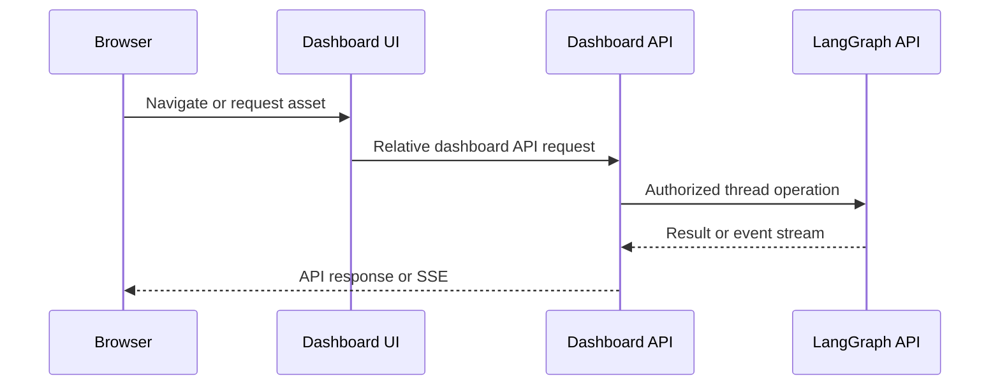
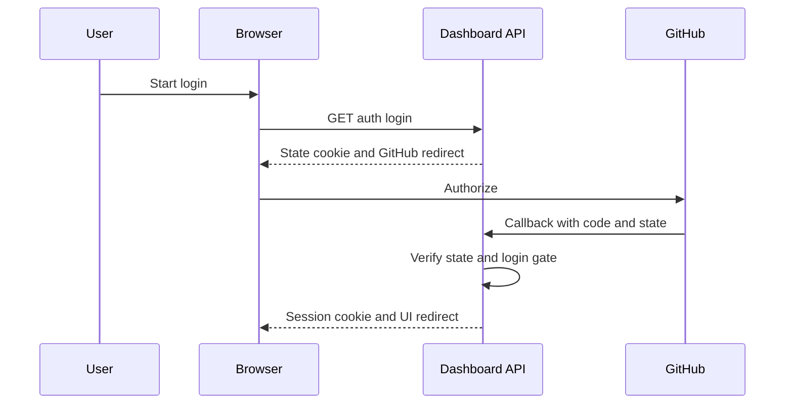
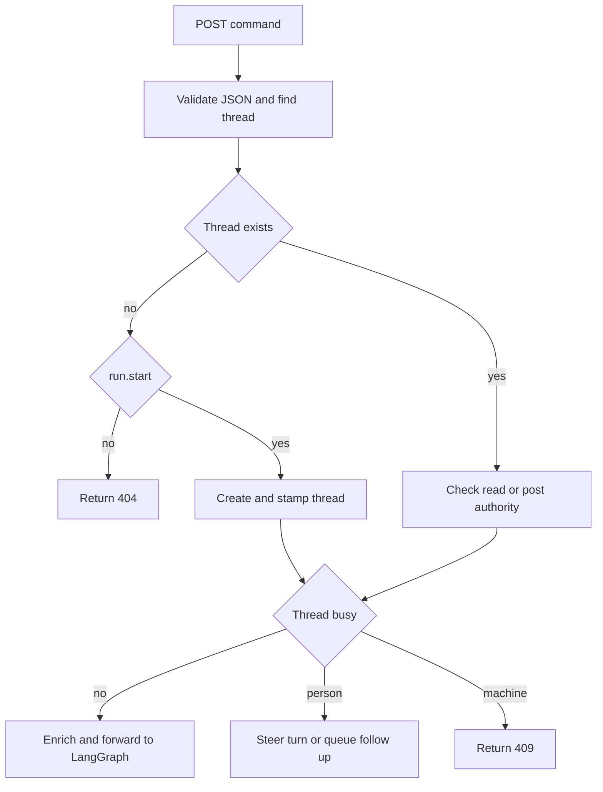

# Dashboard, web API, desktop, and CLI surfaces

Open SWE presents one agent system through three clients with deliberately different trust and execution boundaries. The browser dashboard is the primary UI; Electron packages that UI but proxies it to a configured backend; and `oswe` is a local command-line bridge for a cloud run. In all cases the dashboard API, rather than a client, is the authorization and LangGraph-credential boundary.

## API composition and UI delivery

`openswe.api.app.create_app()` installs credentialed CORS, dashboard and other service routers, and only then calls `mount_dashboard_ui(app)`. The dashboard aggregate router is mounted below `/dashboard/api` and applies `require_same_origin_for_mutations` to every contained route. Its package exports `router` lazily, so importing a dashboard helper does not transitively load FastAPI and every feature router.

The backend can serve a built client-only UI from `DASHBOARD_STATIC_DIR`, or the in-repository `ui/.output/public` if present. It serves hashed `/assets` with immutable one-year caching and `_shell.html` with `no-cache` for HTML navigation; unknown non-HTML paths and reserved backend prefixes are declined rather than becoming SPA responses. `DASHBOARD_DEV_SERVER_URL` replaces the static build with a reverse proxy to Vite while retaining the backend origin. The catch-all must remain after application routes, so extensions that add routes after mounting call `keep_dashboard_ui_last`.

A UI built for a LangGraph mount prefix needs matching `DASHBOARD_BASE_PATH`; TanStack Router consumes Vite's `BASE_URL` as its `basepath`.

Diagram: the bundled UI keeps browser API calls on the backend origin, while thread operations cross to LangGraph only behind the dashboard API.

## Browser authentication and request protection

GitHub login signs state containing a hash of a nonce held in a short-lived state cookie. The regular callback verifies that cookie, exchanges the GitHub code, enforces the configured login gate, persists the GitHub token, and issues the `osw_session` cookie. The cookie's `Secure` and `SameSite` values depend on the API scheme and whether the configured dashboard and API are one origin. `require_session` decodes that cookie and produces `401` when it is absent or invalid; `ADMIN_DEP` then adds the configured admin check.

The router-level CSRF control allows safe HTTP methods. For mutations, it requires an allowed `Origin` or `Referer` when cookie authentication is in play; an explicit bearer credential without the session cookie is exempt, and WebSockets are always checked. CORS uses `DASHBOARD_ALLOWED_ORIGINS` plus `open-swe://app`, with credentials enabled, so `*` is rejected. Origin checking protects the ambient session; endpoint and thread policies still decide whether a caller may read or change a resource.

Diagram: normal browser login binds the OAuth callback to state stored in the initiating browser before a dashboard session is issued.

## Thread and run boundary

The thread router exposes discovery, details, state, files and diffs as dashboard-owned, authorized views; it also exposes run, command, history, and stream endpoints that mediate access to LangGraph. `PrincipalDep` accepts a session, workspace API key, or validated GitHub Actions OIDC token. A machine principal can create only `system` threads and can read or post only threads stamped as started by that same principal; a person uses normal thread readability and postability rules. This prevents an API key from treating its whole workspace as its private thread namespace.

`POST /threads/{thread_id}/stream/events` verifies JSON content and readability before starting the SSE response, then forwards the body to LangGraph's stream endpoint with the server-side `LANGSMITH_API_KEY`. Upstream errors that arrive after streaming begins are represented as SSE `error` events, and transport exceptions close the stream. The browser does not receive that key or call the raw LangGraph API.

`POST /threads/{thread_id}/commands` is the unified command path for browser, key, and workflow clients. A previously nonexistent thread may be created only by `run.start`; other commands get `404`. The proxy authorizes and enriches the command before forwarding it. If a person starts work while a thread is busy, the protocol either steers the open transcript turn or queues a follow-up according to the requested strategy; machine callers receive `409` instead. After a successful start, run metadata is stamped best-effort and a background observer records time-to-first-text without delaying the command response. The dedicated run endpoints similarly proxy enqueue, list, and cancellation; a successful run cancellation interrupts matching transcript turns.

Diagram: command mediation enforces creation and principal invariants before either forwarding a start or handling concurrent person follow-ups.

## Web UI and deployment proxy

The React/TanStack Start app creates a router using `BASE_URL`, integrates the query client for SSR, and starts navigation timing before a route mounts. In a browser, its dashboard fetch layer constructs relative `/dashboard/api/...` URLs. This preserves same-origin cookies when the backend serves the UI; during SSR, it targets `DASHBOARD_API_URL` and explicitly copies the incoming `cookie` header because server-side `credentials: "include"` cannot do that.

Development Vite proxies backend prefixes to `DASHBOARD_API_URL` or `http://localhost:2024`, retaining OAuth redirects. A deployed Nitro handler proxies requests at runtime and refuses to run with no `DASHBOARD_API_URL`, avoiding an accidental production fallback. It streams bodies, strips hop-by-hop and invalid reframing headers, keeps OAuth redirects manual, and forwards each `Set-Cookie` as a separate header line.

## Electron: packaged UI and This Mac bridge

Electron runs the compiled UI at the privileged internal `open-swe://app` origin and maps only trusted app requests to the selected HTTP(S) backend. It accepts the backend URL from command line, `OPEN_SWE_BACKEND_URL` or the compatibility `OPEN_SWE_DESKTOP_URL`, saved configuration, or the development default; packaged builds have no default. The backend is public configuration, not a credential: the renderer proxies `/dashboard/api/*`, so it does not get a LangSmith key or invoke raw LangGraph routes.

Desktop login opens the backend's GitHub flow in the user's browser while an ephemeral loopback listener holds a random PKCE verifier. The callback returns a short-lived PKCE-bound handoff code to that listener; `POST /auth/desktop/exchange` redeems it for a dashboard session, which the app stores per backend origin in `~/.open-swe/config.json` with restrictive permissions. The same file is shared with the CLI.

New **This Mac** work is still a cloud thread, but its sandbox is connected through a per-thread bridge. Electron long-polls the backend for `execute`, upload, and download work, performs it in the selected checkout, and posts the results. It remembers the bridge ID with the thread, opens or reopens the bridge on use, and closes all bridges when the application exits; therefore a cloud thread remains visible elsewhere but cannot execute locally while this app is unavailable. A local project may be the current checkout or a dedicated worktree. The worktree option protects the current checkout and permits concurrent local threads, while only one agent may use a given working tree.

The Python desktop backend support remains relevant for legacy local-graph threads: a desktop run requires a real path that is explicitly allowlisted or below the desktop-managed worktree directory, uses `LocalShellBackend`, and routes scratch artifacts outside the project into sanitized per-thread directories.

## CLI: remote orchestration, local authority

`oswe run` starts a normal cloud agent on a remote deployment but registers a sandbox bridge rooted at the caller's current directory. The backend cannot initiate a connection to that machine, so the CLI long-polls for execution, upload, and download requests, executes them locally, and returns results. This is intentionally unsandboxed local authority: commands can read, write, and delete anything the invoking user can in that directory.

The CLI prefers a workspace API key, then a GitHub Actions OIDC credential, then a person's dashboard session. API-key and workflow calls are machine principals and create `system` threads; a person creates workspace-visible threads unless `--visibility private` is chosen. `oswe login` uses the same browser loopback PKCE handoff as Electron and stores the resulting `osw_session` by backend origin. `oswe auth status` validates the selected credential with the server.

Each CLI run gets a separate bridge and saves its mapping for `--thread`; it prints the dashboard URL on stderr and leaves conversation visibility to the dashboard. It reconnects a dropped event stream with backoff, but stops after ten consecutive short-lived reconnects. Completion is protocol-driven: the agent must call `cli_result`; its `stdout` becomes the CLI's stdout and its exit code becomes the process exit code. Missing completion or agent failure reports to stderr and exits `1`; a single Ctrl-C cancels and releases the bridge.

`oswe tool` and `oswe mcp` use the backend's MCP tool catalog, schemas, authorization, and implementations rather than embedding a separate tool policy. Those operations require a person's session, not a machine credential.

## Focused verification and operational checks

Dashboard tests exercise CSRF origin normalization and bypass resistance, desktop CORS preflight, UI route precedence and mount-prefix serving, path traversal prevention, and Vite proxy streaming, redirects, and multiple cookies. Thread tests cover image/model validation, startup metadata, and concurrent enqueue behavior. Changes at these boundaries should preserve: reserved server-path precedence over the SPA; manual OAuth redirects and independent `Set-Cookie` headers in proxies; pre-stream authorization; the raw-LangGraph-key boundary; and the explicit warning that CLI/local bridge execution is not sandboxed.

## Related

- [Architecture overview](../architecture/overview.md)
- [Auth and security](../concepts/auth-and-security.md)
- [Threads and state](../concepts/threads-and-state.md)
- [Deployment](../operations/deployment.md)
