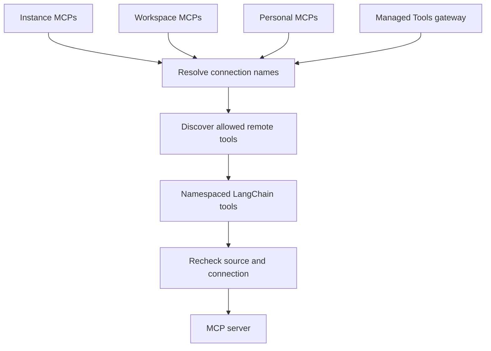

# MCP, tracing, analytics, and external tool integrations

Open SWE has two distinct kinds of external integration: tools that an agent may call through MCP, and telemetry systems that observe product activity. MCP connections are scoped, credentialed capabilities. Analytics is an optional, privacy-oriented event pipeline; audit logging is a durable record of selected sensitive mutations. They should not be treated as interchangeable logs.

See [Authentication and security](../concepts/auth-and-security.md) for authorization boundaries, [Tools](../concepts/tools.md) for agent tool behavior, [Models, profiles, and instructions](../concepts/models-profiles-instructions.md) for provider routing, and [Configuration](../operations/configuration.md) for deployment settings.

## MCP connection scopes and precedence

A connection has a stable lowercase name, HTTPS endpoint, `streamable_http` or `sse` transport, enabled flag, and explicit `allowed_tools` allowlist. During a run, sources are combined in this order: **instance**, **workspace**, **personal**, then an optional **LangSmith Managed Tools** gateway. A later source with the same connection name replaces the earlier connection completely; it does not merge settings or grants. Disabled connections and connections with an empty allowlist supply no tools.

The later MCP scope wins for a repeated connection name, while every invocation rechecks the selected source and connection.

Instance records are inherited by all runs. Workspace records are isolated by normalized workspace slug. Personal records are isolated by normalized login and may be used only when the current thread’s private credential owner is that user. Each scope stores its own record, so updating a personal connection cannot silently reuse credentials from an identically named workspace or instance connection. Older flat pre-workspace records are adopted into the instance scope on first access.

The dashboard exposes administrator-only instance and workspace APIs, while `/my-mcps` is bound to the signed-in user. Public responses include header *names*, connection state, allowlist, revision, and update time—not secret values. Header-reveal endpoints are explicit, scope-authorized operations with `Cache-Control: no-store`; changes, deletion, and reveal endpoints are audit-marked.

## Connection configuration and credentials

Connection URLs and OAuth token URLs must be HTTPS and cannot include credentials, fragments, control/whitespace characters, or secret-looking query parameters. A connection accepts at most 20 valid, case-insensitively unique headers; hop-by-hop and routing-sensitive headers such as `Host`, `Content-Length`, `Connection`, and `Proxy-Authorization` are blocked. Tool names are deduplicated and allowlisted explicitly.

Header values and OAuth client secrets are encrypted before persistence. The public model excludes them. When editing, saved authentication may be retained only from the previous record in the **same** scope and name; changing a URL requires explicitly replacing or clearing existing headers. OAuth and an `Authorization` header are mutually exclusive.

For a configured OAuth connection, Open SWE implements only the `client_credentials` grant. It decrypts the client secret server-side, obtains and caches a bearer token per connection identity/settings, refreshes shortly before expiry, and retries once with a new token after a `401`. Both `client_secret_post` and `client_secret_basic` are supported. Token-request failures are reduced to safe administrator-facing errors rather than echoing credentials.

## Discovery, execution, and failure semantics

Discovery initializes an MCP session and walks paginated tool catalogs. Repeated cursors and duplicate remote names are rejected. Catalogs are cached with stale-while-revalidate behavior—fresh for 10 minutes and usable for up to 24 hours—keyed by source namespace, connection name, and revision. Saving a connection stamps a new revision, which separates its catalog from the prior configuration.

Only discovered tools that remain on the connection allowlist are wrapped. Wrapper names are prefixed and sanitized as `mcp_<connection>_<tool>` with a hash suffix, avoiding collisions and unsafe remote names. At call time, the wrapper:

1. runs the selected source’s authorization check;
2. resolves the connection again using current precedence;
3. rejects a missing, disabled, scope-changed, endpoint-changed, transport-changed, or no-longer-allowed tool; and
4. creates a fresh transport and forwards the arguments under a 30-second timeout.

Thus a catalog from an earlier state is not authority to use a subsequently changed connection. Catalog lookup or discovery failure removes that connection’s tools instead of failing the entire tool set; a runtime exception becomes a generic `ToolException` without provider or credential detail. MCP tool success/failure is also sent as optional Segment usage telemetry.

## LangSmith Managed Tools

LangSmith Managed Tools (LMT) is a separate final MCP source. An administrator chooses a LangSmith gateway for a workspace; the gateway is a curated collection of tools behind one MCP URL. It is not a shared service credential: Open SWE obtains the **private thread owner’s** current LangSmith OAuth token and supplies it only as the gateway request bearer token. LangSmith owns the underlying provider grants and consent process, so provider tokens, consent URLs, and the LangSmith token are never tool arguments, sandbox data, or stored in the MCP connection record.

If a gateway responds that credentials are missing, Open SWE surfaces the missing service list. OAuth services may provide a single-use HTTPS consent link; secret-backed services must be configured in LangSmith. Consent status is long-polled, with a roughly 11-minute deadline. A missing LangSmith link or refresh failure drops this gateway only, allowing lower MCP tiers to remain available.

Managed Tools requires LangSmith OAuth configuration and PostgreSQL. “Sign in with LangSmith” uses an organization-registered confidential OAuth 2.1 client with PKCE and authorization-server metadata restricted to the configured issuer origin. Tokens are encrypted in the `user_oauth_credential` table, keyed by immutable Open SWE user ID rather than mutable GitHub login. Access tokens are refreshed under a per-user/provider refresh guard; absent refresh tokens or `invalid_grant` remove the stale connection and require reconnection.

## LangSmith tracing and model routing

Open SWE’s own tracing is distinct from Managed Tools and from the optional LangSmith LLM Gateway. Agent middleware applies a trace policy that omits middleware input payloads. Trace URLs are best-effort: Open SWE resolves the configured tracing project and tenant, caches results by API credentials and endpoint, and constructs a project thread URL only when both resolve. A supplied LangSmith URL is parsed only when its origin is the configured LangSmith web host (or `smith.langchain.com`); a run locator is resolved through the API to its `thread_id` metadata.

The LangSmith client also supports best-effort cost correlation and feedback. Cost lookup finds root traces by invocation metadata, then accepts thread statistics only when their completion is at least as recent as the target invocation. Feedback IDs are deterministic from a run/thread and feedback key, so create can be retried as an update rather than producing duplicates.

`make_model` centrally applies optional LangSmith LLM Gateway overrides after normal provider defaults. If gateway routing is enabled and the model has a supported gateway mapping, the gateway supplies model kwargs such as endpoint and credential routing; otherwise model construction continues using the direct provider path. This is model-provider routing, not MCP or a per-user LMT grant.

## Product analytics boundaries

The internal analytics pipeline captures typed lifecycle events such as run start/terminal status and cost, PR and review outcomes, findings, and submitted feedback. Identifiers are transformed to opaque IDs before events are emitted. Capture is intentionally fail-soft and does nothing when the database is unavailable, so analytics cannot interrupt product operations.

Events enter a PostgreSQL outbox with an idempotent insert. Workers claim batches with `FOR UPDATE SKIP LOCKED`, acknowledge successful ingestion, and retry failures with jittered exponential backoff; after `ANALYTICS_OUTBOX_MAX_ATTEMPTS` they enter a dead-letter state. Ingestion deduplicates event IDs, records receipts, serializes related projections with advisory locks, and invalidates summaries. Administrators can inspect analytics readiness and outbox pending/dead-letter/stale counts; user-facing usage and PR reports return unavailable rather than fabricated results when their database dependencies fail.

Segment is a separate, optional outbound usage channel enabled by `SEGMENT_WRITE_KEY`. It identifies the resolved Open SWE user and sends limited page, webhook, or MCP-tool usage properties with a two-second HTTP timeout and a masked IP context. Segment delivery failure is logged and does not affect the request or agent run.

## Audit logging boundaries

Audit logs record selected dashboard mutations and selected agent tool operations, not general telemetry. The HTTP middleware considers only write methods, and persists an entry only for an opt-in endpoint below `/dashboard/api/` after an authenticated actor has been bound. It records outcome, actor/API-key/workspace identity, operation name, request method/path/status, and UUID path resource IDs—never request payloads. Tool auditing similarly records the operation outcome and contextual actor/thread/workspace information, while deliberately excluding tool arguments and returned values.

Writes are append-only and fail safely when PostgreSQL is absent or persistence exceeds its three-second shielded budget. Installation administrators can query the history with filters and descending keyset pagination; ranges are limited to 31 days and pages to 100 entries. This makes audit history useful for accountability without becoming a capture mechanism for secrets or agent content.

## Focused verification

Relevant tests cover personal-scope isolation, secret-free dashboard responses, and reveal ownership in `tests/dashboard/test_user_mcps.py`; workspace/instance sharding, source precedence, transport, catalog caching, and client-credentials refresh in the `tests/mcp/` suite; private-owner Managed Tools behavior and gateway failure isolation in `tests/mcp/test_managed_mcps.py`; analytics fail-soft and lifecycle attribution in `tests/test_analytics_capture.py` and analytics route/emitter tests; and payload-free, actor-isolated audit capture in `tests/dashboard/test_audit_logs.py`.
