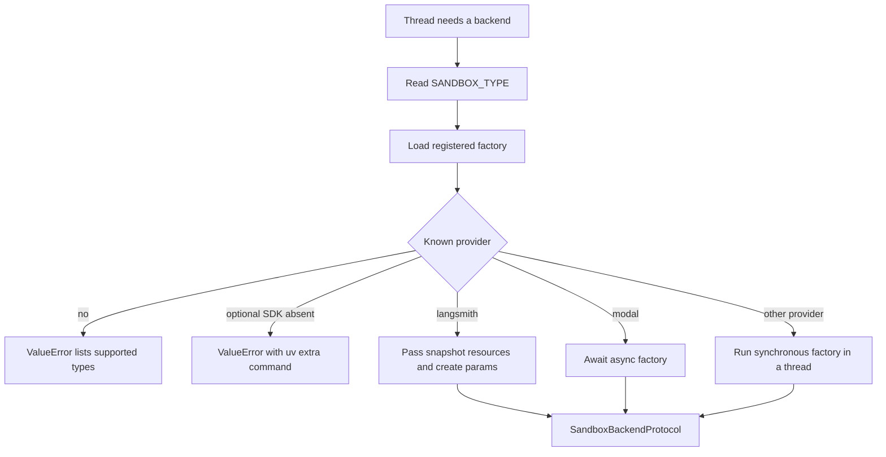
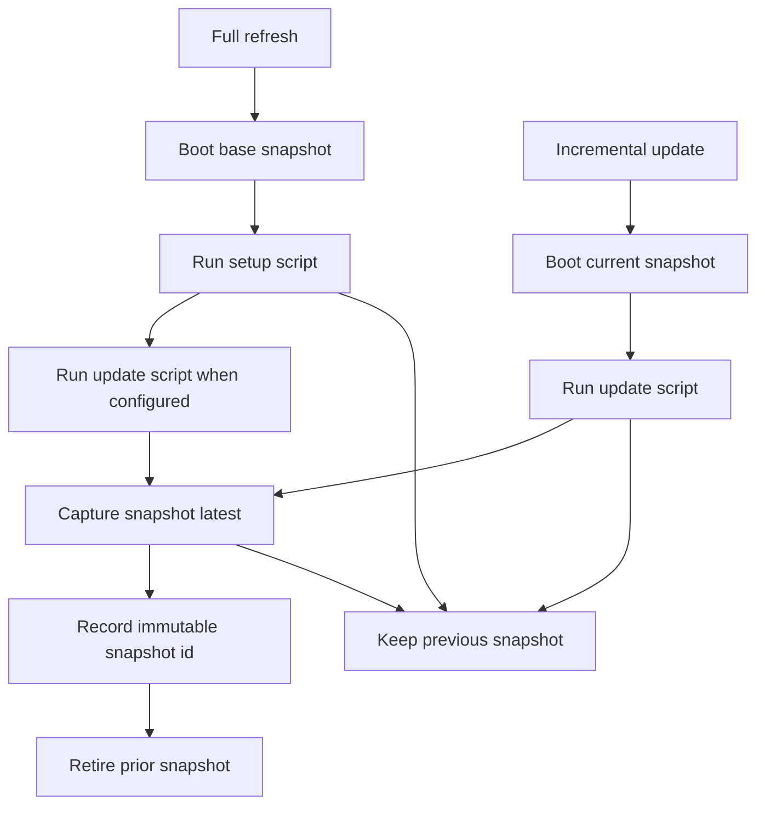

# Sandbox providers and workspace images

Open SWE runs agent filesystem and command work through `SandboxBackendProtocol`. Provider selection is a deployment setting; thread lifecycle code owns binding a backend to a thread, while a workspace supplies the image, resource overrides, and safe create-body options for a new backend. [Sandbox lifecycle](../architecture/sandbox-lifecycle.md) describes the thread-level lifecycle; [configuration](../operations/configuration.md) lists the environment settings.

## Selection, dependencies, and startup checks

`SANDBOX_TYPE` defaults to `langsmith`. The registry lazily resolves one of `langsmith`, `daytona`, `modal`, `runloop`, `e2b`, or `local`; an unknown value raises a `ValueError` naming the supported types. All factories accept an optional `sandbox_id`: an id reconnects, while no id creates a backend.

Provider dispatch, including the special provisioning options available to LangSmith.

`daytona`, `modal`, `runloop`, and `e2b` are optional extras. A base install includes the default LangSmith and local implementations only. If the selected optional provider fails to import its own SDK, the registry turns that particular missing-module error into an actionable command such as `uv sync --extra sandbox-e2b`; `sandbox-providers` installs all four. It does not hide unrelated import errors.

`create_sandbox()` forwards `snapshot_id`, `mem_bytes`, `vcpus`, `fs_capacity_bytes`, and `create_params` only to LangSmith. LangSmith and Modal factories are awaited directly; Local and the third-party synchronous wrappers run in `asyncio.to_thread`. The FastAPI lifespan invokes `validate_sandbox_startup_config()` before database startup. That eagerly loads an active optional provider so a missing extra fails at boot; for LangSmith it also validates numeric sizing/TTL settings, rejects negative TTLs, and parses `SANDBOX_CREATE_EXTRA_JSON` as a JSON object.

## Built-in providers

| `SANDBOX_TYPE` | Create or reconnect | Required configuration | Operational boundary |
|---|---|---|---|
| `langsmith` | Async get-or-create through the LangSmith sandbox API | `LANGSMITH_API_KEY`; `LANGSMITH_ENDPOINT` optionally changes the API root | Only built-in provider with workspace snapshot capture and selector-level image/resource/create-body support |
| `daytona` | Gets an id or creates from `DAYTONA_SANDBOX_SNAPSHOT` | `DAYTONA_API_KEY`; snapshot defaults to `daytonaio/sandbox:0.6.0` | Optional `sandbox-daytona` extra; synchronous wrapper |
| `modal` | Reattaches by id or creates in `MODAL_APP_NAME` | Modal credentials; app defaults to `open-swe` | Optional `sandbox-modal` extra |
| `runloop` | Retrieves an id or creates a devbox | `RUNLOOP_API_KEY` | Optional `sandbox-runloop` extra; synchronous wrapper |
| `e2b` | Connects by id or creates, optionally from `E2B_TEMPLATE` | `E2B_API_KEY` | Optional `sandbox-e2b` extra; one-hour SDK timeout |
| `local` | Creates a `LocalShellBackend`; ignores ids | None; `LOCAL_SANDBOX_ROOT_DIR` is optional | Commands execute on the host: local development only |

The Local provider creates its root directory and passes an explicit environment with `inherit_env=False`, excluding model, LangSmith, and OAuth-broker credentials. Unless `GIT_CONFIG_GLOBAL` is explicitly set, it directs global Git writes to `<root>/.gitconfig-sandbox`, which includes the host config so aliases and credential helpers remain available without overwriting the developer's `~/.gitconfig` bot identity.

## LangSmith provisioning and execution

LangSmith sandbox operations use the deployment's `LANGSMITH_API_KEY` and `LANGSMITH_ENDPOINT`; the latter is normalized to the SDK sandbox base ending in `/v2/sandboxes`. The former `SANDBOX_LANGSMITH_API_KEY` and `SANDBOX_LANGSMITH_ENDPOINT` overrides are not used.

A new box with no snapshot id omits that field and therefore boots from the platform root snapshot. Default provisioning is 4 vCPUs, 16 GiB memory, 128 GiB filesystem capacity, a two-hour idle TTL, and a 30-day delete-after-stop TTL. Deployment variables override these defaults. If a call provides either CPU or memory, both values are passed as supplied rather than mixing a partial call override with the deployment default.

`SANDBOX_CREATE_EXTRA_JSON` provides deployment-wide create-body fields; workspace or caller `create_params` win on key conflicts. The implementation applies fields the SDK does not model by wrapping its `POST /boxes` request only, while normal create retries retryable statuses and transient create failures for at most three attempts. The provider abstraction intentionally has no general delete: thread sandboxes can contain the only uncommitted working tree, so platform reclamation uses the creation-time idle and delete-after-stop TTLs.

`TimeoutLangSmithSandbox` supplies an async command deadline around the SDK's nonblocking WebSocket execution. A server-reported timeout and a client deadline both become an exit-124 response; the latter best-effort kills the command. WebSocket setup or supported stream failures fall back to the base execution path. Command retry is intentionally narrower: only `SandboxRetryableConnectionError`, which indicates a rejected WebSocket upgrade before an execute frame was sent, is retried, up to four jittered exponential-backoff attempts, avoiding accidental double execution.

For LangSmith backends only, thread setup obtains a GitHub App workspace token at runtime and updates proxy rules: Basic auth for `github.com` and `*.github.com`, plus Bearer auth and a placeholder `GH_TOKEN` for `api.github.com`. The real token is proxy-injected rather than written into the sandbox. Custom proxy rules are preserved except for managed rules that are regenerated. If a stopped box rejects the update as not ready, Open SWE best-effort starts it and retries; proxy refresh failures make an existing backend unreachable rather than silently replacing it.

## Workspace images, resources, and refresh

A workspace can define a base snapshot, setup and update scripts, per-workspace `mem_bytes`, `vcpus`, and `fs_capacity_bytes`, plus JSON `create_params`. Resource values must be positive; create params are size-limited JSON and reject credential-like keys and authentication headers. They are revalidated on read before being sent to the platform. When a new thread backend is booted, `SandboxCreateConfig` selects the workspace's ready immutable snapshot and these overrides; absent or not-ready workspace snapshots fall back to the provider base image.

A workspace publishes Docker-style snapshots under a stable name—by default `<WORKSPACE_SNAPSHOT_PREFIX>-environment-<slug>`—with the mutable `latest` tag, but runs store and boot from the immutable snapshot id. A capture in progress therefore continues to expose the prior id. After a successful capture, the record switches to the new id and the old snapshot is retired; a failed capture leaves the prior ready snapshot usable.

Workspace image refresh flow; publication happens only after every requested script and capture succeeds.

Refresh is LangSmith-only because other providers have no capture API. A throwaway builder is created from the base snapshot for a `full` refresh, runs setup then update, and is captured only if every script exits zero. An `update` refresh starts from the current workspace snapshot and runs only the update script. Builders use the workspace resource and create-body values, a short delete-after-stop TTL, proxy GitHub access, and are stopped after completion for platform reclamation. The workspace record carries step status, timestamps, capped logs, and the temporary builder id for live log tailing.

A daily, deterministically staggered cron starts full refreshes. On sandbox creation, a stale workspace image can trigger a background incremental refresh, but the run that detected staleness does not wait: it boots from the existing image and can report that it may be behind. In-flight refresh and recently failed-attempt checks prevent every creation from launching another builder. Workspace setup/update scripts are written under `OPENSWE_SCRIPT_ROOT` (default `/open-swe/environment`), run with `bash -x`, log there, and receive space-separated repository names in `OPENSWE_WORKSPACE_REPOS`; scripts must not put secrets on command lines because tracing expands arguments into those logs.

## Thread safety and extension

Thread lifecycle first reuses a cached backend or reconnects the id in thread metadata; otherwise it creates from the resolved workspace configuration. A deleted LangSmith box is classified as `SandboxGoneError` and is recreated. Other reconnection or proxy-refresh failures become `SandboxUnreachableError` and normally fail the run, preserving the distinction between a deleted box and a possibly working tree with uncommitted work. Callers that can reconstruct their checkout, such as reviewer flows, may opt into replacement.

For a new or replacement backend, Git identity and LangSmith proxy setup complete before the `sandbox_id` is persisted; the initialized backend is published last. Thus later work cannot reconnect to or use a half-initialized sandbox. Task workers do not provision independently: they validate ownership and attach to their coordinator's existing sandbox.

To add a provider, implement `create_<name>_sandbox(sandbox_id: str | None = None)` returning `SandboxBackendProtocol`, then register its module and factory name in `SANDBOX_FACTORIES`. The factory may be synchronous or async. If an SDK is optional, add an extra and its top-level import names to the registry's optional-dependency mappings so startup and on-demand errors remain actionable. Decide explicitly which LangSmith-only capabilities—workspace capture, image/resource parameters, proxy credential refresh, and recreation stop—are unsupported or require an equivalent provider implementation.

## Focused verification

`tests/sandbox/test_optional_provider_extras.py` verifies that each optional provider produces its install hint only when its own SDK module is absent, while unrelated import failures propagate. Provider integration tests cover Daytona snapshot selection and local host-environment/Git-config isolation. `tests/sandbox/test_langsmith_sandbox_config.py` covers create payload injection, capture tag handling, defaults, validation, retry behavior, and failure classification. Workspace store and refresh tests cover immutable-id handoff, preserving a prior snapshot on failure, full versus incremental script order, and builder lifecycle.
