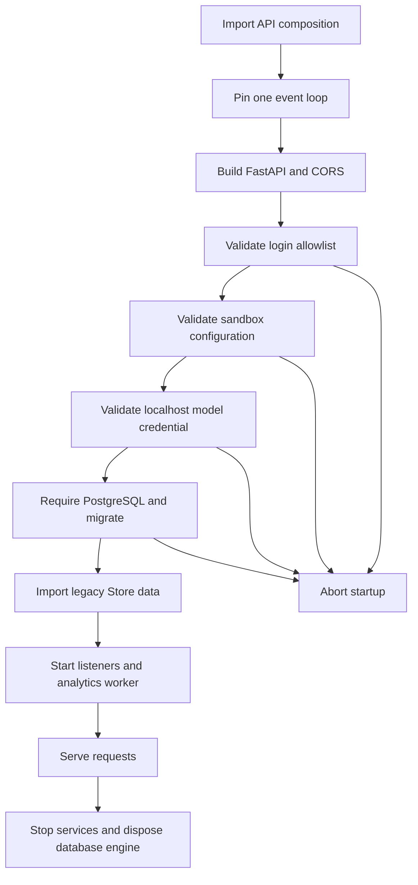

# Configuration and startup validation

Open SWE combines **deployment configuration**—environment variables read through `openswe/config.py`—with **durable configuration**—workspace and instance settings. Environment variables supply infrastructure locations, credentials, provider selection, and deployment defaults. Durable settings select behavior for an instance or workspace without replacing the deployment's secrets.

This page focuses on ownership, precedence, and failure behavior. `openswe/config.py` is the complete variable catalog; [deployment](deployment.md) is the installation procedure. For access controls, see [authentication and security](../concepts/auth-and-security.md); for per-run selection, see [models, profiles, and instructions](../concepts/models-profiles-instructions.md); for provider specifics, see [sandbox providers](../integrations/sandbox-providers.md).

## Configuration planes and registry semantics

`ENV` is the only application configuration registry. It deliberately resolves values lazily rather than snapshotting `os.environ` at import time, so late secret injection, rotations, and test monkeypatches are visible. An empty or whitespace-only value is unset. Each declared variable carries its default, secret classification, aliases, and deprecation metadata.

Use `ENV.NAME`, not direct environment reads. The canonical variable wins over an alias; list, integer, and boolean helpers normalize their inputs, and an undeclared attribute or index lookup fails explicitly. `deprecated_in_use()` reports aliases and obsolete variables, while suppressing an obsolete-name warning when its replacement is configured.

`langgraph.json` is the deployment manifest. It loads `.env`, exposes `openswe.webapp:app` as the HTTP application, and registers the `agent`, `reviewer`, `analyzer`, `review-scout`, `chat`, and `scheduler` graphs. Its checkpointer uses delete-based TTL cleanup, sweeping every 60 minutes with a default TTL of 43200 minutes (30 days).

## Baseline deployment requirements

A production deployment needs a public `LANGGRAPH_URL`, `LANGSMITH_API_KEY`, at least one model-provider credential (or usable LangSmith Gateway credentials), GitHub App credentials and webhook secret, Slack bot/signing credentials, `TOKEN_ENCRYPTION_KEY`, `DASHBOARD_JWT_SECRET`, and a GitHub login allowlist (`ALLOWED_GITHUB_ORGS` or `ALLOWED_GITHUB_USERS`). `CONFIGURED_ADMINS` separately grants dashboard administration.

`POSTGRES_URI` is not optional: application startup refuses to proceed without it because repository and pull-request records live in PostgreSQL. `DATABASE_URI` used by a standalone Agent Server does not substitute for `POSTGRES_URI` in Open SWE code. The URI accepts `postgres://` or `postgresql://`, is normalized to the asyncpg dialect, and translates `sslmode` to asyncpg's `ssl` option; invalid schemes or simultaneous `sslmode` and `ssl` are rejected.

The same deployment normally serves the dashboard, API, and webhooks at one origin, so `DASHBOARD_BASE_URL` and `DASHBOARD_API_BASE_URL` default to `LANGGRAPH_URL`. If extra credentialed browser origins are needed, set explicit comma-separated `DASHBOARD_ALLOWED_ORIGINS`; `*` aborts application construction because credentialed CORS cannot use a wildcard.

### Secret handling and rotation

Keep credentials in the deployment secret store, not in persisted settings. `TOKEN_ENCRYPTION_KEY` is a Fernet key or a comma/newline-separated newest-first key list. New encryption uses the first key; decryption tries all configured keys, allowing a safe rotation by prepending a new key before retiring an old one. Encryption requires a configured key; decrypting invalid ciphertext or with no key logs a warning and yields an empty value.

For the default LangSmith sandbox, Open SWE uses the deployment's `LANGSMITH_API_KEY` and `LANGSMITH_ENDPOINT`; the historical `SANDBOX_LANGSMITH_*` overrides are not used. GitHub access tokens are minted at runtime and delivered through sandbox proxy rules rather than saved as deployment variables.

## Startup sequence: fail-fast prerequisites, migrations, and resilient services

The API composition module pins one event loop before queue workers are built. In its FastAPI lifespan it repeats that pinning, validates the GitHub login gate, validates the active sandbox configuration, validates a local-development model credential when applicable, requires PostgreSQL, and runs database migrations. Failures in those prerequisites prevent the server from serving.

This is the FastAPI lifespan ordering: configuration and database prerequisites fail startup, while several post-migration imports and listeners are designed to degrade gracefully.

The login gate accepts a local authentication token or a nonempty org/user allowlist. Without one, it raises `ALLOWED_GITHUB_ORGS or ALLOWED_GITHUB_USERS must be configured` at boot. The local model check intentionally runs only when an explicitly configured `DASHBOARD_BASE_URL` starts with `http://localhost`; it verifies the credential for `LLM_MODEL_ID` or the default model, but does not prevalidate models later chosen by workspace, profile, or thread settings.

After migrations, startup attempts to import legacy Store-backed user mappings, concierge mode, user records, automations, and skills. A failure is logged but does not stop startup; the affected old data remains unavailable until a later boot succeeds. Store imports coordinate replicas with a PostgreSQL row lock and keep retrying until a pass finds no remaining work at least a day after the most recent move. Blob import is asynchronous. Analytics/reporting, transcript, bridge, and UI-invalidation listeners are also best effort: their failures are warned rather than made fatal, with documented in-process or page-refetch fallbacks. Shutdown cancels the blob import, stops services, and disposes the database engine.

## PostgreSQL lifecycle

Open SWE owns the `open_swe` schema. Migration initializes it under a transaction-scoped PostgreSQL advisory lock, creates the schema if needed, and upgrades Alembic heads; this makes concurrent replica starts serialize their migration work. Connections use a lazily cached async SQLAlchemy engine with `pool_pre_ping`; pool size, overflow, and checkout timeout come from `ANALYTICS_POOL_SIZE`, `ANALYTICS_POOL_OVERFLOW`, and `ANALYTICS_POOL_TIMEOUT_SECONDS`. Query logging is controlled by `POSTGRES_SLOW_QUERY_MS` and can be disabled with `0`.

The database role must be able to create and migrate the schema and its tables. In `OPENSWE_ENV=preview`, startup additionally removes migration revisions superseded by a rebased preview branch before applying current heads; do not use that behavior as a production migration strategy.

## Workspace and instance overrides

Workspace identity and bindings are PostgreSQL-backed, but workspace settings are stored in LangGraph Store. They resolve from three tiers:

1. hardcoded defaults;
2. the instance record under `['team_settings']`, key `default` (the historic name is retained for compatibility);
3. a sparse override record under `['workspace_settings', <slug>]`.

`None` or omitted workspace fields inherit from the tier below. The workspace slug is normalized; invalid names fall back to `default` for internal run-path resolution, while the HTTP API rejects malformed names and returns 404 for nonexistent workspaces. Settings reads are intentionally fail-soft: a Store error returns hardcoded defaults rather than preventing all runs.

The settings include review toggles and guidelines, default repository, agent/reviewer/chat/subagent model-and-effort pairs, routing tiers, gateway and feature toggles, and managed-tools gateway selection. Writes validate model/effort compatibility, reject an effort without a model, cap review guidelines at 10,000 characters, and clear deprecated model IDs. A workspace setting is an override, not a secret store.

Model resolution preserves a supported configured pair; a stale or invalid pair first falls back within its provider when possible, then to the global default. Chat inherits the agent default when its own pair is absent or invalid. A workspace-specific `true` or `false` gateway setting overrides the instance value; unset workspace fields inherit the instance record, and an unset instance value inherits the environment default.

## Models, gateway, and fallback behavior

`LLM_MODEL_ID` and `LLM_REASONING_EFFORT` establish deployment defaults below workspace, profile, thread, and explicit run choices. Supported provider credentials include `ANTHROPIC_API_KEY`, `OPENAI_API_KEY`, `GOOGLE_API_KEY`, `GROQ_API_KEY`, `FIREWORKS_API_KEY`, and `BASETEN_API_KEY`; use `provider:model` model IDs.

The LangSmith LLM Gateway is enabled by `LANGSMITH_GATEWAY_ENABLED` when explicitly set; otherwise, a configured `LANGSMITH_GATEWAY_API_KEY` enables it. Gateway authentication prefers that dedicated key and falls back to `LANGSMITH_API_KEY`; `LANGSMITH_GATEWAY_BASE_URL` selects the host. The gateway routes OpenAI, Anthropic, Baseten, Fireworks, and Google GenAI and obtains the real provider credentials from LangSmith workspace Provider Secrets. An unsupported provider or missing LangSmith key logs a warning and falls back to a direct provider call. Direct Baseten calls instead require `BASETEN_API_KEY`.

`make_model()` applies six retries by default. Requests to OpenAI, Anthropic, Baseten, Google GenAI, and Fireworks receive a 600-second per-request timeout so a stalled connection becomes retryable rather than indefinitely occupying a run. `LLM_FALLBACK_MODEL_ID` overrides the fallback; otherwise Anthropic and OpenAI primaries get cross-provider defaults. No fallback middleware is installed if no fallback exists or it equals the primary model.

## Sandbox selection and workspace snapshots

`SANDBOX_TYPE` defaults to `langsmith`. The lazy provider registry supports `langsmith`, `daytona`, `modal`, `runloop`, `e2b`, and `local`; an unknown value raises `ValueError` listing supported types. Daytona, Modal, Runloop, and E2B are optional dependency groups. Startup eagerly imports the selected optional provider so a missing extra fails at boot with its `uv sync --extra sandbox-<provider>` remedy, rather than on the first run. `local` executes commands on the host without isolation and is for local development only.

Only the LangSmith factory accepts snapshot, CPU, memory, filesystem, and create-body overrides; other providers receive only an optional sandbox ID. With LangSmith, the default resources are 128 GiB filesystem, 4 vCPUs, 16 GiB memory, 7200 seconds idle TTL, and 2592000 seconds deletion-after-stop TTL. `0` disables either TTL. `SANDBOX_CREATE_EXTRA_JSON` must be a JSON object and is merged into create requests.

A LangSmith workspace's captured snapshot is the runtime customization point. Workspace setup/update scripts receive selected repositories through `OPENSWE_WORKSPACE_REPOS`; workspace snapshot names use `WORKSPACE_SNAPSHOT_PREFIX` (default `openswe`). Workspaces can inherit the default workspace's current ready snapshot and resource/create parameters while retaining their own prompt and identity. This is distinct from provider resource defaults and avoids an environment-variable-only snapshot override.

At startup, LangSmith validates configured resource values as integers, rejects negative TTLs, and parses the extra JSON. It does not instantiate a sandbox merely to validate credentials; missing `LANGSMITH_API_KEY` fails when the provider is constructed for a sandbox operation.

## Operating checklist and focused tests

1. Supply `POSTGRES_URI` and grant the role schema/migration privileges before rollout; do not assume Agent Server's `DATABASE_URI` fulfills this application requirement.
2. Configure a GitHub org or user allowlist before boot, alongside the GitHub App, Slack, dashboard-signing, encryption, LangSmith, and model credentials required by your enabled surfaces.
3. Choose a sandbox provider and install its optional extra when needed. For LangSmith, verify the workspace key, endpoint, quotas, and snapshot availability; never use `local` for untrusted workloads.
4. Set deployment defaults in environment variables; use instance and workspace settings for their supported behavioral overrides. Treat Store reads as fail-soft and ensure safe hardcoded defaults remain viable.
5. Rotate `TOKEN_ENCRYPTION_KEY` by placing the new valid key first while retaining old keys until encrypted records are re-encrypted or expired.
6. Exercise the focused tests in `tests/utils/test_config.py`, `tests/sandbox/`, and `tests/dashboard/test_workspace_settings_tiers.py` when changing registry semantics, sandbox configuration, or setting precedence.

## See also

- [Deployment](deployment.md)
- [Authentication and security](../concepts/auth-and-security.md)
- [Models, profiles, and instructions](../concepts/models-profiles-instructions.md)
- [Sandbox providers](../integrations/sandbox-providers.md)
