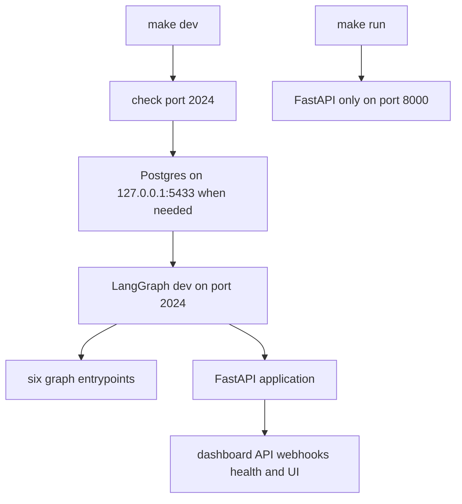
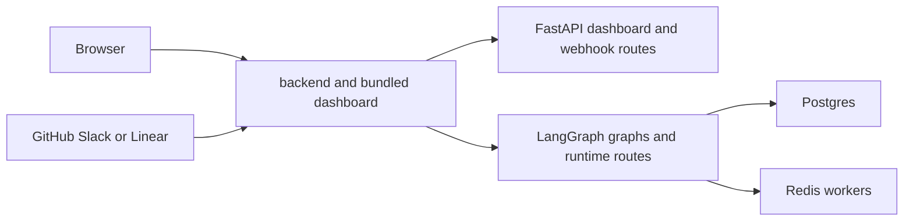

# Local development, packaging, and deployment

Open SWE is normally one LangGraph deployment. `langgraph.json` registers the `agent`, `reviewer`, `analyzer`, `review-scout`, `chat`, and `scheduler` graphs and mounts `openswe.webapp:app`. That FastAPI application owns the dashboard API, health, plan and workflow routes, webhooks, and the optional dashboard catch-all; LangGraph owns the runtime routes. A bundled dashboard gives the browser and API one origin, avoiding cross-origin session-cookie setup.

For application settings and secrets, see [Configuration](configuration.md). For dashboard behavior, see [Dashboard UI](../integrations/dashboard-ui.md); for test strategy, see [Testing overview](../testing/overview.md).

## Local backend and state

Install Python tooling and development extras with:

```bash
make install
```

This runs `uv sync --extra dev`. The normal local entrypoint is:

```bash
make dev
```

It first checks that port 2024 is free, starts local PostgreSQL when `POSTGRES_URI` is absent, then runs:

```bash
uv run langgraph dev --no-browser --port 2024 --n-jobs-per-worker 10
```

`langgraph.json` loads `.env`, selects Python 3.14 and the 0.15 release-candidate API line, registers the six graphs and HTTP app, and deletes old checkpoints on a 60-minute sweep with a 43,200-minute default TTL. The project constrains the local Agent Server packages to the compatible 0.15 release-candidate ranges. `make dev` is therefore the mode for dashboard operations or any feature that creates a LangGraph run.

Without an explicit `POSTGRES_URI`, the `postgres` prerequisite executes `docker compose up -d --wait postgres`. Compose runs `postgres:16` at `127.0.0.1:5433`, health-checks it, and persists data in the named `open-swe-postgres` volume. An explicit shell or `.env` `POSTGRES_URI` is left alone. Local LangGraph runtime state is separate: `langgraph dev` stores threads, checkpoints, and Store data in `.langgraph_api` in the current worktree. Stop a server cleanly before copying or sharing that directory; sharing it permits only one backend at a time, while independent copies subsequently diverge.



This contrasts the complete LangGraph development runtime with the HTTP-only server.

`make run` starts `uv run uvicorn openswe.webapp:app --reload --port 8000`. It is useful for focused FastAPI and OpenAPI work, but does not start LangGraph, so run-creating dashboard features do not work there. `make swagger` imports that same app and rewrites the checked-in `swagger.json`; regenerate it after changing custom FastAPI routes or models. The artifact does not describe LangGraph runtime endpoints such as `/runs`, `/threads`, and `/assistants`.

## Dashboard development and serving

Build a static dashboard for backend-owned serving:

```bash
make build-dashboard
make dev
```

The build installs the filtered pnpm workspace dependencies and emits `ui/.output/public`. The backend serves an explicit `DASHBOARD_STATIC_DIR` when it contains `_shell.html`, otherwise that in-repository build. It serves existing files and returns the client shell only to HTML navigations. The shell is `no-cache`; hashed assets are immutable-cacheable. API and runtime prefixes—including `/dashboard/api`, `/webhooks`, `/health`, `/threads`, `/runs`, `/store`, `/mcp`, `/a2a`, `/docs`, and `/assets`—are reserved, so the UI catch-all cannot shadow them. Add backend routes before the catch-all, or call `keep_dashboard_ui_last` after adding routes.

For hot reload, use:

```bash
make dev-ui
```

This runs Vite (`make web`) and the backend concurrently, passing `DASHBOARD_DEV_SERVER_URL=http://localhost:3000` to the latter. Open `http://localhost:2024`: FastAPI proxies non-reserved UI traffic to Vite while the API and runtime remain on the backend origin. The HMR WebSocket intentionally connects directly to Vite on port 3000.

`make web` alone runs `pnpm run dev`, which scopes Turbo to `open-swe-dashboard`. In development, Vite proxies backend prefixes to `DASHBOARD_API_URL`, defaulting to `http://localhost:2024`. If opening Vite directly at `http://localhost:3000`, configure `DASHBOARD_BASE_URL` and `DASHBOARD_API_BASE_URL` to that origin and register `http://localhost:3000/dashboard/api/auth/callback` with the GitHub App. Additional credentialed origins belong in `DASHBOARD_ALLOWED_ORIGINS`; FastAPI rejects `*` because credentials are enabled.

The dashboard base-path invariant matters under a LangGraph `http.mount_prefix`: build assets and client routes with `DASHBOARD_BASE_PATH` equal to the mounted prefix, for example `DASHBOARD_BASE_PATH=/<prefix>/ make build-dashboard`, and set `LANGGRAPH_URL` to the mounted URL. The Platform manifest derives that value when bundling the UI. A mismatch makes asset or client-router URLs escape the mounted application.

The pnpm workspace includes `bridge-client`, `ui`, `desktop`, `cli`, and `tests/e2e`. Root `build`, `check`, `test`, and `typecheck` fan out through Turborepo; root `lint` and `format`/`format:check` run oxlint and oxfmt once. Turbo does not cache persistent development tasks; its build cache includes the outputs and environment inputs such as `DASHBOARD_API_URL`, `SOURCE_COMMIT`, `VERCEL`, `E2E_HARNESS`, and `VITE_*`, so changes to those inputs invalidate a cached build.

## Webhook-only public access

Local `langgraph dev` has no authentication for raw LangGraph routes. Do not publish port 2024 wholesale. Use a static ngrok domain:

```bash
make tunnel NGROK_DOMAIN=<name>.ngrok-free.dev
```

The target normalizes a supplied URL/domain, tunnels port 2024, and applies `examples/ngrok/webhooks-only.yml`. Its policy returns 404 for every path outside `/webhooks/*`, allowing signature-checked GitHub, Slack, and Linear deliveries while keeping dashboard and raw runtime routes local. If Slack OAuth requires the tunnel callback relay, preserve the dedicated redirect policy for `/dashboard/api/slack/callback`; the stock webhook-only policy blocks it. Restart the backend after changing `.env`, since code reload does not reload environment configuration.

## Production delivery

**LangGraph Platform** can deploy the repository directly. Its manifest's `dockerfile_lines` installs Node and pnpm, builds the dashboard for the manifest mount prefix, copies it to `/opt/open-swe-dashboard`, stamps build information, and sets `DASHBOARD_STATIC_DIR`. The UI step is deliberately best-effort: deployment continues without a bundled UI if it fails.

**Standalone Docker** uses the root image:

```bash
docker build -t open-swe .
```

It is a production LangGraph API image, not a sandbox image. The `langchain/langgraph-api:0.15.1-py3.14` base installs this repository with the Agent Server constraints, registers the same six graphs, HTTP app, and TTL policy through environment variables, and exposes port 8000. Unlike the platform build, it does not compile the dashboard; build `ui/.output/public` before `docker build` or point `DASHBOARD_STATIC_DIR` at a build directory.

A standalone Agent Server also needs `DATABASE_URI` (Postgres), `REDIS_URI`, `LANGSMITH_API_KEY`, `LANGGRAPH_CLOUD_LICENSE_KEY`, and a public `LANGGRAPH_URL`; expose port 8000 through ingress. Do not use scale-to-zero infrastructure: background runs depend on available Redis- and Postgres-backed workers. The image defaults to `LANGGRAPH_AUTH_TYPE=noop`, which leaves raw LangGraph endpoints open to network clients. Set `LANGGRAPH_AUTH_TYPE=langsmith` with `LANGSMITH_AUTH_ENDPOINT` and `LANGSMITH_TENANT_ID`, or use an authenticated/private network boundary. Dashboard sessions and webhook signatures protect custom routes, not raw runtime routes.



This is the same-origin production topology; update `LANGGRAPH_URL`, webhook targets, and the GitHub callback whenever its public URL changes.

### Optional separate dashboard

Build `ui/Dockerfile` from the repository root with `docker build -f ui/Dockerfile .`. It uses a multi-stage Node 24 Alpine build, a frozen filtered pnpm install, and serves the Nitro `.output` application on port 8080 as user `node`. `DASHBOARD_API_URL` is read at each request rather than embedded, allowing one image to front different backends; startup request handling fails explicitly if it is absent.

The Nitro proxy forwards the original path, query, cookies, streaming bodies, and separate `Set-Cookie` headers for dashboard API and webhook traffic. It strips hop-by-hop/framing headers where required and returns upstream OAuth redirects rather than following them server-side. For this same-origin proxy arrangement, set the backend's `DASHBOARD_BASE_URL` and `DASHBOARD_API_BASE_URL` to the frontend origin and register its callback URL. The alternative is a browser-to-backend build using `VITE_DASHBOARD_API_BASE_URL`, with the frontend in `DASHBOARD_ALLOWED_ORIGINS`; `VITE_*` values are public build input and must never contain secrets.

## Desktop and CLI packaging

The experimental Electron desktop client ships the compiled UI and asks packaged users for a compatible organization backend URL, stored in local user data; it has no maintainer-hosted default. At the internal `open-swe://app` origin it proxies dashboard API calls to that backend, preserving the normal GitHub-backed dashboard session. Source launches default to `http://localhost:2024`; resolution order is `--backend-url`, `OPEN_SWE_BACKEND_URL`, saved configuration, then that local default.

Develop it beside `make dev` with `make desktop`. `pnpm --dir desktop run pack` produces an unpacked app and `pnpm --dir desktop run dist` produces a platform installer. Both build the UI, local backend resources, and the `oswe` CLI into the Electron package; this is packaging, not hosted-web deployment. “This Mac” tasks use a bridge that long-polls the selected backend for execution and file requests, executes them in the local checkout, and posts results; quitting the app closes that bridge. Older local threads can still use the bundled private loopback server, described by `langgraph.desktop.json`, which exposes only the agent graph, supplies local auth/checkpoint handlers, and disables the built-in UI and Studio auth.

On macOS, `make install-desktop` requires a clean checkout, switches and fast-forwards `main`, then invokes `scripts/install_desktop.sh`; `make install-checkout` invokes the same script without changing Git state. The script is macOS-only, verifies Node, `ditto`, `uv`, Bun, and pnpm or Corepack, runs the frozen workspace install and desktop pack, then stages and swaps the app into `/Applications` or `~/Applications`.

`make cli` requires Bun, installs the CLI and root workspace filters, and creates `cli/dist/oswe`. Bun compiles its runtime into this one binary, so target machines need neither Node nor Bun. The CLI connects a remote cloud agent to the current local checkout by long-polling for sandbox execution/upload/download requests; those commands run unsandboxed as the invoking user. Treat it as local-code execution, not a sandbox.

## Focused verification and maintenance tools

- Python checks: `make test [TEST_FILE=...]` and `make integration_tests` run pytest through uv; `make lint`, `make format`, and `make format-check` run Ruff; `make typecheck` runs `ty check openswe tests`. Dashboard proxy and backend UI tests verify header/body/redirect forwarding, shell precedence, mount-prefix serving, traversal resistance, and desktop CORS.
- JavaScript checks: `pnpm run build`, `pnpm run typecheck`, `pnpm run test`, and `pnpm run check` use Turbo; use `pnpm run test:e2e` or `test:e2e:desktop` for Playwright paths.
- `scripts/create_sandbox_snapshot.py` creates a LangSmith sandbox snapshot with `SandboxClient`, taking image/name/capacity options and `LANGSMITH_API_KEY` (or `--api-key`), then prints its ID for assignment from the dashboard workspace settings.
- `scripts/purge_wakeup_crons.py` is a one-time cleanup for expired one-shot `thread_wakeup` crons. Start with `--dry-run`; it resolves the target from `--url` or `LANGGRAPH_URL` and credentials from `LANGGRAPH_API_KEY` or `LANGSMITH_API_KEY`.
