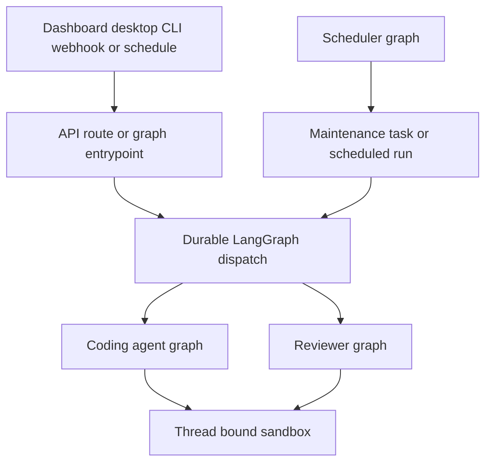

# Open SWE contributor map

Open SWE is an asynchronous, LangGraph-based software factory: its coding agent works in a thread-bound sandbox, and the product also supports pull-request review, review-style analysis, read-only PR chat, scheduled work, dashboard, desktop, CLI, and integration triggers. Start from the changed behavior and its nearest source and test. This map is optional navigation—not required startup reading and not an authority over the repository.

## Establish the smallest useful local loop

The backend requires Python 3.14+ and uses `uv`; the JavaScript workspace uses `pnpm`. Install the relevant dependencies, then pick the serving mode that actually exercises the boundary.

```bash
make install
make dev
make dev-ui
make run
make web
make desktop
```

- `make install` runs `uv sync --extra dev`.
- `make dev` starts PostgreSQL when `POSTGRES_URI` is unset, then runs `langgraph dev` on port 2024. Use it for graph execution, durable runs, webhooks, and the combined backend/dashboard surface.
- `make dev-ui` runs Vite and `make dev` together; browse port 2024 while Vite serves the hot-reloaded UI.
- `make run` starts only `openswe.webapp:app` with Uvicorn on port 8000. It is appropriate for focused FastAPI/OpenAPI work, not behavior that creates LangGraph runs.
- `make web` starts the dashboard workspace; `make desktop` starts the Electron wrapper and needs a backend separately.

Do not publish port 2024 directly during local development: raw LangGraph routes have no authentication. `make tunnel NGROK_DOMAIN=<name>.ngrok-free.dev` exposes only `/webhooks/*` through the supplied ngrok policy.

Python is async-only. If an interface requires a synchronous method, make that method raise `NotImplementedError`; do not create parallel sync and async implementations. Follow the repository conventions in `AGENTS.md`, particularly for types, GitHub client use, prompts, routes, migrations, and focused tests.

## Find the runtime owner before editing

`langgraph.json` is the deployment manifest. It loads `.env`, pins the served runtime to Python 3.14, registers six graph IDs, mounts `openswe.webapp:app`, and configures deleting checkpoint retention. The modules in `openswe/graphs/` are intentionally thin re-exports; normally change the owning implementation rather than the registration shim.

| Entry point | Change owner | Use it when changing… |
| --- | --- | --- |
| `openswe.graphs.agent:traced_agent` | `openswe/server.py` | Coding-agent assembly, sandbox-backed tools, model selection, skills, prompts, or middleware. |
| `openswe.graphs.reviewer:traced_reviewer_agent` | `openswe/reviewer.py` | Diff-grounded findings, review preparation/publication, or reviewer lifecycle. |
| `openswe.graphs.analyzer:traced_analyzer` | `openswe/analyzer.py` | Repository review-style learning. |
| `openswe.graphs.review_scout:traced_review_scout` | `openswe/review_scout/` | Review walkthroughs and human-input summaries. |
| `openswe.graphs.chat:traced_chat_agent` | `openswe/chat.py` | Dashboard PR chat, virtual PR context, and read-only repository access. |
| `openswe.graphs.scheduler:get_scheduler` | `openswe/scheduler.py` | Cron routing, reconciliation, scheduled work, watches, background tasks, refreshes, or deadlines. |
| `openswe.webapp:app` | `openswe/api/app.py` | FastAPI composition, dashboard API/UI, health, webhooks, sandbox HTTP routes, lifecycle, or CORS. |



This shows the practical routing boundary: product ingress converges on durable graph execution, while scheduler ticks either perform a maintenance task or create a scheduled run.

### Runtime invariants that affect safe changes

- The coding-agent object is stateless: per-thread continuity belongs to sandbox state and thread metadata. Do not use process-local agent state as durable thread state.
- `dispatch_agent_run` is the shared agent/reviewer creation contract for dashboard, Slack, Linear, and GitHub triggers. It builds typed input when necessary, defaults to `interrupt`, and refuses a prebuilt input combined with raw content, context, or source identities. Use `create_durable_run` deliberately when producing a different graph.
- `create_durable_run` supplies synchronized durability, resumable streaming, v3 stream modes, invocation correlation, and optional completion delivery. Do not bypass it for a normal durable product run.
- PR chat deliberately has no sandbox: it seeds PR material as `/pr/` virtual files and removes shell/file-mutation tools. The reviewer has a sandbox but its review-oriented tool set excludes commit, push, and PR-opening tools.
- The scheduler is a one-node graph. It validates required identifiers, dispatches a known maintenance task or scheduled run, retries transient sandbox attachment failures, and reports exhausted attachment as `sandbox_unavailable`.
- The FastAPI lifespan pins one event loop before queue workers, validates GitHub login, sandbox, and local-development model configuration, requires and migrates PostgreSQL, and starts supporting workers/listeners. CORS permits credentials only for configured origins plus `open-swe://app`; wildcard origins fail startup.

## Route the change to its detailed context

### Agent, state, and capability changes

- [Runtime architecture and public entrypoints](architecture/overview.md) — service boundaries, persistence ownership, public surfaces, and extension rules.
- [Coding-agent graph assembly](architecture/agent-graph.md) — `get_agent`, backend selection, models, prompts, tools, skills, subagents, and graph loading.
- [Agent middleware and failure boundaries](architecture/middleware-stack.md) — ordering-sensitive preparation, restrictions, retries, queues, timeouts, fallbacks, and accounting.
- [Thread-bound sandbox lifecycle](architecture/sandbox-lifecycle.md) — reconnect, replacement safety, workspace snapshots, proxy state, and bridge handoff.
- [Threads, durable runs, and persistent state](concepts/threads-and-state.md) — thread identity, checkpoints, metadata, message queues, and PostgreSQL versus LangGraph Store ownership.
- [Tool capability model](concepts/tools.md) — static/dynamic tools, authorization, credential scope, MCP loaders, and read-only/plan restrictions.
- [Models, profiles, settings, and instructions](concepts/models-profiles-instructions.md) — precedence, persistence, model/provider routing, and prompt inputs.
- [Sandbox providers and workspace images](integrations/sandbox-providers.md) — provider selection, optional dependencies, local execution, snapshots, and resources.

### Ingress, UI, security, and external integrations

- [Inbound invocation to durable run](workflows/invocation.md) — admission, verification, routing, normalized input/configuration, dispatch, and completion.
- [Follow-ups, interruptions, and deferred delivery](workflows/follow-up-messages.md) — active-run interruption, queues, stop control, and continuity.
- [Dashboard, web API, desktop, and CLI surfaces](integrations/dashboard-ui.md) — browser session/API behavior, Electron/local mode, and CLI bridge boundaries.
- [Authentication, authorization, and credential scope](concepts/auth-and-security.md) — sessions, OAuth, App/user tokens, webhook verification, membership, and trust boundaries.
- [MCP, tracing, analytics, and external tool integrations](integrations/observability-and-mcp.md) — connection scopes, credential routing, tracing, and audit-related adapters.

### Delivery, review, and automation

- [Coding delivery and pull-request creation](workflows/pr-creation.md) — edits, Git operations, workflow approval and push guards, PR creation, and CI.
- [Pull-request review lifecycle](workflows/pr-review.md) — automatic/requested review, diff/finding invariants, publication, reconciliation, and feedback.
- [Review, review-scout, and style-learning graphs](architecture/reviewer-and-analyzer.md) — graph specialization and review data flow.
- [Schedules, automations, and PR babysitting](workflows/scheduling-and-baby-sit.md) — storage, wakeups, monitoring, refreshes, costs, and notifications.
- [Context assembly and repository guidance](workflows/context-engineering.md) — source context, repository instructions, skills, profiles, and recent thread context.

### Configuration and deployment

- [Configuration and startup validation](operations/configuration.md) — environment settings, required credentials/infrastructure, model gateways, and startup failures.
- [Local development, packaging, and deployment](operations/deployment.md) — PostgreSQL, UI bundle/proxy, tunnel safety, Docker/platform deployment, and generated OpenAPI artifacts.

## Validate only the behavior you changed

**Do not run the full suite locally.** Extend or run the closest behavioral test only when it protects a concrete regression; avoid mechanical tests for documentation, prompt wording, source shape, or library-guaranteed behavior. Security, authorization, data integrity, and difficult state transitions merit targeted coverage.

```bash
make test TEST_FILE=tests/sandbox/test_sandbox_state.py
uv run pytest -vvv tests/agent/test_dispatch.py::test_name
make lint
make format-check
make typecheck
```

`make test` accepts an existing file or directory; use direct `pytest` for a node ID. Pytest uses asyncio auto mode. Shared fixtures provide an SDK-shaped in-memory LangGraph Store through the production serialization path and clear global caches/sandbox connections around tests; automatic review is enabled by default unless the test replaces that gate. See [Testing strategy and focused validation](testing/overview.md) for the owning test families and fixture caveats.

For dashboard or desktop changes, target the responsible workspace rather than root workspace tests:

```bash
pnpm --filter open-swe-dashboard run test
pnpm --dir desktop run test
```

Escalate to one Playwright spec only for a real cross-boundary contract. The E2E harness runs the real agent, webhook routes, local sandbox, Git remote, dashboard, and Electron paths while substituting the LLM and external SaaS HTTP seams.

```bash
pnpm install --frozen-lockfile
pnpm run test:e2e:install
pnpm exec playwright test tests/full_flow.spec.ts
```

Browser Playwright runs use one worker; desktop has its own configuration and selects `desktop.spec.ts`. Prefer a single warm-server spec over the full browser suite.
