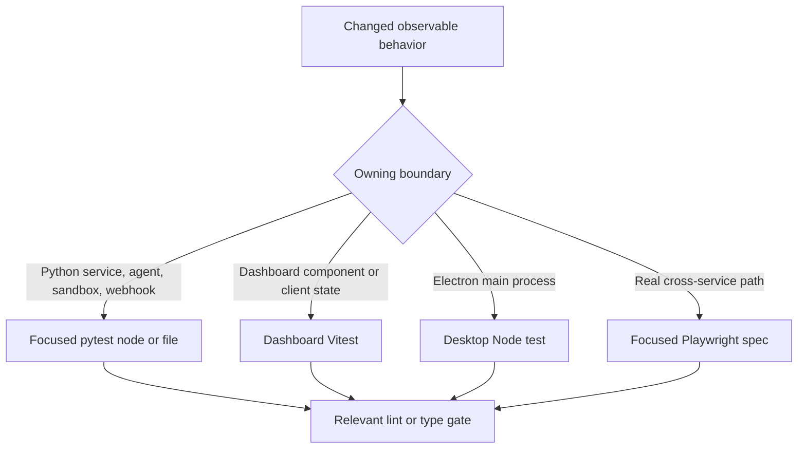
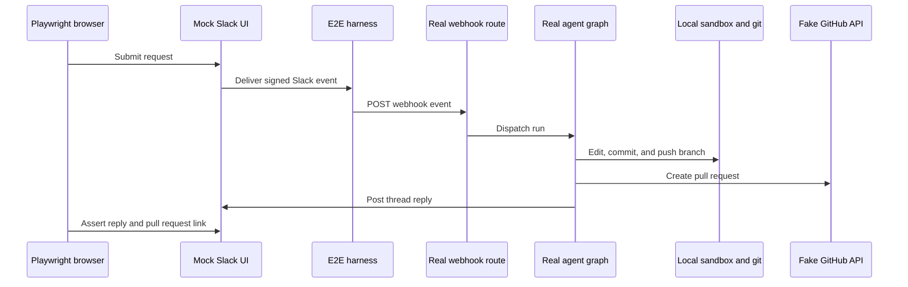

# Testing strategy and focused validation

Validate at the layer that owns the changed observable contract, then run only the directly related quality gate. Python tests cover server behavior, authorization, persistence, webhook handling, agent wiring, and sandbox state; dashboard and desktop packages cover their own client and main-process behavior; Playwright is reserved for contracts that cross the real webhook, application-server, sandbox/git, or Electron boundary. Do not run the full local suite (`make test`, bare `pytest`, or `pnpm test`): start with the existing behavioral test nearest to the changed invariant and extend it when possible.



This routing makes security, authorization, data-integrity, and tricky lifecycle regressions explicit without turning every edit into a broad integration run.

## Python: behavioral boundaries and shared isolation

Pytest collects from `tests/` and runs in asyncio auto mode, so async tests and fixtures need no individual asyncio marker. Test families are arranged around ownership: `tests/agent/` protects graph construction, dispatch, user/workspace settings, and run state; `tests/dashboard/` exercises backend dashboard routes and authorization; `tests/reviewer/` covers review lifecycle and publication; `tests/sandbox/` covers provider and reconnection behavior; and `tests/webhooks/` covers signed deliveries and completion behavior.

Prefer a test that observes a protected outcome over one that snapshots prompt text or mocks the whole implementation. Examples of boundaries with especially important state or safety properties are:

| Change | Focused test family and behavior to preserve |
| --- | --- |
| Agent composition, source-specific skills/tools, middleware, or workspace visibility | `tests/agent/test_agent_assembly_context.py` captures the arguments passed to `create_deep_agent`. It protects the sandbox-backed backend that lets deepagents install file-result eviction and summarization, thread-scoped binary offload, and the separation of public versus personal skills and tools. |
| Dashboard routes, signed session/OAuth behavior, CSRF, thread visibility, or workspace routing | `tests/dashboard/`; extend the route-specific test so it checks the response and authorization decision rather than merely a helper. |
| Reviewer findings, review publication, reconciliation, or outcome learning | `tests/reviewer/`; `test_reviewer_outcomes.py` verifies the outcome payload and converts a create conflict into an update, while reviewer lifecycle tests cover the surrounding decisions. |
| Lazy sandbox reconnection, sandbox identity, or delegation after startup | `tests/sandbox/test_sandbox_state.py`; concurrent work must share the reconnect, a cancelled waiter cannot cancel startup for others, a failed startup can be retried, and metadata is read fresh rather than from stale run config. |
| Completion/error handling across Slack and GitHub | `tests/webhooks/test_completion_webhook.py`; it checks that review-check cleanup and Slack failure reporting remain independently resilient. |

### Shared fixtures are part of the test contract

`tests/conftest.py` deliberately keeps normal tests independent of a running LangGraph Store, a bundled dashboard, and leaked process globals:

- `fake_store` replaces `openswe.store.store_client` with an in-memory SDK-shaped store while using the real store code's `model_dump`/`model_validate` serialization path. Seed it when stored data is part of the behavior under test.
- `user_records` supplies an in-memory, login-normalizing replacement for `UserRecords`; `grant_tool_access` resolves an explicit `Access` value for gated tool tests.
- Autouse fixtures set a test GitHub login allowlist, point `DASHBOARD_STATIC_DIR` at a missing temporary path, clear the TTL and in-process LangGraph caches before and after each test, and clear sandbox backend/connection registries before and after each test. Tests of isolation or access policy must override those defaults deliberately.
- The autouse auto-review fixture treats every repository as enabled because the normal dashboard opt-in list is empty without a live Store. A test of the opt-in gate must replace its `is_review_repo_enabled` stub with the intended policy.
- `registry_db` creates a migrated isolated PostgreSQL database only when `TEST_ANALYTICS_POSTGRES_URI` is configured; otherwise it skips. `registry_db_if_available` lets behavior that degrades without PostgreSQL prove both configurations.

## Focused commands and independent gates

Install the Python development environment with `make install`, which runs `uv sync --extra dev`. The dev extra provides `pytest`, `pytest-asyncio`, `pytest-xdist`, Ruff, and ty; Pygments is a normal runtime dependency.

Use an existing path with `TEST_FILE`; `PYTEST_ARGS` passes focused pytest options. The Makefile only invokes pytest for an existing file or directory, so a node id must be run directly.

```bash
make install
make test TEST_FILE=tests/sandbox/test_sandbox_state.py
uv run pytest -vvv tests/sandbox/test_sandbox_state.py::test_sandbox_proxy_retries_failed_startup
make test TEST_FILE=tests/dashboard/test_dashboard_csrf.py PYTEST_ARGS="-k csrf"
make lint
make typecheck
```

`make test` and `make tests` run `uv run pytest -vvv $(PYTEST_ARGS) $(TEST_FILE)` and print a skip message when the path does not exist. `make integration_tests` targets `tests/integration_tests/` if that directory is present. Keep these scopes narrow locally. Lint, formatting, and typing are separate checks: `make lint` runs Ruff checking plus a format diff, `make format` applies Ruff formatting and fixes, and `make typecheck` runs `ty check openswe tests`.

For frontend changes, target the responsible workspace rather than root `pnpm test`, which delegates workspace test tasks to Turbo:

```bash
pnpm --filter open-swe-dashboard run test
pnpm --dir desktop run test
```

The dashboard command is `vitest run`. The desktop command builds its main bundle, then invokes `node --test test/*.test.cjs`. Use these tests for component rendering, client state, API-client transformations, or Electron main-process behavior before escalating to a browser run.

## Playwright: real execution with controlled external seams

The E2E harness proves the happy path without live SaaS. It starts real `langgraph dev` with the real agent graph, webhook routes, tools, middleware, workspace/store behavior, a local temporary-directory sandbox, and real git against a seeded local bare remote. It replaces the model with scripted `fake_llm.py` and redirects external Slack/GitHub HTTP, OAuth/token minting, and snapshot boundaries to controlled endpoints. In-memory fake Slack and GitHub stores are rendered by their mock UIs, so browser assertions see the state the real agent wrote.



The browser happy path retains real webhook-to-agent, sandbox, and git control flow while substituting only external service seams.

The dashboard is also real: global setup builds `ui/` when needed and starts its Nitro server on `E2E_UI_PORT` (default `3100`). Playwright drives that app-server origin, not the harness origin. Its same-origin `/dashboard/api/*` proxy points to the harness, and a harness-issued signed session cookie exercises SSR, the session gate, redirect, hydration, and per-user authorization. Set `E2E_FORCE_UI_BUILD=1` after UI or port changes. The suite needs PostgreSQL through `POSTGRES_URI` because the backend launched by `langgraph dev` requires it.

Run one relevant spec against the warm local server rather than the whole browser suite:

```bash
pnpm install --frozen-lockfile
pnpm run test:e2e:install
pnpm exec playwright test tests/full_flow.spec.ts
pnpm exec playwright test tests/ssr.spec.ts
pnpm run test:e2e:desktop
```

`test:e2e:install` installs Chromium with Playwright dependencies. The root scripts dispatch browser and desktop runs to the E2E workspace. The browser configuration is serial (`workers: 1`), excludes `desktop.spec.ts`, gives a test 90 seconds, and reuses its server outside CI. The desktop configuration selects only `desktop.spec.ts`, uses a 180-second test timeout, and has separate result/report directories.

`full_flow.spec.ts` covers a Slack request through implementation, PR creation, and a same-thread PR link. The Electron spec resets harness state, clones the seeded remote into an isolated project, injects a harness-issued `osw_session` cookie, runs a local-agent request through the bridge, and verifies both the edited checkout and fake-GitHub PR data. Select a more specific spec in `tests/e2e/tests/` for dashboard, SSR, review, Slack delivery, sandbox identity, or workspace behavior.

## Failures and diagnostics

Browser runs keep screenshots on failure and retain trace/video on failed attempts locally or on the first retry in CI. Set `E2E_ARTIFACTS=1` to capture trace and video for every attempt under `test-results/` and `playwright-report/`. Desktop disables automatic Playwright media because its spec records an Electron trace and attaches screenshots itself; it removes temporary desktop state unless `E2E_KEEP_TMP` is set.

```bash
pnpm exec playwright show-report
pnpm exec playwright show-trace test-results/<test>/trace.zip
SLOW_MO=700 pnpm exec playwright test tests/full_flow.spec.ts --headed
```

Inspect the trace, screenshot, and fake-boundary state before expanding a timeout or weakening an assertion.

## Related pages

- [Agent graph](/openwiki/architecture/agent-graph.md)
- [Sandbox lifecycle](/openwiki/architecture/sandbox-lifecycle.md)
- [Quickstart](/openwiki/quickstart.md)
- [PR review workflow](/openwiki/workflows/pr-review.md)
