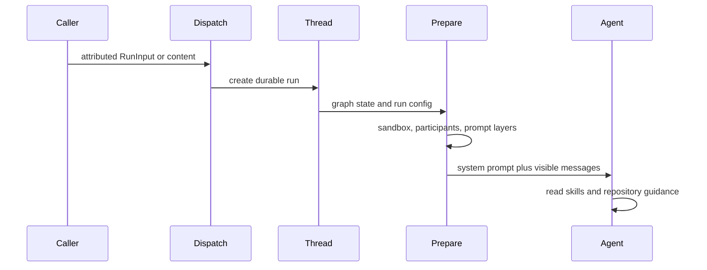

# Context assembly and repository guidance

Open SWE does not pass a webhook or dashboard payload directly to a model. It first builds a typed `RunInput` transcript, creates a durable LangGraph run, then lets preparation middleware resolve runtime-dependent context immediately before the agent's model calls. This separates the durable conversation from material that must be fresh for each invocation—such as the sandbox path, credential-derived sender identity, workspace settings, and recent-thread digest.

This is the main coding-agent path. The [agent graph](../architecture/agent-graph.md), [invocation workflow](invocation.md), and [models, profiles, and instructions](../concepts/models-profiles-instructions.md) describe adjacent lifecycle, graph, and configuration concerns.

## 1. Normalize inbound content into an attributed transcript

`RunInput` contains `messages` and optional virtual `files`. The application-owned message constructors turn authored content into XML-like `<input-message>` envelopes. An envelope has a namespaced `sender`, `surface`, and `kind`; it can also carry a channel and scalar or nested structured metadata. Text and XML attributes are escaped, structured-data field names are constrained, and sender/channel IDs must be nonempty namespaced identifiers without whitespace or XML-sensitive characters. For multimodal content, only text blocks are enveloped, leaving non-text blocks available to an image-capable model.

Before an authored message, callers may add dynamic introductions for a channel or system. These are `<dynamic-context>` blocks whose hash is SHA-256 over canonical XML (without the claimed hash). The hash supports deduplication without trusting a caller-provided hash. `build_input_messages` avoids introductions already in the supplied set; dashboard continuation additionally combines hashes recorded in thread metadata with hashes in graph state.

Summarization creates an important exception: messages before the deepagents summarization cutoff are no longer present in the model prompt even though they remain in state. `visible_dynamic_context_hashes` examines only the post-cutoff suffix, so preparation can introduce a person again when their earlier introduction has been summarized away. XML parsing helpers ignore malformed input instead of using it as sender evidence.

`dispatch_agent_run` is the common boundary for Slack, GitHub, Linear, dashboard, desktop, and other callers. An adapter can submit a deliberately ordered, prebuilt `RunInput`, or let the dispatcher construct one from content and a context. It rejects mixing a prebuilt input with raw content, context, channels, or systems, and rejects omitted content when no input is supplied. `create_durable_run` then supplies Open SWE's run configuration, synchronous durability, interrupt multitasking strategy, resumable stream modes, and optional completion webhook to LangGraph.

## 2. Keep routing provenance out of the transcript

`SourceContext` is durable metadata describing where a thread originated, rather than prompt text. It can hold a Slack thread or ask route, Linear issue, GitHub issue, and PR number; it travels in `source_context` thread metadata and baby-sit watch records. Dispatch passes it to Slack background-status synchronization after an agent run is created.

This metadata is deliberately forward-compatible and failure-tolerant. The top-level and nested models allow unknown fields, while `dump()` excludes fields that were never set; therefore a read-enrich-write caller does not erase integration-specific extras or introduce default values. `SourceContext.parse()` accepts mappings only and returns an empty context after validation failure, logging a warning instead of failing an otherwise usable historical thread.

## 3. Prepare current model-visible context

The main graph starts with `system_prompt=""`. `PrepareAgentRunMiddleware`, installed early in its middleware stack, fills `rendered_system_prompt` in a before-agent step. It resolves or attaches the sandbox, derives the work directory, resolves the GitHub token and triggering identity, loads workspace data, schedules title generation, records run attribution, and selects/validates requested model settings when applicable. Sandbox connectivity errors notify the user and are re-raised; preparation does not silently proceed without a workspace.

Preparation is checkpoint-aware. `BasePrepareRunMiddleware` fingerprints its class, the latest message's type/id/content, and subclass configuration. A checkpointed matching `run_prepared_for` skips repeated setup on a resumed attempt; a later invocation with a different message or configuration repeats setup so credentials and prompt context are fresh. `_prepare` must consequently be idempotent, including on a failure before the latch is checkpointed. Forked deepagent contexts bypass this hook. For each model request, `awrap_model_call` prepends the rendered prompt to any system message that is already present.

### Prompt layers

`construct_system_prompt` renders the `system/main` Jinja template with strict undefined variables. The composed prompt includes environment/working-directory guidance, source-specific behavior, a default prompt loaded from `DEFAULT_PROMPT_PATH` or packaged resources, optional repository-organization boundaries, collaboration and untrusted-external-comment guidance, repository custom instructions, workspace instructions, and optional recent-thread context. Source guidance is selected for Slack, Linear, GitHub, schedules, dashboard, background tasks, or generic runs; repository scope restrictions are only rendered for dashboard and Slack sources.

Sender identity is intentionally **not** rewritten into the historical request. During preparation, the middleware identifies the latest human sender (or triggering Slack bot), resolves thread participants, orders them deterministically by display name and ID, and appends only person introductions not currently visible. That retains an immutable transcript while making current participant information available. A person block may include standing instructions, but repository instructions still govern repository work.

### Recent thread context is optional and privacy scoped

A profile can enable a small digest of the sender's other threads. Preparation enables lookup only for an eligible profile/login: dashboard and private/DM Slack contexts can receive a private audience, while a shared Slack channel receives only a shared-channel audience. Bot-triggered Slack and background-completion runs do not receive it.

The selector searches participant metadata, excludes the current thread, unlisted/admin/automation/incident threads, and applies audience-specific visibility checks. In a shared Slack audience it requires a public thread from the same Slack team and channel; private mode permits public threads and privately owned threads. It returns at most five newest entries, each limited to safe title/repository/status metadata. Rendering caps the section at 4,000 characters by dropping whole trailing entries. Lookup has a one-second timeout and any timeout or error omits the digest rather than failing the run. The module treats the digest as background data, never instructions.

## 4. Repository guidance at root and directory scope

The rendered repository-setup prompt tells the agent to inspect an existing checkout and read applicable repository instructions before setup. For a hosted code-changing task, immediately after synchronizing or cloning it must read the repository-root `AGENTS.md` in full if present; its rules override the agent defaults. A local checkout follows a non-destructive variant, but has the same root-file requirement before substantive work. Repository-provided skills are a separate convention: relevant files may be read from `.agents/skills/<name>/SKILL.md` or `.claude/skills/<name>/SKILL.md` under the repository root.

`SubdirAgentsReadMiddleware` adds a tool-time mechanism for directory-specific rules. After a successful `read_file` result for an absolute path, it finds ancestor `AGENTS.md` candidates from shallowest to deepest and reads unseen files from that thread's sandbox backend. It appends their contents as a `<system-reminder>` to the successful tool result, explicitly saying that deeper instructions take precedence. Reading `AGENTS.md` itself marks that path loaded, preventing a redundant injection later.

This assistance must not turn guidance discovery into a file-read failure. The middleware returns the original result when the requested read failed, is non-text, has no thread/backend, or has a relative path. Each candidate is attempted independently; missing files, backend exceptions, empty/non-UTF-8 results, and other unusable responses are skipped. Candidate reads are bounded to 1,000 lines and 64 KiB; oversized UTF-8 text is truncated with a marker.

The reviewer has a distinct, clone-free convention loader. It fetches root `AGENTS.md` from GitHub Contents at the requested ref, falling back to `CLAUDE.md` **only** after a 404. Network errors, non-200 responses, and content above 64 KiB produce no context rather than an unsafe fallback. For changed files it independently derives directory ancestors, fetches their convention documents concurrently with a semaphore of eight, and returns successful paths in shallow-to-deep order so consumers can apply nested precedence.

## 5. Skills are virtual, read-only instruction files

The main agent exposes skill routes through a `CompositeBackend`; its project/sandbox backend remains the default. Bundled skills are a read-only virtual filesystem route. Hosted runs additionally mount read-only organization skills and, when a credential login exists, that user's skills; the user route is placed first in `skill_sources`. Desktop runs mount a read-only `StateBackend` for user skills and add desktop artifact routes instead of hosted organization/blob arrangements. `_SkillFiles` lazily materializes stored skill records in memory on the first read, so skills are available as files rather than copied wholesale into the prompt.

These routes are passed to `create_deep_agent(skills=...)`, allowing the skills middleware to advertise them while the model reads detailed `SKILL.md` instructions through ordinary file tools. Repository-local skills remain repository files and are not automatically added to that catalog.

The review-style analyzer uses a separate `/skills/` `StateBackend`. Its launchers seed the run input's `files` with bundled playbooks using prefix-stripped paths because `CompositeBackend` removes `/skills/` before delegation. `PrepareAnalyzerRunMiddleware` chooses `bootstrap-repo-analysis` or `continual-learning`, renders the selected agent-facing path into its focused prompt, and the analyzer reads it at `/skills/<name>/SKILL.md` without writing the playbook into the execution sandbox.

## Operational guidance and focused tests

When changing this area, preserve the distinction between untrusted authored content, validated attribution metadata, durable provenance, and privileged prompt instructions. In particular, do not mutate cached transcript messages to inject a current sender; do not regard a summarized-away introduction as model-visible; and do not make unavailable convention files fatal to a successful requested file read.

Start focused verification with `tests/agent/test_input_messages.py`, `tests/agent/test_agents_md.py`, `tests/middleware/test_prepare_run_middleware.py`, `tests/middleware/test_subdir_agents_middleware.py`, `tests/threads/test_recent_context.py`, and `tests/agent/test_skills.py`. They cover serialization and visibility boundaries, convention-fetch failure behavior, checkpointed preparation, scoped injection, privacy/bounds for recent context, and virtual skill routing.
