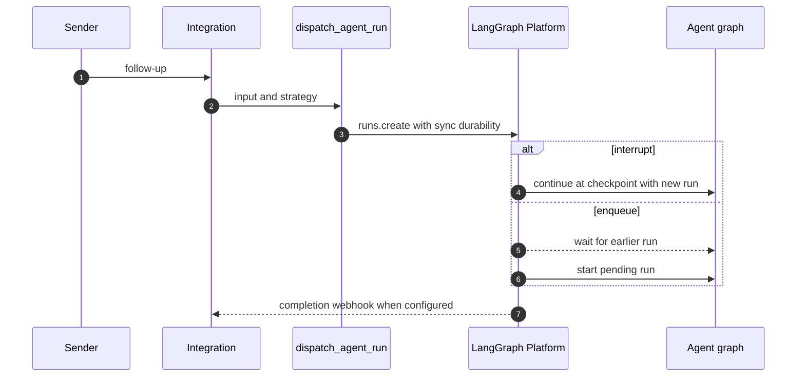
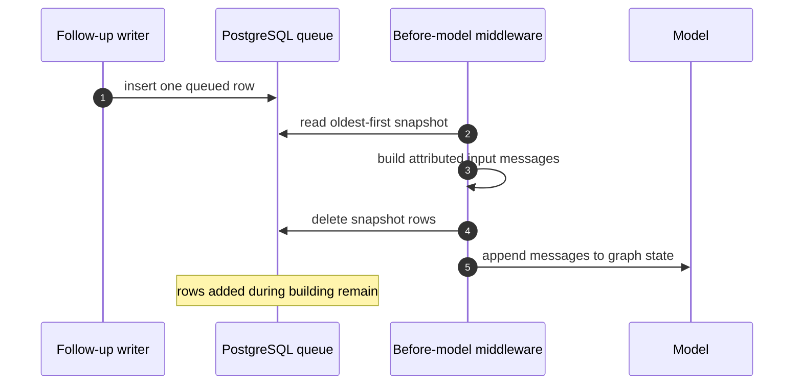

# Follow-ups, interruptions, and deferred delivery

A thread is the continuity boundary for a durable LangGraph conversation. A follow-up can either create another durable run on that thread or be stored for the active run to consume at its next model boundary. These mechanisms solve different ordering problems:

- A **durable run** uses the platform's `multitask_strategy`: `"interrupt"` preempts live work, while `"enqueue"` leaves a new run pending until earlier work finishes.
- A **queued message** is a PostgreSQL row associated with the thread. The before-model middleware snapshots it, turns it into attributed conversation input, and removes only the rows it consumed.

Thus, enqueueing a run is not the same as queueing a message. The former waits for a run slot; the latter can steer a currently executing run. See [Invocation](invocation.md) for initial run creation and [Threads and state](../concepts/threads-and-state.md) for the thread boundary.

## Durable follow-up dispatch

`dispatch_agent_run` is the common contract for agent and reviewer dispatch. Callers may supply a prebuilt `RunInput`, or content plus source identity from which it builds one; it then delegates to `create_durable_run`. The default multitask strategy is `"interrupt"`, though callers can explicitly select `"enqueue"`.

Every durable dispatch uses `durability="sync"`, a resumable stream, subgraph streaming, and the shared v3-compatible stream modes. `prepare_run_config` also adds an invocation identifier and the `__event_streaming_v2` marker. Together, the sync checkpointing and resumable protocol let a dashboard attach to and replay a run that it did not start. A caller can opt out of resumability, but it is on by default.

A completion callback is attached only when `RUN_COMPLETE_WEBHOOK_SECRET` is configured and `COMPLETION_WEBHOOK_URL` is absolute and non-loopback. This avoids a platform-rejected run creation for local/relative callback URLs. The receiving completion endpoint is intentionally fail-closed: its token must match the configured secret.

The strategy is selected at durable-run creation; both paths retain the same thread identity.

### Selecting a strategy

Slack makes the priority choice explicit. `_dispatch_or_queue_slack_run` uses `"interrupt"` for an explicitly tagged request and `"enqueue"` for an untagged follow-up. An explicit request can take over a busy conversation; ordinary thread traffic is serialized behind it rather than preempting it.

Runs that finish while a message is still stored need a pickup. `dispatch_pending_follow_ups` checks `QueuedMessage.for_thread` and, if rows remain, starts an empty-input agent run tagged with `FOLLOW_UP_PICKUP_KIND`; its first model boundary drains the rows. Completion applies this pickup after an ordinary successful run, but not after a pickup run itself, preventing a pickup that left its input untouched from continually retrying.

## Database message queue and before-model drain

`QueuedMessage` is the durable queue. Each message has its own `thread_queued_message` row, monotonically ordered by `seq`; writers insert rather than update, and the consumer deletes only the rows from its snapshot. This prevents a concurrent writer from being overwritten while a run is draining. Reads are oldest first. The table retains at most 100 newest rows per thread, logs dropped oldest rows, and uses a non-null `(thread_id, queue_id)` conflict target to make retried dashboard sends idempotent.

The queue middleware is installed on both the agent and reviewer graphs. Agent stop-summary mode deliberately excludes it, so the read-only stop report cannot consume ordinary deferred work. The middleware is not inherited by subagents.

Each drain removes only its original snapshot, so a concurrent follow-up remains available for a later model call.

### Attribution, handoff, and failure behavior

Before each model call, `check_message_queue_before_model` obtains the thread ID from the run config and reads all queued rows. It converts them in FIFO order through `build_input_messages`, which preserves structured sender, surface, and dynamic-context semantics rather than pasting raw text. Ordinary unstructured content is emitted as automation input from `system:thread-queue`.

Dashboard messages carry `source: "dashboard"`, a stable `queue_id`, web surface, and an attributed GitHub sender. The middleware changes the reply surface to web and emits the dashboard-handoff notice only when moving from Slack, avoiding repeated notices for subsequent web messages. Its structured message receives the queue ID so transcript identity follows the queued dashboard message.

For image URL payloads, the middleware resolves the run model (or thread model) once when needed. It skips fetched images for a model without image support and adds a warning to text, while preserving supplied image blocks. Any failure during construction is logged and leaves the snapshot rows intact for a later attempt; a queue-read failure returns any input already assembled. The queue's snapshot/delete ordering is therefore deliberately **build first, remove after success**, rather than delete-before-convert.

## Stops and preservation policy

### Slack reaction and session stop

A Slack `:x:` reaction is resolved through a reply-to-run mapping, or the reacted timestamp is treated as the root. The handler verifies that the target thread's stored Slack context matches the channel and root timestamp before it claims the event ID. Missing IDs and duplicate claims have no side effects.

After validation and claim, Slack stop enumerates every `pending` and `running` run (with pagination) and cancels them using `action="interrupt"`. It clears all queued messages, marks thread metadata `latest_run_status="interrupted"` and records `stop_requested_at_ms`, then dispatches an agent run in `stop_summary` mode and maps that run back to the Slack thread. Failures to cancel or clear the queue stop the sequence before a summary is dispatched. The summary graph omits queue middleware, ensuring it cannot resume deferred work.

A code-channel `agent_session_stopped` event uses the same live-run enumeration, queue clear, and interrupted status update, then returns the Slack session to `active`. Unlike a reaction stop, it does not dispatch a summary run.

### Dashboard cancellation differs

The dashboard cancellation path authorizes against thread metadata and enumerates live runs instead of trusting `latest_run_id`, so it can stop work that Slack, CI, or another integration started. When a user stops a thread, it preserves a pending run attributed to another user; other pending/running runs are interrupted. It records interrupted transcript turns for precisely the cancelled run IDs and marks the thread interrupted.

Queued messages are preserved. Unless another user's queued run was kept, the handler calls `dispatch_pending_follow_ups`, creating an empty-input pickup run when queue rows exist and updating metadata to its pending run ID. A failure after cancellation to launch that pickup is reported as HTTP 502. This policy avoids discarding a dashboard follow-up merely because it arrived near a stop operation.

## Completion delivery and operations

The completion handler treats `success`, `error`, `timeout`, and `interrupted` as terminal for telemetry and relevant bookkeeping, but only `error` and `timeout` are user-visible failures. `interrupted` is expected when a follow-up preempts a run and must not create a misleading failure reply.

For a failure, it resolves the originating Slack, Linear, or GitHub location from thread metadata and posts a best-effort explanation. Failure replies are idempotent per run ID (with a bounded list of recorded IDs); legacy payloads without a run ID fall back to a thread-level flag. Success resets the consecutive event-woken failure counter, settles Slack status, and, for eligible Slack runs with an invocation ID, schedules one session-cost refresh per run.

Operationally, configure an externally reachable non-loopback `COMPLETION_WEBHOOK_URL` and `RUN_COMPLETE_WEBHOOK_SECRET` to enable completion delivery. Without the secret, the endpoint rejects all callbacks and dispatch safely omits the webhook. Monitor queue-cap warnings: they mean the oldest deferred inputs were intentionally dropped after the 100-row limit.

## Focused tests

`tests/agent/test_dispatch.py` verifies durable defaults, including sync durability, interrupt strategy, v3 stream shape, resumability, invocation/prepare IDs, and optional callback attachment. `tests/middleware/test_check_message_queue.py` verifies that a dashboard handoff is announced only once and that a message inserted while a snapshot is being converted remains queued. `tests/slack/test_slack_stop.py` covers mapped-reply stops, cancellation of pending and running runs, cleanup, summary dispatch, duplicate-event safety, context mismatch rejection, and failure short-circuits.
