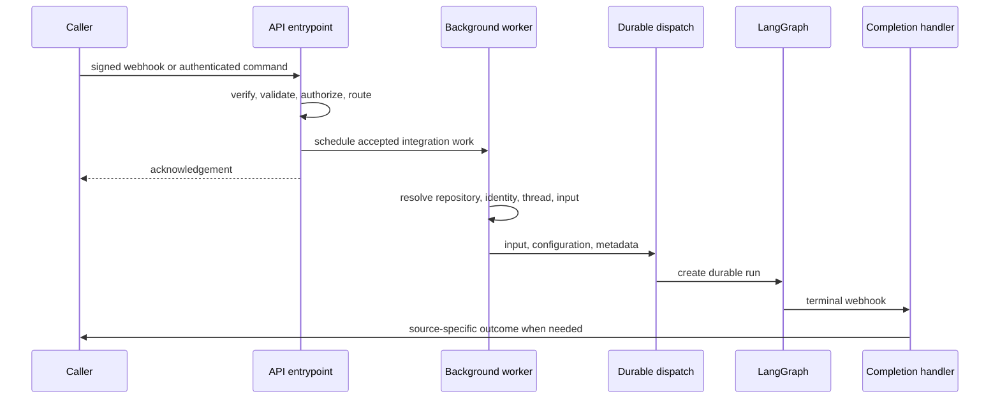

# Inbound Invocation to Durable Run

Open SWE has several admission surfaces, but they converge on a persisted LangGraph thread, structured `RunInput`, `RunConfig`/metadata, and a durable run. The source remains significant: it determines authorization, a reply surface, identity context, and—in Slack—the multitasking behavior. See [Auth and security](../concepts/auth-and-security.md), [Threads and state](../concepts/threads-and-state.md), and [Follow-up messages](follow-up-messages.md) for the corresponding policies.

## Lifecycle

This diagram shows the common boundary: webhook routes acknowledge after cheap admission and defer remote work, whereas the dashboard enriches and proxies the command synchronously.

## Application and admission boundary

`create_app` mounts dashboard, plan, workflow-approval, Linear, Slack, health/completion, GitHub, rollout, sandbox-tool, and sandbox OpenAI routers. It adds the desktop `open-swe://app` origin but refuses a wildcard dashboard origin while credentialed CORS is enabled. At startup it validates GitHub login policy, sandbox and local-development model configuration, requires/migrates the database, and starts listeners; some migration and listener failures are deliberately logged without preventing service startup.

GitHub, Linear, and Slack webhook routes read and authenticate the raw body before parsing it. Invalid signatures receive `401`; Linear also rejects a signed delivery whose `webhookTimestamp` is over one minute from local time. Each route records an event log before applying its event-specific filters, so an accepted HTTP response is not itself evidence that an agent run was created.

## Surface-specific routing

### Slack

The Slack Events endpoint verifies the signature, handles URL verification, and rejects ineligible channels before normal message routing. In an external shared channel, an `app_mention` receives a one-time claimed refusal reply; unverified/external channels never dispatch work. Ordinary messages are filtered to prevent bot/self loops and must be directed at Open SWE: an explicit mention, direct message, code-channel message, kitchen-channel message, permitted solo-thread follow-up, allowed bot, or a supported message update. Code channels intentionally share one session thread and treat every message as directed.

Before a normal message worker is scheduled, the route claims the Slack event. This is the delivery deduplication gate. It resolves the thread by preferring the stored location mapping, then exact source-context metadata, and finally a deterministic location-derived identifier; more than one metadata match is an error rather than a guess. Message edits are separately claimed and are associated only with a matching previously delivered message.

The worker obtains Slack identity, history, channel context, repository resolution, and existing thread state. It serializes channel/person/system introductions and message envelopes into `RunInput`; visible dynamic-context hashes and source timestamps prevent unnecessary reintroduction/replay. An explicit request is dispatched with `multitask_strategy="interrupt"`; other Slack follow-ups use `"enqueue"`, so they wait rather than replace active work. Failures before dispatch are reported back to the Slack target.

### Linear

Linear verifies the raw-body signature, logs the delivery, rejects replayed timestamps, and treats Issue create/update events as automation candidates. Agent work is limited to non-bot `Comment` `create` events that mention Open SWE and identify an issue. Repository resolution prefers an explicit repository in the comment, then the comment author's profile default, then the workspace default; the selected repository must be allowed. The route schedules `process_linear_issue` after admission, passing the issue and selected repository.

### GitHub and review work

GitHub similarly verifies before parsing, logs the delivery, and rejects a repository that no workspace owns. It multiplexes PR state, push, CI, issue, issue-comment, review-comment, and review events. Event/action filters, repository allowlisting, registered-commenter checks, public-repository organization gates, and Open SWE mention requirements prevent routine GitHub traffic from becoming coding runs. PR state and push paths can instead update review/watch state or schedule automatic review; replies to review findings are routed to their dedicated handler.

### Dashboard and desktop

The dashboard proxy accepts JSON commands on behalf of an authenticated principal. A missing thread may only be created by `run.start`; other commands receive `404`. On a busy thread, an interactive `run.start` is either steered into an open transcript turn or queued as a follow-up; machine principals cannot use that attribution path and receive `409`. The proxy enriches starts before forwarding to LangGraph and records the returned run as pending in thread metadata.

Desktop is a source value carried in `RunConfig` rather than a separate webhook path. Local desktop execution is allowed only when `source == "desktop"` and the requested project resolves either to a registered allowed project or to a worktree below the configured worktree directory.

### Scheduled automations

The scheduler graph routes a cron tick by task type. Ordinary schedule ticks call `launch_scheduled_agent_run`; missing schedules and obsolete trigger ids are detected rather than run. A launch checks enabled/workspace state and, when a repository is supplied, workspace repository access. It creates a fresh UUID thread with automation metadata, builds a system-authored automation input and configuration, then invokes `create_durable_run`. Post-dispatch bookkeeping records the latest thread/run but does not undo a durable run if bookkeeping fails.

## Input, configuration, and durable dispatch

Inputs at the graph boundary are typed messages, not unstructured prompt strings. `human_input` and `system_input` require aligned context kind/role and wrap authored text in XML-escaped `<input-message>` envelopes. Identity introductions are `<dynamic-context>` messages whose canonical content is SHA-256 hashed; Slack uses those hashes to avoid repeating context that is still visible.

`dispatch_agent_run` is the shared agent/reviewer contract. It rejects a prebuilt `input` combined with raw content or identities; otherwise it builds typed input from supplied context or from parsed configuration. It then delegates to `create_durable_run`, where `assistant_id` chooses the graph.

`create_durable_run` optionally ensures the titled thread, derives useful run metadata, and places an invocation id and start time in both configuration/metadata. Its defaults are `multitask_strategy="interrupt"`, `durability="sync"`, and resumable streaming. Every run carries the v3 compatibility marker, standard stream modes, and subgraph streaming. Sync durability checkpoints before each step, while resumable streams let clients attach to externally initiated runs.

A completion webhook is attached only when `RUN_COMPLETE_WEBHOOK_SECRET` is configured and `COMPLETION_WEBHOOK_URL` is absolute and non-loopback. The receiver fails closed on that token, parses only JSON objects, and delegates terminal handling. This avoids a relative/loopback webhook configuration making run creation fail.

## Completion and recovery

Completion first settles telemetry and transcript state, then handles task workers, review-style state, queued follow-up pickup, and task/event delivery as applicable. A successful non-review run can restore code-channel status, schedule answer feedback, and schedule a deduplicated Slack session-cost refresh when the thread has a Slack location and a valid invocation id.

For `error` and `timeout`, completion loads thread metadata, best-effort settles an unfinished reviewer check, restores code-channel state only when no later run is live, and posts a source-appropriate Slack, Linear, or GitHub failure reply. Failure replies are deduplicated per run id (or by a legacy thread flag without a run id), and repeated event-woken failures are capped. `interrupted` is intentionally not a failure reply: it is the expected result of an interrupting follow-up.

## Change guidance and focused verification

- Preserve raw-body verification before parsing, stale-delivery checks, and Slack claims. Exercise signature failure, replay, external-channel refusal, duplicate delivery, and message eligibility when changing admission.
- Treat Slack location mappings and source context as routing compatibility data. Do not replace a conflict with a heuristic selection.
- Keep new run producers on `dispatch_agent_run` or `create_durable_run`; verify defaults, stream configuration, invocation correlation, and the completion-webhook fallback in `tests/agent/test_dispatch.py`.
- Verify success/failure completion behavior, per-run idempotence, reviewer cleanup, pending follow-up pickup, and intentional interrupted-run silence in `tests/webhooks/test_completion_webhook.py`.
- Verify dashboard lazy creation and busy-thread steering/queue behavior in the thread proxy tests, and schedule launch authorization, fresh thread creation, and durable-dispatch bookkeeping in schedule tests.
