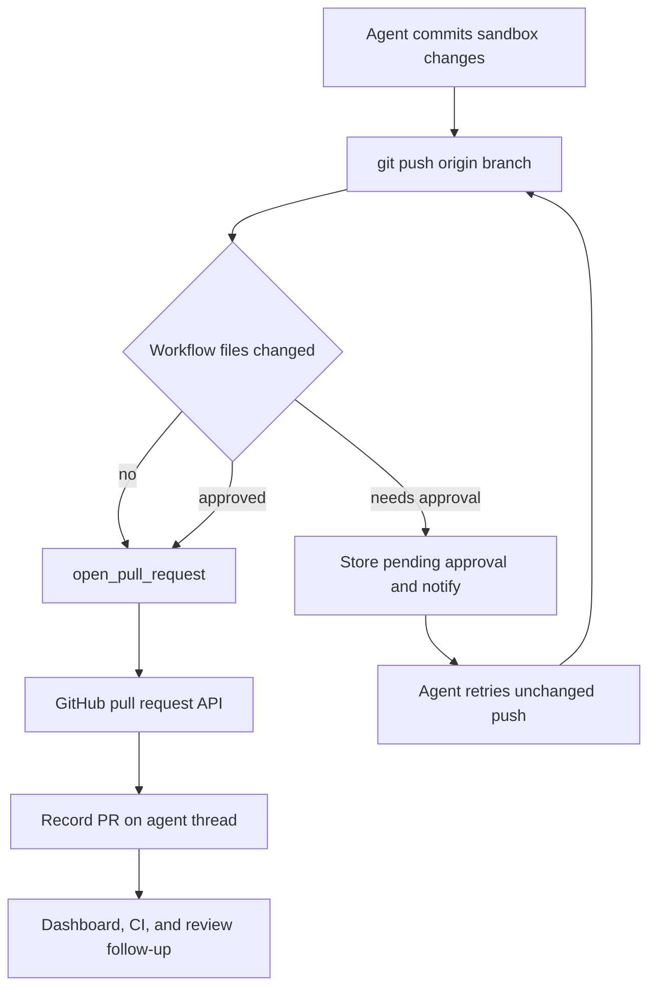

# Coding delivery and pull-request creation

The delivery path is **commit → push → open or update a pull request → respond to CI and review**. Creation is deliberately centralized in `open_pull_request`, while middleware protects two boundaries: avoiding an unattributed direct-create fallback and requiring human confirmation before workflow files are pushed. The resulting PR is persisted against the agent thread, which makes it visible to the dashboard and lets lifecycle webhooks update—or, when opted in, resolve—the thread.

Caption: delivery proceeds through the workflow-push approval boundary before an attributed PR is opened and recorded.

## Open an attributed PR

After pushing the branch to `origin`, the agent calls `open_pull_request(owner, repo, head, base, title, body, draft=True, resolves_thread=False)`. Do not substitute `gh pr create`: the tool chooses the PR author's credential, validates access, adds delivery metadata, and returns `success`, URL, number, author, token kind, and `created`.

The author token comes from the scoped author selected for the thread. When an author login is available, the tool obtains that person's valid GitHub OAuth token; a missing or revoked user authorization fails rather than silently changing the author. For a system thread with no author login, it uses the GitHub App installation token. A user-token operation is additionally constrained to a repository visible to the workspace App unless a private credential owner is configured, and the act-as consent gate may refuse the create operation.

Before POSTing `/repos/{owner}/{repo}/pulls`, the tool checks the repository and base branch, and checks the head branch when it is in the same owner. Its structured failures distinguish inaccessible repository/App access, an invisible branch (including an unpushed head), revoked user authorization, and other preflight errors. Diagnostic errors include GitHub's status, selected response headers, and a truncated body; this is intended to make a failed delivery actionable rather than invite a shell fallback.

Creation is idempotent for an existing open PR on the head branch: after a `422`, the tool looks it up and returns `created=False`. The caller should then use `gh pr edit` for edits rather than create a duplicate. The requested `draft` value is a default; `RunConfig.draft_prs`, when configured, overrides it.

### PR body, references, and recording

The tool stamps the platform attribution/collaboration footer and can append a `## References` section. A rendered plan gets a dashboard link. Slack-source runs can include their Slack permalink; Linear and GitHub-origin references are included when the destination repository is confirmed private. Reference gathering is best effort, and a body already containing `## References` is left unchanged.

After either a successful creation or duplicate lookup, telemetry fetches PR details and records usage, trace feedback, thread metadata, and a durable `PullRequest` registry record linked to the agent thread. Thread metadata retains normalized `pull_requests` records as well as legacy `pr_url` fields. For an active Slack code-channel session, it refreshes repository context, exposes the PR as an agent resource, and displays the diff only when GitHub returns a nonempty one. This recording is best effort: a telemetry or registry failure does not retract a PR that GitHub already created.

`resolves_thread=True` is delivery intent, not immediate resolution. Lifecycle webhooks update records matched through the PR registry (falling back to persisted metadata). A thread auto-resolves only once *all* its tracked PRs are terminal and at least one carries that flag. Otherwise a terminal set is marked `attention_reason="prs_closed"`; reopening a PR clears an automatic resolution or that attention marker.

## Delivery mutation guards

### Block direct creation fallbacks

`PullRequestCreationGuardMiddleware` wraps `execute` and `background_execute`. It blocks `gh pr create`, `gh api` pull-creation requests with POST or body fields, and `curl` POST/body requests to GitHub's pulls endpoint. The detector tokenizes commands and expands supported `bash`, `dash`, `sh`, and `zsh` `-c` nesting to a bounded depth; reaching the limit is blocked rather than treated as safe.

The result is a non-recoverable `PullRequestCreationFallbackBlocked` tool error with code `pr_creation_fallback_blocked`. Safe operations such as `gh pr view`, `gh pr edit`, and comments are not creation fallbacks. The hosted main agent and hosted subagent guard stack install this guard; local runs skip it.

### Require a human decision for workflow files

`WorkflowPushGuardMiddleware` recognizes only conservative standalone `git push origin <refspec>` commands, including `git -C`, `cd ... &&`, and `--set-upstream` forms. Other command shapes are not interpreted by this middleware. For an eligible current-branch push, it uses the sandbox backend to compare the target commit with the remote branch or merge base and examines `.github/workflows/`. If no workflow paths changed, the original push proceeds.

For a workflow change, the guard computes changed file names, binary diff, bounded preview, diff statistics, base and head SHA, normalized remote, and a SHA-256 fingerprint over the change identity. It stores a pending approval under the fingerprint in the thread's `workflow_push_approvals` metadata, retaining the review fields and notification state. Records are trimmed to the 20 most recent; an approved or rejected record is terminal.

An approved fingerprint allows only the inspected commit: the middleware rewrites the command to an explicit `<head_sha>:refs/heads/<branch>` refspec. A missing, pending, rejected, or failed approval lookup returns `WorkflowPushApprovalRequired`. A changed workflow diff produces a different fingerprint and therefore needs another decision. The workflow guard is installed for both main agents and subagents.

The guard posts an interactive Slack request only when the pending record is not already notified, then marks it notified after the post succeeds. The dashboard workflow-approval routes require a session, same-origin mutation protection, and readable/promptable thread access. Approval records the session actor and dispatches an agent follow-up directing a retry of the unchanged push; rejection records the decision without dispatching a retry.

## User-facing PR controls and status

`request_pr_review` is a separate handoff from creation. It parses a GitHub PR URL, obtains active Slack-thread context and the triggering identity from run configuration, delegates to the reviewer trigger, and adds a dashboard review URL on success.

The dashboard reads the tracked PR list (or legacy `pr_url`) using the viewer's GitHub credential. Per PR, it reports live open/closed/merged state, draft status, merge conflict state, failing checks with links, pending and inconclusive check counts, and unresolved review threads. Reads degrade independently: `statusAvailable`, `checksAvailable`, and `commentsAvailable` must be respected instead of interpreting an unavailable section as clean.

The dashboard's mutation layer uses typed `merge`, `close`, `mark-ready`, and `update-branch` actions. Each confirms GitHub's response: merge includes the viewed head SHA, close optionally posts a deduplicated reason before closing, draft readiness uses GitHub GraphQL because REST cannot clear draft state, and update-branch uses the expected head SHA. Resolving review threads likewise restricts requests to currently unresolved threads on that PR and performs mutations serially to avoid GitHub secondary-rate-limit pressure.

## CI and feedback follow-up

`CommitChecks` reads GitHub check runs and legacy commit statuses together, filters Open SWE's own checks, and returns unavailable rather than breaking webhook handling when either read fails. Required checks combine branch protection and rulesets, including an optional App identity, so the system can tell whether a required check has actually reported.

Baby-sit treats completed `failure`, `timed_out`, and `action_required` runs—and failing legacy statuses—as retryable failure signals. It treats incomplete checks as pending and other terminal non-success states as requiring owner triage. CI webhook helpers normalize branch and head SHA from `check_run`, `check_suite`, `workflow_run`, and `status` events; active watches match the delivered SHA or branch. Dispatch is deduplicated per head/retry fingerprint, bounded by a retry limit, and queued as an agent follow-up.

For GitHub review feedback, `fetch_pr_comments_since_last_tag` merges issue comments, inline review comments, and nonempty review bodies chronologically. The first configured Open SWE mention returns the full history; later mentions return entries after the prior mention. Configured handles use a suffix boundary, so `@openswe` does not accidentally match `@openswe-preview`. Before prompt inclusion, reserved trust-wrapper tags are sanitized and comments from unregistered authors are fenced as untrusted.

## Focused verification

- `tests/github/test_open_pull_request.py` covers token, preflight, body, duplicate, and failure behavior.
- `tests/github/test_pr_creation_guard.py` covers direct and nested-shell fallback detection and allowed PR commands.
- `tests/agent/test_workflow_push_guard.py` covers push parsing, diff/fingerprint approval, no-workflow pass-through, and explicit-SHA rewriting.
- `tests/github/test_github_ci.py` and `tests/github/test_baby_sit_webhook.py` cover required-check/CI handling and signed CI webhook routing.
- `tests/github/test_pull_request_actions.py` and `tests/agent/test_agent_thread_pr_state.py` cover confirmed user actions and PR-driven thread lifecycle updates.
