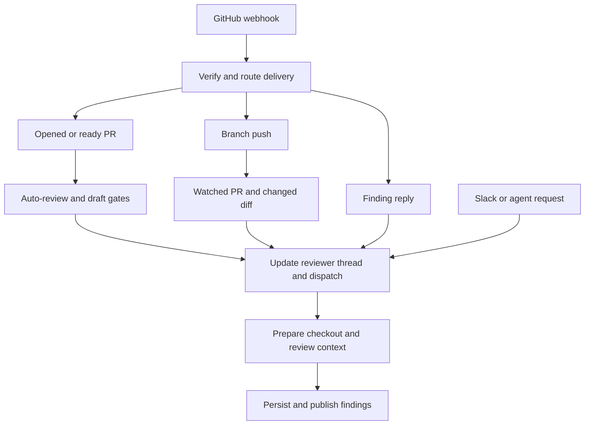
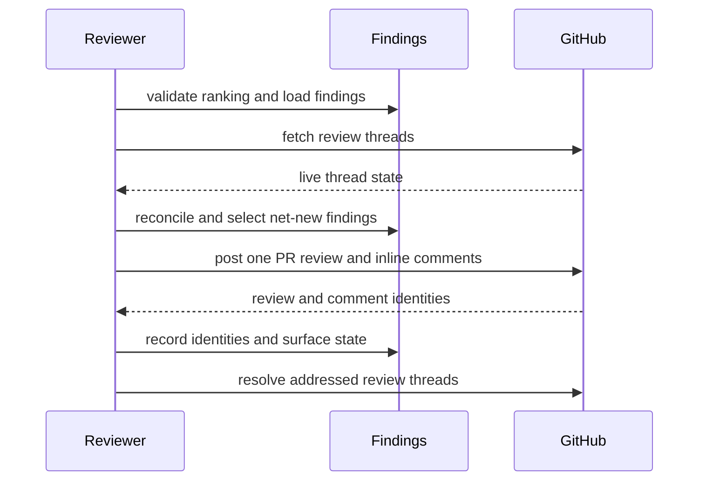
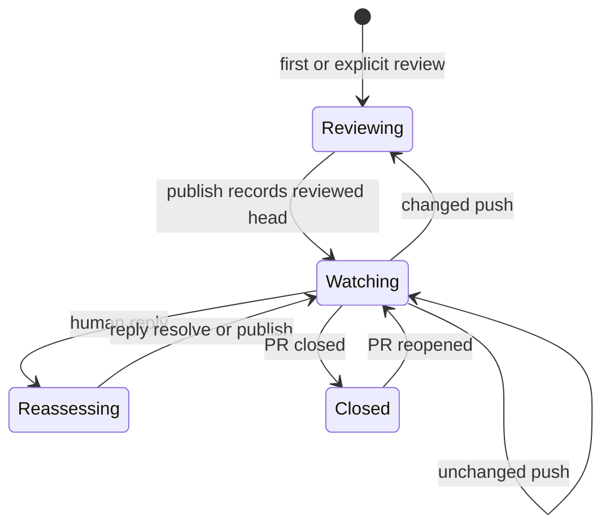

# Pull-request review lifecycle

Open SWE treats review as a long-lived per-pull-request workflow, not a sequence of independent comments. The `reviewer` graph owns review output; its deterministic LangGraph thread retains routing and watch state while PostgreSQL owns the evolving finding records. Later pushes, GitHub replies, and a requested re-review converge on that same state. For graph boundaries and the scout, see [Reviewer and Analyzer Architecture](../architecture/reviewer-and-analyzer.md); for sandbox behavior, see [Sandbox Lifecycle](../architecture/sandbox-lifecycle.md).

## Admission and entrypoints

`POST /webhooks/github` is the signed ingress. It verifies `X-Hub-Signature-256`, records the delivery, rejects unsupported event/action shapes, and routes accepted work through FastAPI background tasks. Before routing a repository-associated delivery, it verifies that a workspace owns the repository; an unavailable ownership lookup returns `503` so GitHub retries rather than silently losing work.

There are four useful ways into a reviewer run:

- **Automatic first review:** `pull_request` `opened` and `ready_for_review` actions require the repository’s automatic-review setting. Public-repository organization policy is then enforced. A draft is reviewed only when the author’s effective `review_draft_prs` setting permits it.
- **Explicit request:** the main-agent `request_pr_review` tool parses a GitHub PR URL, retains the active Slack-thread reference when available, and calls `trigger_pr_review_from_ref`. The trigger fetches PR metadata, rejects draft PRs, initializes the canonical reviewer thread with `watch=true`, posts a transient in-progress comment, and dispatches the reviewer.
- **Push re-review:** a branch push is eligible only for an automatically enabled repository, an open PR on that branch, and an existing watched reviewer thread.
- **Finding reply:** a registered user’s reply to an Open SWE inline review comment is routed ahead of ordinary mention processing into a focused `finding_reply` reviewer run.

The entrypoints converge on the canonical reviewer thread, while push eligibility prevents unsolicited repeat reviews.

## Stable identity and state ownership

`reviewer_thread_id(owner, repo, pr_number)` is UUIDv5 over `"{owner}/{repo}/pr/{pr_number}/reviewer"`. Webhooks and the reviewer re-derive it from the same external identity; it is therefore a persisted routing contract, not an implementation detail that can be changed without migrating live threads.

The thread metadata is deliberately limited to reviewer-level state: `kind="reviewer"`, PR identity, current `head_sha`, `last_reviewed_sha`, `watch`, optional Slack origin, current run/check/status-comment identifiers, and similar coordination data. Runs are dispatched with `assistant_id="reviewer"`, which `langgraph.json` maps to `openswe.graphs.reviewer:traced_reviewer_agent`.

Findings are durable PostgreSQL records under the pull request, linked to the reviewer thread by `pull_request_finding_state`. This permits a reviewer sandbox to be replaced without losing findings. On first access, legacy findings still held in metadata are copied into the database; reads normalize legacy publication fields into canonical comment/thread-ID lists and monotonic `surface_state`. Evaluation runs are the intentional exception: their findings are isolated in process memory so repeated benchmark runs do not contend for a PR’s production state.

Each finding captures its generated title, category, severity and confidence, file/range/side, description and optional suggestion, diff hunk and SHAs, status, fingerprint/rank, GitHub identities, surface state, and human/bot interactions. Mutations lock the pull-request finding state, re-read the freshest rows, and write only actual changes. Snapshot replacement merges by ID, while append de-duplicates an open finding by its normalized fingerprint. A missing reviewer thread is returned to tools as a structured `thread_not_found` do-not-retry result.

## Deterministic preparation and review discipline

Before its first model call, `PrepareReviewerRunMiddleware` acquires and caches a repository-scoped GitHub App token, ensures a replaceable per-thread sandbox, and clone-or-fetches then checks out the requested head. The checkout is disposable: if replacement cannot restore an unreachable sandbox, the run posts a notification and fails instead of pretending the repository is trustworthy.

Preparation materializes either the initial PR diff or a delta from `last_reviewed_sha`, computes the changed `(file, side, line)` membership set, and injects both diff text and line set into agent state. In parallel it fetches PR metadata, existing review threads, organization guidance, repository style, base-SHA `AGENTS.md` instructions, approval policy, and optional API standards; it reconciles live threads before using them as context. For ordinary reviews it also awaits a head-specific review-scout walkthrough, but a scout timeout/failure is non-fatal.

The reviewer exposes dedicated review tools rather than code-authoring tools: it can inspect the review diff, add/update/list findings, publish, reply to, or resolve finding threads. PR title/body, existing review comments, and finding replies are author-controlled data, not instructions: they are delimited in XML-style blocks with closing tags neutralized, and GitHub logins are constrained. Approval policy and repository instructions are read at the base SHA so the PR cannot rewrite the standard by which it is judged.

`add_finding` normalizes a one-ended range, requires a non-default generated title, validates severity, confidence, side, and range ordering, and rejects line anchors absent from the changed-line set with `success: false`, `in_diff: false`, and a do-not-retry instruction. File-level findings with no line range can be stored, but cannot be inline GitHub comments. Suggestions over `MAX_SUGGESTION_LINES` (four) are dropped while the description-only finding remains.

## Publication and its failure semantics

`publish_review` must be the only tool call in its model turn. Its required `ranking` must enumerate every candidate exactly once, most important first; otherwise it posts nothing. Candidates are open, in-diff, unpublished findings at or above the selected severity threshold (default `medium`), ordered/capped by the finding selector. Re-reviews further restrict publication to findings first seen at the live head, avoiding duplicate inline comments.

This publication sequence makes GitHub thread identity recoverable for later reconciliation and resolution.

One GitHub PR Review contains the host-formatted summary plus eligible inline comments anchored by path, line/range, and side. Every inline comment carries an `open-swe-review-comment` marker containing the finding and anchor identity; optional suggestions are fenced `suggestion` blocks. After GitHub accepts the review, the tool records the review and comment identities in a consolidated findings update, backfills from threads if necessary, records thread IDs, resolves addressed threads, links the pull request to the review, advances `last_reviewed_sha`, removes the transient status comment, and settles the check.

The response is structured and must be interpreted rather than treated as a simple boolean. Evaluation is a dry run that stores a publication snapshot but posts nothing. If no net-new comment exists after an earlier Open SWE review, publication skips a duplicate “no issues” summary while still resolving fixed threads and advancing `last_reviewed_sha`. If GitHub rejects anchors with an unresolved-anchor `422`, the tool filters against a current diff, drops identifiable invalid findings, and retries once only when valid comments remain; otherwise it returns `unresolvable_findings` with remediation guidance. A stale assessment whose declared commit differs from the live head is rejected before posting.

## Watch, reconciliation, and completion

A `closed` PR disables `watch`; `reopened` enables it. `converted_to_draft` disables it only when the PR author’s effective draft-review setting is off. On a watched push, the workflow stops when the head already equals `last_reviewed_sha`. If it can prove the PR diff is unchanged, it advances the reviewed SHA, carries the walkthrough forward when PostgreSQL is configured, and creates then completes a current-head **No new changes to review** check. Otherwise it reconciles live threads, refreshes PR/head metadata, creates an in-progress **Open SWE Review** check, and dispatches a `re_review=True` run with an instruction to reconcile existing findings and add only net-new ones.

Reconciliation matches GitHub review threads first by Open SWE’s embedded marker, then by saved thread ID, then by comment ID. It backfills publication identity, marks findings surfaced, records the latest non-bot reply after the bot comment as an interaction requiring reassessment, and resolves an open finding only when every matched thread is resolved. An outdated thread is terminal but does not itself establish resolution. The sweep writes only when state changed; reply handling then dispatches the focused reviewer with `reviewer_event="finding_reply"`.

The lifecycle retains finding and GitHub-thread identity while review runs come and go.

Automatic first reviews and changed-push re-reviews create and track an **Open SWE Review** check. `settle_review_check_run` clears its stored ID only after GitHub accepts the completion patch; on transient failure it keeps the ID and persists the intended result for retry. If a run exits without publication, after-agent middleware completes the remaining check as `neutral`—an incomplete reviewer run is infrastructure failure, not a code failure—unless it can retry a pending real publication result.

## Operations and focused tests

Automatic review is opt-in through the repository setting; an App installation alone is insufficient. When a review appears stuck, inspect reviewer-thread metadata for `review_check_run_id`, `review_check_pending_result`, and `status_comment_id`, then check App-token access and sandbox preparation. A `thread_not_found` tool response is terminal for that run, not a retry signal.

`tests/reviewer/` focuses on automatic-review admission (`test_pr_ready_auto_review.py`), watched pushes and unchanged diffs (`test_reviewer_watch.py`), finding persistence and tools (`test_reviewer_findings.py`, `test_reviewer_tools.py`), reconciliation (`test_reviewer_reconcile.py`, `test_reconcile_sweep.py`), diff preparation (`test_reviewer_diff.py`), publishing and outcomes (`test_reviewer_publish.py`, `test_reviewer_outcomes.py`), and review-scout Git behavior (`test_review_scout_git.py`).
