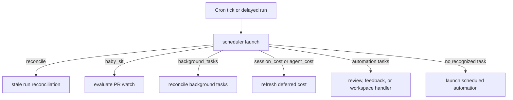
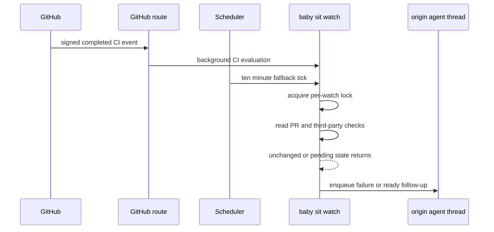

# Schedules, automations, and PR babysitting

Open SWE separates **model-free control work** from work that deliberately starts an agent. The `scheduler` assistant receives cron ticks and delayed runs, deterministically selects one handler, and never makes the routing decision with an LLM. A handler may maintain state itself, enqueue a fresh run on an existing agent thread, or launch a fresh automation thread.

This page covers the automation and reliability layer around agent work. For invocation and durable runs, see [Invocation](invocation.md); for source follow-ups, see [Follow-up messages](follow-up-messages.md); and for the agent's PR workflow, see [PR creation](pr-creation.md).

## The scheduler is a router

`openswe.scheduler.get_scheduler` compiles a single-node graph, `START → launch → END`, registered as `scheduler` in `langgraph.json`. `_launch` reads `task` from the tick state or its `RunConfig`, invokes one matching coroutine, and returns that handler's result.

Diagram: a scheduler invocation selects exactly one bounded path.

The core branches return a status such as `missing_watch_key`, `missing_thread_id`, `missing_request`, or `missing_schedule_id` for absent routing input rather than crashing a cron. The outer call retries transient sandbox-attach failures for a bounded interval; after exhaustion it returns `sandbox_unavailable`. Producers, rather than the router, own their cron creation and cleanup.

### Stored automations and triggers

Automations are PostgreSQL records (`automation` and `automation_trigger`) containing a prompt, workspace, enabled state, and one or more triggers. A schedule trigger owns one LangGraph cron; GitHub, Slack, and Linear triggers are dispatched from their respective inbound webhooks. GitHub deliveries are claimed once per automation before launch, preventing one delivery from starting duplicate work.

A dashboard schedule accepts only normalized five-field cron expressions. Each field supports `*`, numbers, ranges, steps, and comma-separated lists, and is range checked. When a schedule cron fires, the scheduler passes its `schedule_id` and `trigger_id` to `launch_scheduled_agent_run`. That function verifies that the automation and its fired schedule trigger still exist; it removes orphan crons for missing or replaced records rather than running an obsolete definition. A valid trigger launches a new agent run from the automation record.

## Reliability and deferred housekeeping

### Reconciliation of stuck durable runs

Completion webhooks normally release a thread after its run ends. `reconcile_stale_runs` is the safety net for a lost completion: it pages through `busy` threads, lists each thread's `pending` runs, and interrupts only runs older than `max_age_seconds` (1,800 seconds by default). Invalid timestamps are skipped. Search failures end the sweep, but per-thread failures are isolated, so one bad thread cannot prevent other busy threads from being repaired. The result reports `threads_checked`, `stale_runs`, and `cancelled`.

### Deferred cost refreshes

LangSmith cost availability can lag completion. Session and usage cost therefore use stateless delayed scheduler runs at a fixed sequence of 15, 30, 60, 120, and 240 seconds, with `on_completion="delete"`; they do not leave permanent pollers.

* On a qualifying Slack-backed agent completion, the completion handler schedules `session_cost` once per run and records the scheduling identity in thread metadata. A refresh verifies the Slack response mapping, retrieves both cumulative session cost and the run-only cost, and updates the Slack footer. Only a transient `pending` outcome schedules the next attempt; unavailable prerequisites or exhausted retries clear the pending marker and stop.
* `agent_cost` retrieves the run-only LangSmith cost for an invocation and persists it to agent-usage telemetry. It also stores the successful value in per-run thread metadata for dashboard use. Invalid payloads and explicit unavailable results terminate; retrieval or persistence failures consume the same finite retry budget.

### Background commands: callback-first, polling fallback

Background command completion is model-free. For a launch whose person opted into `experimental_background_callbacks`, the runner calls back through the sandbox tools channel; otherwise `ensure_background_task_cron` maintains one per-thread `background_tasks` cron every minute. Both paths reconcile only tasks owned by the relevant thread, including carefully scoped legacy ownership.

A terminal task (`completed`, `failed`, `timed_out`, `stopped`, or `lost`) is claimed by creating a task-local claim directory before a completion message is enqueued to the owning agent thread. Delivery is marked durable only after dispatch succeeds; a dispatch error releases the claim so a later callback or tick can retry. Completion prompts contain task metadata and direct the agent to retrieve bounded output when needed.

The reconciler synchronizes the Slack background status and maintains the thread's tracked running-task metadata. A polling monitor removes its crons when the thread or sandbox is gone. When it appears idle, it takes a sandbox monitor lock and performs a fresh task listing before deletion, avoiding a race with a just-started task or an undelivered terminal notification.

## Thread wakeups

`schedule_thread_wakeup` creates a one-shot cron directly for the current thread and the `agent` assistant, rather than using the scheduler assistant. It accepts integer delays from one minute through 24 hours, rounds the fire time upward to a minute, and assigns an `end_time` 90 seconds later so the expression cannot fire again. It supplies a system automation message, a default polling prompt if none is provided, selected source/repository configuration, and the normal completion webhook when configured.

To prevent autonomous polling loops, each thread may create at most 10 wakeups between human messages. The tool derives a generation hash from the latest human input message, stores the generation and count in thread metadata under a per-thread in-process lock, and resets only when a new human message appears. It records the count before cron creation, so a failed creation still consumes the budget.

Firing stops a cron but does not remove its row. Before creating a new wakeup, the tool best-effort fully pages and deletes only rows with `metadata.kind=thread_wakeup` and an expired `end_time`; it never selects dashboard or analyzer crons. `cancel_thread_wakeups(thread_id)` provides explicit cleanup for a thread.

## `/baby-sit`: opt-in CI monitoring

A baby-sit watch is not a general repository watcher. It is a durable, opt-in watch created by the agent-facing `manage_baby_sit` tool for one canonical GitHub PR URL. The tool requires an executable agent thread; on start it verifies GitHub access, an open PR with a head SHA and branch, and a GitHub App installation. Stop and retry recording are restricted to the thread that owns the watch.

### Watch state and triggers

A `BabySitWatch` is persisted in the `baby_sit_watches` store under a lower-cased `owner/repo#number` key. It binds the origin thread, head SHA/ref, App installation, selected follow-up configuration, and `SourceContext`; it also persists retry counts, failure-dispatch keys, webhook delivery IDs, alert keys, evaluation errors, and the cron ID. Only one active thread can own a PR watch. Restarting on the same head carries deduplication and retry state; a new head starts it fresh.

Starting first stores the watch, then idempotently finds or creates a UTC `*/10 * * * *` cron tagged `kind=baby_sit_watch` that invokes `scheduler` with `task=baby_sit`. Duplicate crons are removed. If first-time cron creation fails, the service rolls back the new store row and any known partial cron. Stopping removes the cron and row; if deletion fails, it marks the row inactive so evaluation cannot continue.

Diagram: webhook-first and polling-fallback triggers converge on a serialized evaluation.

The GitHub route rejects requests unless `X-Hub-Signature-256` matches the configured HMAC secret. Supported CI events are processed in the background. `handle_ci_webhook` accepts completed CI payloads—not only failures—matches active watches by repository and head SHA or branch, refreshes an installation ID, and records a delivery ID before evaluation. Repeated deliveries are ignored. The cron fallback covers missed or delayed webhook delivery.

Both triggers acquire a five-minute lock implemented as a short-lived LangGraph thread. A conflicting evaluation returns `busy`; this serialization, plus durable dedupe keys, ensures a failure is dispatched once even when cron and webhook arrive together.

### Evidence-based state decisions

Evaluation reads the current PR and the latest third-party check runs plus legacy commit statuses. Open SWE's own review and auto-fix checks are excluded. The result is:

* **pending** for incomplete checks, pending statuses, no checks, or required branch checks not yet reported;
* **failure** for completed check conclusions `failure`, `timed_out`, or `action_required`, or status `failure`/`error`;
* **blocked** for other completed non-success states; and
* **success** only when the observed checks are all acceptable and required checks are reported.

A closed PR simply stops its watch. A changed head resets retry count, failure-dispatch keys, and alert keys. A new failure gets a fingerprint based on head SHA and retry count; the fingerprint is stored before the agent run is enqueued and removed again if dispatch fails. Thus unchanged failures return `duplicate` without model work. The failure prompt lists bounded check names, conclusions, and URLs and treats those signals as untrusted data for the agent's diagnosis.

Green is also an agent follow-up: after required checks are confirmed, `_finish_ready` enqueues a ready prompt to the origin thread and stops the watch. If that dispatch fails, terminal notification fallback is used. Blocked checks, retry exhaustion, and three consecutive evaluation errors also finish the watch. A terminal message attempts the source destination (Slack or GitHub comment where applicable); otherwise it enqueues `/baby-sit --terminal` on the owning thread, then stops the watch.

### Rerun boundaries and notifications

The agent decides whether a failure is demonstrably flaky and performs any GitHub rerun. Only after that evidence-backed action should it call `manage_baby_sit(action="record_retry")`. The durable operation checks current ownership and head SHA, caps retries at three per head, increments state, and emits a flaky-CI alert only once per head, check name, and safe `https://github.com/` details URL. Non-rerunnable terminal outcomes are escalated for owner triage rather than retried indefinitely.

## Verification focus

`tests/agent/test_scheduler.py` exercises router behavior. `tests/agent/test_baby_sit.py` covers failure deduplication, distributed lock behavior, green/required-check progression, terminal fallback, retry caps, and head resets. `tests/reviewer/test_reconcile_sweep.py` covers pagination, stale-only cancellation, malformed timestamps, and failure isolation. `tests/tools/test_schedule_thread_wakeup.py` covers delay validation, cron construction, bounded wakeup generations, and conservative cleanup. Background task and CI helper behavior are covered by their focused tool and GitHub tests.
